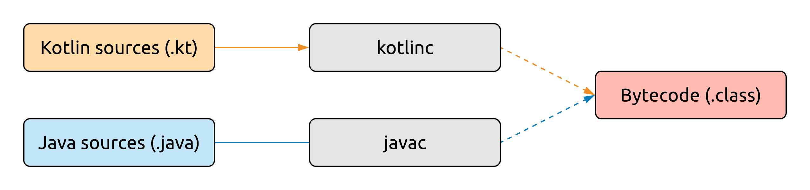
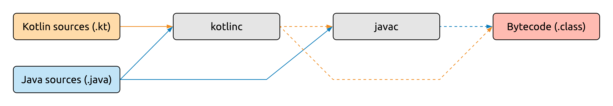

# Introduction

Programming languages. There's a lot of them, and it could be argued that all of them have their uses, their pros and cons. ~~Well, perhaps all but JavaScript.~~

There are things however that are generally considered positive attributes for languages, and many modern languages are converging in terms of these attributes. During this course, we'll be studying Kotlin, which is an example of a modern, well-rounded language, but you'll see many similar features in other languages such as Swift, C#, or Groovy, just to name a few examples.

The language's creators proudly admit that almost none of the features in Kotlin have been invented from scratch. We all stand on the shoulders of giants, there's nothing new under the sun, and [everything is a remix](https://www.youtube.com/watch?v=nJPERZDfyWc). Great creations always take existing pieces of work, copy, transform, and combine them into something new. Creating a language is no different from your everyday coding in this regard.

What still makes Kotlin unique is how well the features that _were_ picked fit together, and what features were omitted on purpose, because they would have broken the language's consistency, or go against its aims.

So what are some of these desired attributes that Kotlin aims to achieve?

- **Conciseness**, i.e. less code for expressing the same ideas. Not for the sake of conciseness itself, but to improve **readability** compared to more verbose languages. Not having to write boilerplate code makes coding faster, and more importantly, not having that boilerplate in your codebase makes navigating through and reading your existing code a lot easier.
- **Safety** means that your program misbehaves as little as possible. There's various ways to achieve such safety at the language level. Kotlin does this by having a strong, static type system, which reveals most mistakes at compile time (and often even at edit time), rather than letting your code fail at runtime.
- **Interoperability** is one of the fundamental aims of Kotlin. It runs on multiple platforms, and on each of them it cooperates with the native environment and libraries as much as possible.
- **Pragmatism** is a way of saying that Kotlin is not an academic language. It's meant for use in real industrial settings, and to solve real, practical problems.
- **Tooling** is something you might overlook at first when evaluating languages, but it's something that can make a good language a true pleasure to use. While there are still proud Vim warriors out there, most developers are used to using rich IDEs for their coding needs, and Kotlin's tooling comes directly from its creators.

This brings us to Kotlin's origin story.

# History

JetBrains, the company behind the IntelliJ platform (and all the IDEs that are built on it) has been developing their products in Java for a decade by 2010. During this time, they've built up immense experience in creating tooling for programming languages, and they also got very familiar with Java's pros and cons.

It was at this time that they started looking for a new language for their own development needs that was better than Java. They've evaluated the existing languages that ran on the Java Virtual Machine (JVM), but they didn't find one at the time that would've satisfied their needs. (The closest candidate was Scala, but it was notoriously difficult to make tooling for, and it suffered from lengthy compilation times.) So they've done what anyone else would've done at this point - created their own.

This is not generally a good idea for just anyone - like writing your own date library or rolling your own crypto. But with the tooling and language expertise of JetBrains, as well as their good market position, they've deemed it a viable project, and got started on it.

Some highlights of the language's development:

- 2010: internal development started under the name "JetLang".
- July 2011: announced to the general public as Project Kotlin.
- February 2016: Kotlin 1.0, the first stable release.
- March 2017: version 1.1, the first major feature update to Kotlin, with initial JavaScript support.
- May 2017: first-class Android support for Kotlin announced at Google I/O.
- November 2017: version 1.2, with the first version of multiplatform projects.
- October 2018: version 1.3, containing stable coroutines.
- May 2019: Android development going Kotlin-first announced at Google I/O.

Let's take a moment to review some of the previously mentioned language attributes, with this history now in mind:

- **Interoperability**: JetBrains had hundreds of thousands of lines of Java code that they could never just throw away. The new code written in Kotlin and the old code written in Java had to be able to communicate efficiently and effortlessly.
- **Pragmatism**: The language was born to serve a specific need, a real industrial project.
- **Tooling**: Language and tooling could be developed side-by-side, in-house, and complement each other perfectly.

# Compilation

Kotlin now positions itself as a modern, multiplatform [application programming language](https://medium.com/@elizarov/application-programming-language-ff7f0063c16). Its original and primary target is the JVM, but Kotlin code can also be compiled to [JavaScript](https://kotlinlang.org/docs/reference/js-overview.html), and even [native](https://kotlinlang.org/docs/reference/native-overview.html) binaries.

In this course, we'll focus on using Kotlin on the JVM. When compiling `.kt` Kotlin sources, the output here is *bytecode* in the form of `.class` files - the same as when compiling Java code.



What makes this compilation interesting is the strong interoperability between Kotlin and Java. Code written in one language can call into the other one completely seamlessly. So how can this work out during compilation, if we need to compile Java and Kotlin with their respective compilers? How would the Java compiler know about declarations in Kotlin sources, and vice versa?

Here's how the compilation actually works ([credits to Jake Wharton](https://youtu.be/CtZL_IjR5Ww?t=378)):



The Kotlin compiler, `kotlinc` runs first, and it parses both Java and Kotlin sources. This allows it to compile Kotlin code that references declarations in the Java sources. Next, the Java compiler `javac` is invoked. This again parses the Java sources, plus it receives the output of the Kotlin compiler as already compiled bytecode, which is what allows Java sources to reference Kotlin declarations. Finally, the merged output of these two compilers is bytecode in `.class` files.

# Tooling and environment

Unsurprisingly, JetBrains works very hard to provide the best possible tooling for Kotlin. After all, this is their business angle with the language, selling tooling for it.

Therefore, IntelliJ IDEA is the definitive IDE for Kotlin development, although other ones ([e.g. Eclipse](https://kotlinlang.org/docs/tutorials/getting-started-eclipse.html)) are technically supported as well. Naturally, you can also download the Kotlin compiler and [compile it from the command line](https://kotlinlang.org/docs/tutorials/command-line.html), if that's your thing.

Most non-trivial Java projects use build tools instead of invoking the compiler directly. Kotlin supports both [Maven](https://kotlinlang.org/docs/reference/using-maven.html) and [Gradle](https://kotlinlang.org/docs/reference/using-gradle.html), which are the popular build tools in the JVM world. Gradle which also happens to be the de-facto build system for Android projects, is generally preferred. Kotlin also has [Ant](https://kotlinlang.org/docs/reference/using-ant.html) support, and there's even examples of completely Kotlin-centric build systems, such as [Kobalt](https://beust.com/kobalt/home/index.html).

IntelliJ has a suite of convenient tools for working with Kotlin. Let's take a quick look at each of these.

### Scratch files

Scratch files are temporary files that you can use to quickly write and run Kotlin code. They are not associated with any project, and they reside outside your project directory, so they won't be under version control, but only stored locally.

Despite this, you can reference code in your current project from a scratch file, if you need to. You can create instances of classes, call existing functions, and so on. To create scratch file, go to *File -> New -> Scratch File*.

### REPL

Read-Eval-Print Loops, or REPLs, are usually a tool for scripting languages. They allow you to write and execute code line by line, to quickly iterate and try out various things in the language. 

Kotlin comes with this tool as well, which you can either run this from the command line, or right inside IntelliJ IDEA (*Tools -> Kotlin -> Kotlin REPL*). Just like with scratch files, you can call into code in your currently open project from the REPL.

### Decompiler

Sometimes the easiest way to understand what a certain piece of Kotlin code does is to look at what it compiles to. The bytecode that the compiler will output for a given Kotlin source file can be viewed by going to *Tools -> Kotlin -> Show Kotlin Bytecode*.

While this can help you figure out what's happening in some cases, most people can't read bytecode very well (nor should they be required to), so there's an even more important feature here. You can decompile this bytecode to Java by choosing the *Decompile* option on the bytecode viewer panel.

This gives you a Java source file, which is an attempt at writing Java code that would result in the same compilation result. Keep in mind that this is a best effort step, and not all the bytecode that the Kotlin compiler produces can be represented by Java code in a straightforward way. Most of the time, this decompiled Java code will contain at least a few errors. Still, the decompiler is a very useful tool for gaining a deeper understanding of Kotlin.

# Basic syntax

### Variables

Let's take the first thing you'd want to do in a language, and declare a variable!

>Note: In the beginning, we'll look at the Java equivalents of the Kotlin code in case you need them for reference. Remember, Kotlin *does not* actually compile to Java!

```kotlin
var x: Int = 0              // int x = 0;
```

Let's take note of a couple things:
- You declare variables with the `var` keyword.
- The variable name *precedes* the type.
- Semicolons are optional (but really, you shouldn't use them).

You should only use `var` when you explicitly want a *mutable* **var**iable. By default, use `val`, which declares an *immutable* **val**ue.

```kotlin
val y: Int = 1              // final int y = 1;
```

That's better. We can make another improvement to this declaration, by making use of *type inference*.

```kotlin
val z = 2                   // final int z = 2;
```

Kotlin is statically typed and has a very strong, strict type system. This variable is still typed to be an `Int` just like before, but you can omit the type in your code, as the compiler can *infer* it itself. You'll see a lot of this happening in Kotlin code.

This mechanism means you'll never type out something as verbose as this again:

```java
final FileInputStream fis = new FileInputStream("filename");
```

Instead, you'll have the Kotlin compiler figure out the type for you in almost all cases:

```kotlin
val fis = FileInputStream("filename")
```

>Note: You may also notice here that there's no `new` keyword in Kotlin for constructor calls.

The simple number literal we had before was inferred to be an `Int`, but you can also use special formats for the other basic types:

```kotlin
val myLong = 1L             // final long myLong = 1;
val myFloat = 1f            // final float myFloat = 1;
val myDouble = 1.0          // final double myDouble = 1;
```

##### Primitives vs boxed types

Java - and the JVM itself - makes a distinction between primitive types and boxed types. Primitives (`int`, `double`, `boolean`, and so on) are much more efficient, as they live on the stack, and only take up the space required to represent them.

The corresponding boxed classes (`Integer`, `Double`, `Boolean`, and more) are reference types, so only references to them are stored on the stack, and their actual instances live on the heap. These instances are also larger than the primitive's size, [sometimes significantly](https://dzone.com/articles/whats-wrong-with-java-boxed-numbers).

Using the primitives is sufficient in most cases, but sometimes the boxed variants are still required. This can happen when you *need* an object for some reason, for example when dealing with generics (there's no `List<int>`!). The boxed instances also have various methods you can call on them, which you can't do with a primitive value.

So where does Kotlin's `Int` (and `Boolean`, and `Double`, and other numeric types) fit in this picture? Well, just like it's between `int` and `Integer` by its looks, its semantics lie somewhere in the middle as well. On the Kotlin language level, we don't make a distinction about primitives and boxed types. The compiler will use a primitive whenever it's possible, and use a boxed type automatically when it needs to.

This doesn't exactly mean that we never have to think about this problem, because the performance considerations of what happens under the hood are still important - but we won't use different types to represent these things in our code.

##### Strings

The last basic type that's worth mentioning here is `String`, which behaves much like a `String` in Java. It's declared with quotation marks:

```kotlin
val name = "Sarah"           // final String name = "Sarah";
```

Kotlin also supports *string templates*, which is an easy way to place values inside a `String`, without having to use lots of concatenation:

```kotlin
val sum = "$x + $y + $z = ${x + y + z}"     // outputs "0 + 1 + 2 = 3"
```

Single values can be inserted with just a `$` prefix, and expressions can be computed using additional curly braces `${...}`.

### Functions

##### Our first function

Let's move on to functions. We'll convert this very simple function to Kotlin first, which just adds two numbers together, and returns the result.

```java
int add(int x, int y) {
    return x + y;
}
```

Here's a Kotlin equivalent of this code:

```kotlin
fun add(x: Int, y: Int): Int {
    return x + y
}
```

Some important observations about the syntax:

- We use the `fun` keyword to declare a function. (Yay!)
- The names precede the types in the parameter list, just like we've seen with variables.
- The return type comes after the rest of the function header as well, following the `name: Type` structure yet again.

For functions as simple as this one, that only compute a single expression and return its value, Kotlin offers a shorthand syntax called an *expression body*:

```kotlin
fun add(x: Int, y: Int): Int = x + y
```

And type inference can also kick in here, since the type of the `x + y` expression, an addition of two `Int` values is known by the compiler to be an  `Int`:

```kotlin
fun add(x: Int, y: Int) = x + y
```

#####   Functions that don't return anything

There's another case where the return type can be omitted, this is when the function doesn't return anything. This is equivalent to a function returning `void` in Java.

```kotlin
fun noReturnValue() {
    /* Empty */
}
```

Technically, functions like this still do return *something* in Kotlin. The language doesn't have the super special case that Java has with `void` functions. Functions where you don't return a meaningful value - like the one above - will implicitly have a return type of `Unit`. You can also write this out explicitly, although the IDE will warn you that it's unnecessary.

```kotlin
fun noReturnValue(): Unit {
    /* Empty */
}
```

`Unit` is an empty class that has a single instance. This makes it perfect for representing "no meaningful value". Returning this type from methods like the one above gives us some interesting possibilities. For example, you can assign the return value of this function to a variable, just like you could with any other function that returns any regular type.

```kotlin
val result: Unit = noReturnValue()
println(result) // kotlin.Unit
```

Again, there's no hard distinction between functions that do return something, and functions that don't. If there's nothing to return, we're indicating that by returning `Unit` implicitly (both the declaration of the return type and the actual `return` statement may be implicit).

We'll see that this type also plays well with generics. We won't need the weird distinction that Java makes between `void` and `Void`, we'll just use `Unit` for everything. But we're getting ahead of ourselves. Spoilers.

##### Default and named parameter values

Functions come with some neat new features in Kotlin. One of these is *default parameter values*. Let's write a function that mimics the registration of a user.

```kotlin
fun register( 
    username: String, 
    password: String = "12345678", 
    email: String = ""
) {
  // Pretend that there's something useful here.
  println("$username $password $email")
}
```

This function takes three arguments, and it defines default values for the last two. Note the formatting of each parameter on a separate line, this is conventional in Kotlin for functions with long signatures.

Having these default parameters in place means that we can call this method with three, two, or just one parameter. For any parameters that are not provided, the default value will be used instead.

```kotlin
register("piglet", "0h_d34r", "piglet@hundred-acre-wood.co.uk")
register("owl", "tea_party")
register("eeyore")
```

Another feature that works nicely in conjunction with default values is *named parameters*. For any function defined in Kotlin, you can optionally specify the names of the parameters when you call the function. Our previous calls could be made like this (note again the formatting of the lengthy call, on multiple lines.):

```kotlin
register(
    username = "piglet",
    password = "0h_d34r",
    email = "piglet@hundred-acre-wood.co.uk"
)
register(username = "owl", password = "tea_party")
register(username = "eeyore")
```

Naming our parameters, especially in cases like this where we are passing in a bunch of simple strings to a function, can help us avoid mixing up the parameter order, making our code safer. It also improves readability, as which argument fulfills which parameter is immediately clear at the call site.

Combined with default values, we can use this to omit parameters that have default values, but are not at the end of the parameter list:

```kotlin
register("tigger", email = "tigger@hundred-acre-wood-co.uk")
```

### Control structures

Let's continue with the basics and get to know our control structures. Most of these will be familiar already, so you'll have no problem getting started with them, but they almost all get some usability upgrades in comparison to Java.

##### Conditionals

The classic `if` statement is available in Kotlin just like you'd expect:

```kotlin
if (age < drinkingAge) {
    println("We can't serve you")
} else {
    println("Have a beer")
}
```

They come with the exciting twist of being not only statements, but also *expressions*, i.e. they have a return value. This return value is whatever the last expression in the branch that was executed is.

```kotlin
val discount = if (age < adultAge) {
    println("Calculating discount")
    val diff = adultAge - age
    100 - diff * 5
} else {
    println("No discount available")
    0
}
```

If you omit the braces, you get a very concise syntax for these expressions:

```kotlin
val max = if (a > b) a else b
```

For this reason, the so-called ternary operator (`a > b ? a : b`) is not present in the language [at this point](https://youtrack.jetbrains.com/issue/KT-5823).

##### Switches get ~~stiches~~ improvements

The well-known `switch` statement is an interesting control structure. Many languages (Scala, Swift, or C#, just to mention a few) have taken it beyond its original capabilities by adding *pattern matching* of various kinds to it. Even Java [is getting some upgrades](https://openjdk.java.net/jeps/325) to its `switch` - although it's only available from Java 12, and is still just a preview feature, which means you need to flip a compiler flag to enable it.
  
How does Kotlin measure up? Like in most times when it's compared on a scale from Java to Scala, it's somewhere in the comfortable middle.

Kotlin's replacement for the `switch` is the `when` expression. It does things that you expect a regular `switch` to do, with slightly different syntax:

```kotlin
val grade: Int = getGrade()
when (grade) {
    1 -> {
        println("Failed")
    }
    2 -> { println("Adequate") }
    3 -> { println("Average") }
    4 -> { println("Good") }
    5 -> { println("Excellent") }
    else -> {
        /* "This shouldn't happen" */
        throw RuntimeException("Invalid grade!")
    }
}
```

Instead of cases, `when` features branches, which follow whatever value it matched. There is no fall-through between these branches, so there's no need to `break` at their end. Instead of a `default`case, you can use `else` to indicate the branch that should be executed if none of the others have matched.

It also has some more advanced features:

```kotlin
when (val rating = calculateRating()) {
    0 -> {
        println("Terrible")
    }
    1, 2, 3 -> println("Bad")
    in 4..6 -> println("Average")
    in 7 until 10 -> println("Good")
    10 -> println("Perfect")
}
```

In this example, you can see that:

- You can declare the variable that you're performing the check against in the argument of `when` ([since Kotlin 1.3](https://kotlinlang.org/docs/reference/whatsnew13.html#capturing-when-subject-in-a-variable)). This variable will only be accessible within `when`'s body.
- You can list multiple values that will execute the same branch.
- If your branch is a single expression, you can omit the curly braces.
- You can perform containment-in-`Range` checks.

And of course, `when` is an expression, which means that it can be used to return a value - the last expression of whatever branch was executed. This can reduce code duplication when all branches perform the same action with, for example, a different argument:

```kotlin
val description = when (grade) {
    1 -> "Failed"
    2 -> "Adequate"
    3 -> "Average"
    4 -> "Good"
    5 -> "Excellent"
    else -> {
        /* "This shouldn't happen" */
        throw RuntimeException("Invalid grade!")
    }
}
println(description)
```

Note that in this case, the `else` block is mandatory, because without it we could run into a scenario where none of the branches were executed, and we have nothing to assign to the variable that the result of `when` is to be stored in.

Finally, it's worth noting that `when` can also be used without an argument, as a replacement for a long `if-else if` chain. In this case, each branch argument has to evaluate to a `Boolean`, and the first one that evaluates to `true` will execute its branch.

```kotlin
when {
    x < 40 -> println("x is too small")
    y in 0..50 -> println("y is in invalid range")
    x % y == 0 -> println("y should divide x")
    !check1(x, y) || !check2(x, y) -> {
        println("x and y didn't pass advanced validation")
    }
}
```

We'll see even more of `when`'s powers when we get to enums, classes and typechecks.

##### Exceptions

Exceptions in Kotlin are handled using a `try-catch` block (with an optional `finally` clause):

```kotlin
db.open()
db.beginTransaction()
try {
    db.insert(Customer(name = "Ann", balance = 1_000_000))
    db.commitTransaction()
} catch (e: IllegalStateException) {
    db.rollbackTransaction()
} finally {
    db.close()
}
```

>Note that underscores can be used to break up long number constants and improve readability.

As you might expect at this point, `try-catch` is also an expression, and it returns the last expression in the `try` branch if nothing is thrown from that branch, and the last expression of the `catch` branch otherwise:

```kotlin
val input: String = readUserInput()
val value: Double = try {
    input.toDouble()
} catch(e: NumberFormatException) {
    0.0
}
```

>Note that instead of using `Double.parseDouble` and similar methods, Kotlin offers methods on the `String`type that let you easily convert them to other types, such as [`toDouble`](https://kotlinlang.org/api/latest/jvm/stdlib/kotlin.text/to-double.html) or [`toInt`](https://kotlinlang.org/api/latest/jvm/stdlib/kotlin.text/to-int.html).

One last notable design choice is that there are *no checked exceptions* in Kotlin. This means that there's no requirement of declaring what exceptions a given function may throw, and you're not forced to handle non-`RuntimeExeptions` by the compiler either.

This choice was made based on the experience that Java's checked exceptions did a lot more to inconvenience developers than to improve the safety of code, and often just resulted in many empty `try-catch` wrappers around functions that declared exceptions being thrown from them.

##### Loops

Last but not least, let's talk about loops. `while` and `do-while` loops have nothing special about them. They check at the beginning and end of the loop respectively, and run until their condition evaluates to `true`.

```kotlin
val entries = ...
while (entries.hasNext()) {
    println("Entry: ${entries.next()}")
}
```

`for` loops, on the other hand, are more interesting. The C-style `for` loop with three parts in its header is not present in the language. Instead, anything that can provide an `Iterator` can be iterated with `for` loops.

For example, here's how you can iterate over a list of numbers, created with the [`listOf`](https://kotlinlang.org/api/latest/jvm/stdlib/kotlin.collections/list-of.html) factory function:

```kotlin
val myNumbers = listOf(1, 2, 5, 14, 42, 132, 429)
for (number in myNumbers) {
    println(number)
}
```

But what if we just want to iterate on numbers, for example from 0 to 10? It would be very wasteful to create a `List` and fill it up with elements just to get a simple loop. (We'd also be inclined to write the same `for` loop to populate the list with these numbers...)

Here's where the concept of a `Range` comes in. We'll look at these in detail later, but the basic idea is that the syntax `0..10` creates a `Range` from 0 to 10. This can provide an iterator that can be used with a `for` loop:

```kotlin
for (i in 0..10) {
    print("$i ")
} // 0 1 2 3 4 5 6 7 8 9 10 
```

It might seem wasteful to create this `Range` object and then an `Iterator` of some kind just to loop through numbers like this. A Java for loop allocates just a single primitive on the stack, while this sounds like multiple object allocations on the heap. The good news is that in simple cases, the compiler will optimize these object creations away, so this code is no less efficient than what we'd write more manually in Java.

Finally, what if we wanted to iterate slightly differently, excluding the upper bound of the range? This is common when we want to iterate valid indexes of a collection, for example. We can create a half-open interval using the `0 until 10` syntax:

```kotlin
for (i in 0 until 10) {
    print("$i ")
} // 0 1 2 3 4 5 6 7 8 9 
```

We'll take a deeper look at how both of these `Range` creation syntaxes work in more detail later.

# Sources

- [KotlinConf 2018 - Conference Opening Keynote by Andrey Breslav
](https://youtu.be/PsaFVLr8t4E?t=120)
  - Goals of Kotlin, often misunderstood
- [It's a Kotlin, Kotlin, Kotlin World - Jake Wharton - Londroid 2017 @Telegraph Engineering](https://youtu.be/CtZL_IjR5Ww?t=378)
  - Explanation of the interaction between the Java and Kotlin compilers.