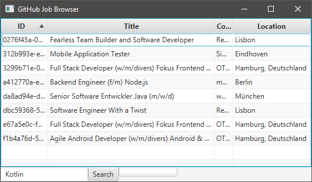
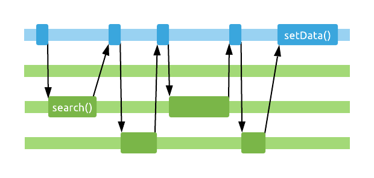

# Chapter 10: Coroutines

Kotlin's coroutines are a language feature that enable powerful asynchronous programming. They're a "simple", low-level construct, that various kinds of asynchronous abstractions and APIs can be built upon. In this chapter, we'll get familiar with the practical basics of coroutines, and see how they can make our unavoidably asynchronous lives easier.

## Foundations

Threading, parallelism, concurrency... We'll come across a lot of similar-sounding concepts while exploring coroutines. Let's start by defining some of these.

#### Threading

All of our code executes on threads. By default, when writing a JVM console application, it creates just a single thread, which executes the `main()` function for us (and any functions called from there).


We can also create own threads manually, if we want to get off of the main one. Then we can place code on them in the form of a `Runnable` (conveniently represented by a lambda in Kotlin), and run them, join them, interrupt them, ~~boil 'em, mash 'em, stick 'em in a stew~~ as we please.

```kotlin
val thread = Thread {
    println("Printing from this thread!")
}
thread.name = "my-background-thread"
thread.start()
thread.join()
```


Threads are very expensive to create and tedious to manage with this direct API, so we have the abstraction of an [`Executor`](https://docs.oracle.com/javase/8/docs/api/java/util/concurrent/Executor.html) (and the further abstraction of [`ExecutorService`](https://docs.oracle.com/javase/8/docs/api/java/util/concurrent/ExecutorService.html)), which makes dealing with threads easier.

```java
public interface Executor {
    void execute(Runnable command);
}
```

`Executor`s can wrap a single thread or multiple ones (a threadpool) and *reuse* those for whatever tasks we throw at them in the form of `Runnable` instances, with neat scheduling, cancellation options, and so on. This is much cheaper than creating new threads all the time, for anything we want to do in the background.

```kotlin
val singleThreadExecutor: Executor = Executors.newSingleThreadExecutor()
val threadpoolExecutor: Executor = Executors.newFixedThreadPool(8)

singleThreadExecutor.execute {
    println("I'm in a Runnable!")
}
```


Why is going to background threads beneficial? One thing we might seek by doing this is improved performance, thanks to parallelism, which we'll get to in just a moment.

In other cases, it can also be a hard requirement. When we write GUI applications (be it Android, JavaFX, or Swing for example), the frameworks responsible for the GUI usually dedicate a single *main* or *UI* thread to processing input events and drawing the interface elements. If we block this thread with long-running code, our users will see our app freeze, which is a terrible experience!

#### Parallelism

Starting new threads and placing work on Executors like above lets us perform things in **parallel**. Multiple computations or IO operations can be in progress at the exact same time, which can reduce the total time that executing our program takes. For example, we can calculate the results of two complicated formulas at the same time, or process filters on two images on two separate threads.


The alternative to parallel execution would be what we get by default when using a single thread: **sequential** execution. One task executed after another.


Note that sequential doesn't always mean single-threaded. You can perform a sequential series of tasks while continuously hopping threads (in fact we'll do quite a bit of this later on!):


Of course, not every task can or should be parallelized: for small tasks, the overhead of creating new threads and coordinating work between them will result in worse performance than just single-threaded sequential processing. Parallel code is also a lot harder to reason about than sequential code, as [race conditions](https://en.wikipedia.org/wiki/Race_condition#Software) may occur.

#### Concurrency

**Concurrency** is the idea of executing two tasks *virtually* at the same time. This can happen by true parallelism, on two different threads executing simultaneously on a multi-core CPU:


However, it can also be done using just a single thread and core in a time-sliced manner:


Both of these approaches achieve concurrency. To the outside world, it will seem like these two tasks have been performed "at the same time". This means that any concurrent code, even if it's not parallel, is subject to the perils of race conditions.

>Threads and scheduling are a very complex topic to discuss as we have CPU-level hyperthreading, upon which OS threads run, upon which JVM threads are created, etc. Slicing, optimizations, and virtualization happens at several levels here. We are using simplified, good-enough definitions here.

#### Asynchronicity

Two quick and relatively simple definitions to wrap up the introduction.

When you execute something **synchronously**, you wait for it to finish before moving on to another task. This is what happens with regular, blocking function calls.

>This would be making a sandwich for ourselves for dinner, performing all the required steps, participating in the process all along, without doing anything else while it's happening.

When you execute something **asynchronously**, you can move on to another task before it finishes, and then deal with the result later. This is what happens when you use callback-based APIs.

>This is making popcorn in the microwave. We start it, then for a while we are free to perform other tasks, and then we're eventually notified of completion by the beeping in the kitchen.

## Our asynchronous sample app

Enough definitions, let's see all of this in code! Our example app will be a JavaFX application, which allows us to search for jobs using the [GitHub Jobs API](https://jobs.github.com/api). If we're learning Kotlin, we might as well see if anyone will hire us to write Kotlin code for them. After all, the language is supposed to be all pragmatic and is meant to be used to build real applications.



Hurray, there *are* jobs for Kotlin developers out there! *Promising.*

We'll focus on the part of the application that fetches the job information from the network. This is done using two models:

```kotlin
data class JobSummary(
    val id: String,
    val title: String
)

data class JobDetails(
    val id: String,
    val title: String,
    val company: String,
    val location: String,
    val description: String,
    val type: String
)
```

### Blocking behaviour

... and an initial, blocking API with the following interface:

```kotlin
interface BlockingApi {
    fun search(query: String): List<JobSummary>
    fun getDetails(jobId: String): JobDetails
}
```

First, we'll perform a search for the keyword that was input in the text box. This will yield a list of `JobSummary` objects, which only contain IDs and job titles, so we'll then call the details API for each of these IDs to figure out who the listing belongs to, where they're located, and more - this is the information contained in the `JobDetails` model.

Here's this in code, using our API:

```kotlin
fun getJobDetailsBlocking(query: String, tableView: TableView<JobDetails>) {
    val api: BlockingApi = BlockingApiImpl()

    val jobSummaries = api.search(query) // blocking network call
    val details = jobSummaries.map {  summary ->
        api.getDetails(summary.id) // blocking network calls
    }

    tableView.setData(details)
}
```

>The GitHub API actually returns all the data we need in the first fetch. We're not parsing it on purpose so that we have to make additional network calls for the detailed descriptions. This is for educational purposes only!

This takes *1+N* network calls - *N* being the number of results - which takes a bit of time. All these calls are executed on a single thread, sequentially, and synchronously. As our `map` call is looping through the summaries, it waits for each of their details to be fetched over the network.

This means that we are blocking the UI thread of the application while we're performing all these calls! If you try to interact with the application - sort a column, resize the window, etc - while the search is happening, you'll see that it's unresponsive.


### Asynchronous callbacks

Let's get off the UI thread for our network calls, with a popular solution: callbacks.

Instead of having our API's functions block the caller's thread until it can return the results, they'll take a callback function as their parameter, and return immediately. The actual network calls are started in a background thread, and the provided callback function will be invoked back on the main thread when the results are ready, *asynchronously*. In the meantime, the main thread will be free to do other things, for example, process UI events.

Our callback based API will have this interface:

```kotlin
interface CallbackApi {
    fun search(query: String, callback: (List<JobSummary>) -> Unit)
    fun getDetails(jobId: String, callback: (JobDetails) -> Unit)
}
```

Let's take a look at how this may be implemented, on top of the original blocking API:

```kotlin
override fun search(query: String, callback: (List<JobSummary>) -> Unit) {
    Thread {
        val result = blockingApi.search(query)
        Platform.runLater {
            callback(result)
        }
    }.start()
}
```

The function starts a new background `Thread` immediately, which it blocks for the duration of the network call, and then it gets back to the main thread to invoke the `callback`.


This is done by using [`Platform.runLater`](https://docs.oracle.com/javase/8/javafx/api/javafx/application/Platform.html#runLater-java.lang.Runnable-), which puts the `Runnable` it receives as a parameter on the event queue that the JavaFX application's main thread processes events from. This is the same queue that user input events will end up in! Whenever the main thread is not busy, it will process events from this queue, eventually running our `Runnable`, invoking the callback, which we'll use to update the table with the results.

>Other platforms with a GUI, such as Android, also have dedicated UI threads and various mechanisms to dispatch runnable pieces of code to that thread (e.g. [`runOnUiThread`](https://developer.android.com/reference/android/app/Activity.html#runOnUiThread(java.lang.Runnable))).

Starting a new `Thread` for every call into our API implementation is quite wasteful. This could be improved by using a single `ExecutorService` internally, backed by a threadpool of a couple of threads.

>Try making this improvement to the `CallbackApiImpl` class yourself!

Moving to this callback-based API will force us to change the way we write our code at the call site. The functions we call don't return results to us directly. They return immediately, and we have to place the code we want to run after they've produced a result in the callbacks.

Since we need to make a second round of network calls based on the results of the first one, we'll also have to nest our callbacks:

```kotlin
fun getJobDetailsWithCallbacks(query: String, tableView: TableView<JobDetails>) {
    val callbackApi: CallbackApi = CallbackApiImpl()

    val results = mutableListOf<JobDetails>()
    callbackApi.search(query) { jobSummaries ->
        for (job in jobSummaries) {
            callbackApi.getDetails(job.id) { jobDetails ->
                results.add(jobDetails)

                if (results.size == jobSummaries.size) {
                    tableView.setData(results)
                }
            }
        }
    }
}
```

Note that since `getDetails` is now asynchronous and returns immediately (not waiting for its network call to complete), our behaviour has changed significantly here. The `for` loop fires off all requests for job details in parallel (each in their own thread), whereas we were making these calls sequentially before.


This will actually give us better load times, as network requests are generally slow operations, and are worth executing in parallel. However, it also comes with plenty of complications - as concurrent code was promised to.

Our callbacks will be invoked in an unknown order, which means that it's no longer simple to tell when they're all done, so that we can use their results. To know when we've received the last callback, we are placing each details object in a `MutableList` as it's loaded, and whenever there are as many items in the list as we expect it to have for the final result, we figure that we're done and set the data in the `TableView`.

This has some issues:

- The results in this list are in essentially random order, as our network calls might have taken varying amounts of time, and the callbacks could've run in any order. If the order of these items was important, we'd have to somehow keep track of this (or sort them after they're all loaded).
- We should've prepared for some of these calls failing, which can happen easily when making network requests. If any of the calls fail and they don't invoke their callback, that will mean that we'll never reach the desired list size in the callbacks, despite getting *some* amount of results from the network. Our UI will never be updated.

Fixing these kinds of things using callbacks is very, very painful. Even if these all worked magically, callbacks twisted our code inside out. Instead of writing code from top to bottom, we are forced to continuously nest callbacks into each other as our asynchronous steps progress, in a lovely structure often referred to as callback hell (see [here](http://callbackhell.com/), [here](https://stackoverflow.com/a/25098230/4465208), and especially [**here**](https://journal.stuffwithstuff.com/2015/02/01/what-color-is-your-function/)).

### Futures, Promises, and Rx

There are higher level abstractions that operate asynchronously, but they at least flatten sequential asynchronous calls by chaining function calls together. For example, the same code using a [`CompletableFuture`](https://docs.oracle.com/javase/8/docs/api/java/util/concurrent/CompletableFuture.html) based API might look something like this (with a bit of help from [Java Streams](https://docs.oracle.com/javase/8/docs/api/java/util/stream/package-summary.html) to fire off a list of futures at the same time):

```kotlin
futureApi.search(query)
    .thenApply { summaries ->
        val futures = summaries.map { futureApi.getDetails(it.id) }
        Stream.of(*futures.toTypedArray())
            .map(CompletableFuture<JobDetails>::join)
            .collect(Collectors.toList())
    }
    .thenAccept { results: List<JobDetails> ->
        Platform.runLater {
            tableView.setData(results)
        }
    }
```

Or using the ever popular [RxJava](https://github.com/ReactiveX/RxJava) library, you could do something like this:

```kotlin
rxApi.search(query)
    .flatMapObservable { jobSummaries ->
        Observable.fromIterable(jobSummaries)
    }
    .flatMapSingle { rxApi.getDetails(it.id) }
    .toList()
    .subscribeOn(JavaFxScheduler.platform())
    .subscribe { results: List<JobDetails> ->
        tableView.setData(results)
    }
```

These solutions both avoid the issues of callbacks to some degree. They prevent endless nesting by turning the same sequential behaviour into chained calls. They are also able to keep the order of the jobs while grabbing the details, and even give you reasonable error handling functionality (not present in the code snippets above).

However, they come with their own downsides. `CompletableFuture` has a fairly small API, and you'll somehow have to grab additional tools such as `Stream` to combine them just the way you need them.

RxJava is likely to have an operator for everything you'll ever need, you just have to know about them and figure out how to combine them. This is also its drawback, it has [*all of the operators*](http://reactivex.io/documentation/operators.html). You have to learn these and get used to them.

Both of these APIs solve some of our problems - they give us multi-threaded, asynchronous calls, with error handling - but they require us to shape our code differently from the traditional, imperative, synchronous style that we write blocking code in, and are used to.

>This familiarity is useful: it helps us spot mistakes in the code, as we already know what certain patterns will behave like.

Their APIs are also not what we're used to with synchronous code. Instead of returning the actual types that they are "returning", they return wrappers that will eventually yield these types somehow. In the case of the `Rx` example, this is `Single`:

```kotlin
interface RxApi {
    fun search(query: String): Single<List<JobSummary>>
    fun getDetails(jobId: String): Single<JobDetails>
}
```

With all of this behind us, let's see how coroutines can make dealing with all of these issues simpler.

## Coroutines

Coroutines are small pieces of work that can be executed in the background. They used to be advertised as *lightweight threads*, which gets the basic idea across well enough, but we'll see that coroutines are much more capable than threads in many ways.

Once again, we'll use our original blocking API, this time as the basis for the coroutine based implementation of fetching jobs. We'll start our first coroutine by using `GlobalScope.launch`. This `launch` function returns immediately, and the lambda passed to it will be executed on a background thread - in a coroutine:

```kotlin
val api: BlockingApi = BlockingApiImpl()

GlobalScope.launch {
    // start of the coroutine
    val jobSummaries = api.search(query)
    val details = jobSummaries.map {  summary ->
        api.getDetails(summary.id)
    }
    tableView.setData(details)
    // end of the coroutine
}
```

>Nearly all of the coroutine functionality we'll be using comes from a library, [`kotlinx.coroutines`](https://kotlin.github.io/kotlinx.coroutines/). You can think of this library as the Standard Library's equivalent for coroutines. Just like there's basically no Kotlin without the Standard Library, there's also nearly no coroutines without `kotlinx.coroutines`.

This is conceptually very similar to just starting a `Thread` manually, like this:

```kotlin
Thread {
    val jobSummaries = api.search(query)
    val details = jobSummaries.map {  summary ->
        api.getDetails(summary.id)
    }
    tableView.setData(details)
}.start()
```

This is a good start, but there's still the issue of getting back to the main thread for the call to the `tableView`. So let's talk about how coroutines handle threads, and how we can control the threads that they are executed on.

### Contexts

Taking a look at the simplified signature of the `launch` function, we can see that it takes a `CoroutineContext` as an optional parameter.

```kotlin
fun launch(
    context: CoroutineContext = EmptyCoroutineContext,
    block: suspend () -> Unit
): Job
```

>We'll ignore the `GlobalScope` part of our coroutine starting code for now for simplicity, but we'll get back to it later!

So what's a context then? It's a set of elements that describe *how* a coroutine is executed. They can control various aspects of a coroutine:

- Threading
- Cancellation
- Error handling
- A name for debugging

A `CoroutineContext` may contain a value for any number of these elements, even none or all of them. You can think of these as being available slots in the context that may be filled:


Each of these elements may be used as a `CoroutineContext` on their own, in that case, they form a context with only a single element.


Contexts can also be combined easily using the `+` operator. If two contexts that contain the came kind of element are combined, the element on the right hand side of the operator will be the one that makes it into the result context.


The threading aspect of coroutines is handled by [`CoroutineDispatcher`](https://kotlin.github.io/kotlinx.coroutines/kotlinx-coroutines-core/kotlinx.coroutines/-coroutine-dispatcher/) instances. The `kotlinx.coroutines` library includes a few dispatcher implementations that cover most common use cases, which are found nested in the [`Dispatchers`](https://kotlin.github.io/kotlinx.coroutines/kotlinx-coroutines-core/kotlinx.coroutines/-dispatchers/index.html) object:

- [`Default`](https://kotlin.github.io/kotlinx.coroutines/kotlinx-coroutines-core/kotlinx.coroutines/-dispatchers/-default.html)
  - Used by default for new coroutines, if no other dispatcher is specified. It's meant to be used for CPU-heavy computational tasks. This dispatcher wraps as many threads as your CPU has, but at least two. Thanks to having a matching number of threads to CPU cores, running lots of coroutines using this dispatcher can comfortably saturate all CPU cores.
- [`IO`](https://kotlin.github.io/kotlinx.coroutines/kotlinx-coroutines-core/kotlinx.coroutines/-dispatchers/-i-o.html)
  - This dispatcher also wraps a threadpool, and is meant to be used for IO intensive work (for example, disk and network interactions), which block threads, but don't require CPU-heavy computation. It uses 64 threads for this purpose (or the number of cores the CPU has, if that happens to be more).
- [`Main`](https://kotlin.github.io/kotlinx.coroutines/kotlinx-coroutines-core/kotlinx.coroutines/-dispatchers/-main.html)
  - This dispatcher is only available if there is a GUI framework being used, and wraps the main thread of the application in a platform-specific way. To access this dispatcher, additional dependencies (e.g. [`kotlinx-coroutines-javafx`](https://github.com/Kotlin/kotlinx.coroutines/tree/master/ui/kotlinx-coroutines-javafx)) have to be included in the project.
- [`Unconfined`](https://kotlin.github.io/kotlinx.coroutines/kotlinx-coroutines-core/kotlinx.coroutines/-dispatchers/-unconfined.html)
  - A special dispatcher which doesn't prescribe any specific thread for the coroutine, and simply executes on the thread that it was started from (with some caveats, see its documentation for more precise details).

To use any of these dispatchers, we can pass them in as the parameter of the `launch` function, and the coroutine it starts will execute on that dispatcher. We'll also be able to change the dispatcher a coroutine is running on as it's executing.

>Fun fact: the IO and Default dispatchers described above actually share threads between their threadpools, which means that switching between these two dispatchers in a running coroutine might be entirely free, as it can theoretically just keep using the same thread!

These are just the built-in dispatchers, but you may also create your very own, should you need to do something very specific for threading. For example, you might want to have a Dispatcher wrapping a single background thread, and move all of your database operations to that Dispatcher with coroutines. The easiest way to create your own Dispatcher is to convert an `Executor` into one:

```kotlin
val dispatcher: CoroutineDispatcher = 
        Executors.newSingleThreadExecutor().asCoroutineDispatcher()
```

### Using the correct context in our sample app

With our newfound knowledge of coroutine dispatchers, let's launch our coroutine performing network calls in the correct context:

```kotlin
GlobalScope.launch(Dispatchers.IO) {
    val jobSummaries = api.search(query)
    val details = jobSummaries.map {  summary ->
        api.getDetails(summary.id)
    }
    tableView.setData(details)
}
```


Blocking network calls now happen on a thread provided by `Dispatchers.IO`, yay! However, we still didn't make it back to the UI thread for our `tableView` update. For this, we'll use the [`withContext`](https://kotlin.github.io/kotlinx.coroutines/kotlinx-coroutines-core/kotlinx.coroutines/with-context.html) function. This higher order function takes a lambda that it will execute sequentially inside our coroutine, but will do so in a different context - the one given to the function as a parameter.

Since a `CoroutineContext`, among other things, defines the thread the coroutine executes on, we can use this to move a part of our coroutine to the main thread, with `Dispatchers.Main`:

```kotlin
GlobalScope.launch(Dispatchers.IO) {
    val jobSummaries = api.search(query)
    val details = jobSummaries.map {  summary ->
        api.getDetails(summary.id)
    }
    withContext(Dispatchers.Main) {
        tableView.setData(details)
    }
    println("Back in the background!")
}
```

The mechanism making this happen is the very essence of coroutines - suspension. The `withContext` function is a *suspending* function. When it's called, it suspends execution of the coroutine on the IO thread that it was started on, *freeing up that thread for other coroutines to use*.

Then, it executes the code passed to it in the specified context, in this case, on the main thread. When it's done, `withContext` returns, and our coroutine will get back into the context of the IO Dispatcher, and continue from the point where it left off before suspending, executing the rest of the code in it after the `withContext` call. In this example, this is the dummy call to `println`.


>Note that the coroutine gets back into the context of `Dispatchers.IO` after `withContext` returns, but this doesn't mean that it'll be on the same thread as before. It can end up on any thread used by this Dispatcher.

It's more conventional to turn this thread handling inside out - start the coroutine in the context of the UI thread and have its contents execute there by default. Any costly blocking calls can then be moved to background threads by switching contexts:

```kotlin
GlobalScope.launch(Dispatchers.Main) {
    val jobSummaries = withContext(Dispatchers.IO) {
        api.search(query)
    }
    val details = jobSummaries.map { summary ->
        withContext(Dispatchers.IO) {
            api.getDetails(summary.id)
        }
    }

    tableView.setData(details)
}
```



Notice how `withContext` actually returns the result of the part of the coroutine that executes inside of it, which is used above in both cases. This is possible, as the function that calls it is suspended while it executes, and waits for this result.

Making these context changes here in the UI handling code with `withContext` is a bit unsightly, and if we forget to wrap these calls, we'll accidentally block the UI thread. Thankfully, we can create our own *suspending functions*, which will have the same ability as `withContext` - they'll be able to execute without blocking the caller thread!

This is done by using the `suspend` keyword on our functions. Yes, we'll now `suspend fun`. We'll create a `CoroutineApi` interface like this:

```kotlin
interface CoroutineApi {
    suspend fun search(query: String): List<JobSummary>
    suspend fun getDetails(jobId: String): JobDetails
}
```

There are no callbacks, and the methods directly return the result when they're called. However, they'll be able to do this in a non-blocking way, by suspending. Their implementation is actually rather simple too: we'll use `withContext` inside them to switch from whatever thread the methods were called on to the IO dispatcher!

```kotlin
class CoroutineApiImpl : CoroutineApi {
    private val blockingApi: BlockingApi = BlockingApiImpl()

    override suspend fun search(query: String): List<JobSummary> {
        return withContext(Dispatchers.IO) {
            blockingApi.search(query)
        }
    }

    override suspend fun getDetails(jobId: String): JobDetails {
        return withContext(Dispatchers.IO) {
            blockingApi.getDetails(jobId)
        }
    }
}
```

The call site at this point simplifies to something very familiar and simple looking:

```kotlin
val api: CoroutineApi = CoroutineApiImpl()

GlobalScope.launch(Dispatchers.Main) {
    val jobSummaries = api.search(query) // suspends!
    val details = jobSummaries.map { summary ->
        api.getDetails(summary.id) // suspends!
    }
    tableView.setData(details)
}
```

Apart from having to start the coroutine, the rest of our code looks the same as its blocking, synchronous counterpart that we started out with. Unlike with callbacks, futures, or reactive frameworks, coroutines don't make you learn a new style of programming, and don't change the shape of your code.

What's done with comments above, noting *suspension points*, is actually marked by the IDE with icons:


The `suspend` keyword and its accompanying mechanism is actually the only support provided for coroutines by the language. All other constructs that we're using here (`launch`, `withContext`, and so on) come from the `kotlinx.coroutines` library, which is a first party library built on top of the suspension mechanism. The expectation is that only library authors will ever have to interact with the coroutine APIs on the lowest levels, and everyone else writing application code will rely on `kotlinx.coroutines` and similar libraries (like we just did!), which offer higher level abstractions.

Thanks to asynchronous code with coroutines keeping its simple, straightforward, imperative style, you can still make function calls, assign their results to variables, and quite importantly, still use constructs like basic loops, or the collection functions you've already learned, and even the regular try-catch for error handling (across threads!).
 
Here's an example of a suspending function that, depending on a coin flip, either returns a value or throws an exception:

```kotlin
suspend fun failedValueFetch(): Int = withContext(Dispatchers.Default) {
    if (Random.nextBoolean()) {
        throw RuntimeException("Oops!")
    }
    return@withContext 13
}
```

If we call this from another suspending function, we can surround it with a `try-catch`, which will work as we'd expect it to for blocking, synchronous calls.

```kotlin
suspend fun tryToFetchValue() {
    try {
        println(failedValueFetch())
    } catch (e: Exception) {
        e.printStackTrace()
    }
}
```

The `e.printStackTrace()` call will run in whatever context this function was invoked on, even though the exception is being thrown from the context of `Dispatchers.Default`.

### Suspension doesn't happen magically

It's very important to note that marking a function with the `suspend` keyword only *enables* it to suspend execution on the caller thread - it doesn't perform the suspension on its own. For example, a function like this is still not safe to call from the main thread, as it performs a heavy computation that will freeze the UI:

```kotlin
suspend fun findBigPrime(): BigInteger = BigInteger.probablePrime(4096, Random())
```

A well-behaving suspending function is expected to suspend on the caller thread, and perform its work somewhere else. This might be done by using `withContext`, which is a very commonly used solution, but there are also other mechanisms available that can be used to suspend a coroutine.

### Starting coroutines

Suspending functions have an important rule: they can only be called from other suspending functions. A regular function has no notion of suspending execution, so they'd have no way of waiting for a suspending call to return its result.

This presents a small riddle: how do we make our first call to a suspending function, if we need to already be in a suspending function to do so? This is the purpose that *coroutine builders* serve. They let us bridge the gap between the regular, synchronous world and the suspenseful world of coroutines.

[`launch`](https://kotlin.github.io/kotlinx.coroutines/kotlinx-coroutines-core/kotlinx.coroutines/launch.html) is the first coroutine builder that we've taken a look at. The trick to `launch` is that it takes a lambda parameter, which is a suspending function:

```kotlin
fun launch(
    context: CoroutineContext = EmptyCoroutineContext,
    block: suspend () -> Unit
): Job
```

It creates a new coroutine, which will execute the suspending `block` of code passed to it. `launch` is a fire-and-forget style coroutine builder, as it doesn't return a result. The `launch` function returns immediately after starting the coroutine, while the started coroutine fires off asynchronously. It does return a [`Job`](https://kotlin.github.io/kotlinx.coroutines/kotlinx-coroutines-core/kotlinx.coroutines/-job/index.html) instance, which, according to the documentation:

>is a cancellable thing with a life-cycle that culminates in its completion.

Basically, this `Job` represents a piece of work being performed for us by a coroutine, and can be used to keep track of that coroutine. For example, we can check if it's still running, or cancel it:

```kotlin
val job = GlobalScope.launch {
    println("Job is running...")
    delay(500)
    println("Job is done!")
}

Thread.sleep(200L)
if (job.isActive) {
    job.cancel()
}
```

>[`delay`](https://kotlin.github.io/kotlinx.coroutines/kotlinx-coroutines-core/kotlinx.coroutines/delay.html) is a handy suspending function that we can use inside coroutines to wait for a given amount of the time in a non-blocking way.

Since the coroutine above is cancelled before the `delay` is over, only its first print statement will be executed.

We can also `join` a `Job` (wait until it completes), similarly how we can join a `Thread`. This doesn't happen in a blocking way, however. The `join` method on `Job` is suspending, and will suspend until that `Job` completes. This means that we can only use it if we're inside a coroutine, for example:

```kotlin
fun main() {
    val job = GlobalScope.launch {
        println("Job is running...")
        delay(500)
        println("Job is done!")
    }

    GlobalScope.launch {
        println("Second coroutine started, will wait for first")
        job.join()
        println("All done!")
    }

    Thread.sleep(1000)
}
```

### Under the hood of a suspending function

Let's take a brief look at coroutines under the hood, to see how the suspension mechanism works. We'll use this piece of code for this:

```kotlin
suspend fun compute(question: String): Int {
    delay(236_682_000_000_000_000L)
    return 42
}

fun demoCoroutines() {
    GlobalScope.launch {
        println("Asking question")
        val result = compute("life, universe, and everything")
        println("Answer was: $result")
        delay(1000)
        println("Forty-two?!")
    }
}
```

Every call to a suspending function creates a *suspension point* in your function. These suspension points slice your functions up into various pieces, each of which executes in a regular, boring, blocking way. For our `demoCoroutines` function with its two suspension points, this means three distinct parts:


The first, yellow block executes together, as a series of blocking instructions. When it calls into `compute` though, the magic happens. It doesn't just pass in the `String` parameter that's visible here at the call site: it also passes in a *continuation*. 

Here's what (a slightly skewed projection of) the interface of the `Continuation` type looks like:

```kotlin
public interface Continuation<in T> {
    public val context: CoroutineContext
    public fun resume(value: T)
    public fun resumeWithException(exception: Throwable)
}
```

This `Continuation` represents the remaining part of our coroutine after a suspension point, and it's how we can get back to our coroutine after a suspension completes. Its generic type argument is whatever type the suspending function call returns to the next piece of the coroutine. If we manage to produce this value inside the suspending function, `resume` will be called, and if we failed with an exception, `resumeWithException` is called instead.

All of this is invisible to us at the source level, but if we get a good enough decompiler (and unfortunately, the built-in one is not able to handle coroutines to well), we can see it happening at the bytecode level:

```java
@Nullable
public static final void compute(
    @NotNull final String question,
    @NotNull final Continuation<Integer> $completion) {
     // lots of code pertaining to delay, which would be yet another 
     // suspending call and an additional level of nesting...
     $completion.resume(42)
}
```

>This is *not* the real bytecode produced by coroutine code, it is vastly simplified here to avoid some of the complicated details.

Every time we suspend, we pass in the next piece of code to be executed after the asynchronous call is completed as a parameter. This type of programming is called [*continuation-passing style*](https://en.wikipedia.org/wiki/Continuation-passing_style), as opposed to the direct style that we're used to with synchronous code.

But doesn't this look awfully familiar? We've managed to make our way back to using callbacks! However, we are much better off than before. Instead of writing these callbacks ourselves, and having to think in this style at the source level, the compiler is performing this transformation for us!

Please note that the actual implementation of coroutines also involves some generated classes to hold state, as well as a state machine that keeps track of which suspension point a given coroutine is at in a function. We won't dive any deeper into this here, but you can find more resources on this in the sources below.

### Explicit parallelism

Let's get back to the high level APIs that we actually want to use! We already know `launch`, our simple, fire-and-forget coroutine builder. We can also switch threads back and forth by using `withContext` and passing in various dispatchers. However, all of our coroutine code so far has been sequential. At each suspension point, the coroutine waited for the suspending call to return, and then continue from there.

Let's use this dummy function in the upcoming snippets to load some data, with a bit of a delay, in a suspending way.

```kotlin
suspend fun getData(index: Int): Double {
    delay(1000L)
    return index.toDouble() * 2
}
```

If we want to load two pieces of data with this function using `launch`, this will take us two seconds, as we only start loading the second piece of data once we have the first one:

```kotlin
GlobalScope.launch {
    val result = getData(1) + getData(2) 
    println("Result is $result")
}
```

This is perhaps even clearer if we format this code this way:

```kotlin
GlobalScope.launch {
    val data1 = getData(1) // Loads for 1 second
    val data2 = getData(2) // Another load for 1 second
    val result = data1 + data2
    println("Result is $result")
}
```

This sequential-by-default behaviour of coroutine is actually very handy. As discussed in the introduction, it's much easier to reason about sequential code than concurrent code.

Coroutines do also support parallelism, but they require us to be explicit about it. The second coroutine builder we'll learn is the one that lets us run coroutines in parallel: [`async`](https://kotlin.github.io/kotlinx.coroutines/kotlinx-coroutines-core/kotlinx.coroutines/async.html).

When we call `async`, we pass it a suspending function as its parameter, just like we did with `launch`. However, `async` is not fire-and-forget: it will produce a value when it's done. The value is represented by the [`Deferred`](https://kotlin.github.io/kotlinx.coroutines/kotlinx-coroutines-core/kotlinx.coroutines/-deferred/index.html) object that's returned from the `async` call (immediately, after it fires off the coroutine). This is a coroutine-powered, non-blocking *future*/*promise* type.

If we create two coroutines with `async` that each call `getData`, they'll start executing in parallel:

```kotlin
val data1: Deferred<Double> = GlobalScope.async { 
    getData(1) 
}
val data2: Deferred<Double> = GlobalScope.async { 
    getData(2) 
}
```

To get the results of these coroutines, we'll have to use the [`await`](https://kotlin.github.io/kotlinx.coroutines/kotlinx-coroutines-core/kotlinx.coroutines/-deferred/await.html) function available on `Deferred`. Hello, *async-await*. `await` is a non-blocking, suspending function. This means that we have to call it inside a coroutine. Let's just start a third coroutine for now, which will `await` both results, and then print their sum:

```kotlin
val data1 = GlobalScope.async { getData(1) }
val data2 = GlobalScope.async { getData(2) }

GlobalScope.launch {
    val result = data1.await() + data2.await()
    println("Result is $result")
}
```

This last coroutine here has two suspension points, one at each `await` call. Unlike before, however, these `await` calls aren't what start the data fetches - by the time we get to these, those are already happening in the first two coroutines which are running.

These `await` calls only serve to suspend until each `Deferred` can produce a result, and they will return as soon as the async coroutines that are behind the `Deferred` instances complete. Since these run in parallel, the first `await` call will take about a second to return, but the second `await` call will return almost immediately.

In total, this code will execute in roughly one second, instead of the two that it would've taken sequentially.

### Cancellation

Let's talk cancellation in detail, which will eventually get us to a second `CoroutineContext` element, as well as one last crucial concept around coroutines.

```kotlin
val job = GlobalScope.launch {
    println("Job is running...")
    delay(500)
    println("Job is done!")
}

Thread.sleep(200L)
if (job.isActive) {
    job.cancel()
}
```

We've seen that code like this works, and only the first message in the coroutine is printed:

```
Job is running...
```

This happens because we call `cancel` while the suspending `delay` call is happening in the coroutine. What if there were no suspension points in the coroutine, and its entire body was just blocking code? For example, if we replace the `delay` call with [`Thread.sleep`](https://docs.oracle.com/javase/8/docs/api/java/lang/Thread.html#sleep-long-):

```kotlin
val job = GlobalScope.launch {
    println("Job is running...")
    Thread.sleep(500L)
    println("Job is done!")
}

Thread.sleep(200L)
if (job.isActive) {
    job.cancel()
}
```

If we run the code again, we'll see this output:

```
Job is running...
Job is done!
```

We're in trouble, cancellation is now broken! It turns out that coroutines can only be cancelled cooperatively. While a coroutine is running continuously blocking code, it won't be notified of being cancelled.

Why doesn't the `Thread` that the coroutine is running on get shut down forcibly? Because doing something like this would be dangerous. Whenever you write blocking code, you expect all those lines of code to be executed together, one after another. If this gets cut off in the middle, completely unexpected things can happen in the application. Hence the cooperative approach instead.

So how do we cooperate? For one, we can call functions from `kotlinx.coroutines` that support cancellation already - `delay` was an example of this. If our coroutine is cancelled while we are waiting for `delay`, it will throw a `JobCancellationException` instead of returning normally. If our coroutine was cancelled some time _before_ a call to `delay`, and this cancellation wasn't handled yet, `delay` will also throw this exception as soon as it's called.

For example, let's say that we have a list of entities to save to two different places which we perform by calling these two blocking functions:

```kotlin
fun saveToServer(entity: String): Unit = ...
fun saveToDisk(entity: String): Unit = ...
```

We don't want to end up in a situation where we've saved an entity to one of these places, but not the other. We either want both of these calls to run for an entity, or neither of them. 

A first approach to this problem would be to just block a thread on the IO dispatcher for the entire length of our operation, which ensures that this coroutine is practically never cancelled:

```kotlin
suspend fun processEntities(entities: List<String>) = withContext(Dispatchers.IO) {
    entities.forEach { entity ->
        saveToServer(entity)
        saveToDisk(entity)
    }
}
```

However, we can also add cancellation support, by checking if our current coroutine has been cancelled, manually. For example, we can do this after processing each entity:

```kotlin
suspend fun processEntities(entities: List<String>) = withContext(Dispatchers.IO) {
    entities.forEach { entity ->
        saveToDisk(entity)
        saveToServer(entity)
        if (!isActive) {
            return@withContext
        }
    }
}
```

If our coroutine is cancelled while we run the blocking part of our code, that entire blocking part will still be executed together, but then we'll eventually notice the cancellation at the end of the loop, and stop performing further work, in a safe way.

There is a dedicated function in kotlinx.coroutines to check for a cancelled coroutine: [`ensureActive`](https://kotlin.github.io/kotlinx.coroutines/kotlinx-coroutines-core/kotlinx.coroutines/ensure-active.html).

All `ensureActive` does is handle cancellation (meaning that it throws a `JobCancellationException` when it's invoked in a cancelled coroutine:

```kotlin
public fun Job.ensureActive(): Unit {
    if (!isActive) throw getCancellationException()
}
```

This means that we can call it every once in a while when performing lots of blocking work, to provide opportunity for the coroutine to be cancelled. This is done completely manually though, explicitly, which means we are aware of the possibility of cancellation. `ensureActive` can easily replace manual cancellation checks, if terminating with an exception upon cancellation is good enough for us:

```kotlin
suspend fun processEntities(entities: List<String>) = withContext(Dispatchers.IO) {
    entities.forEach { entity ->
        saveToDisk(entity)
        saveToServer(entity)
        ensureActive()
    }
}
```

Just like with `delay`, even if the coroutine happens to have been cancelled some time before `ensureActive`, it will notice this, and throw an exception. The cancellation doesn't have to happen at the exact time that `ensureActive` is called.

Note that if there's some cleanup of the coroutine to do (freeing up resources, etc.) when it's cancelled, manual cancellation checks can still be very handy, and should be used instead of `ensureActive`.

>Another function from kotlinx.coroutines is [`yield`](https://kotlin.github.io/kotlinx.coroutines/kotlinx-coroutines-core/kotlinx.coroutines/yield.html), which has the original purpose of performing a manual suspension of the current coroutine, just to give other coroutines waiting for the same dispatcher a chance to execute. It essentially reschedules the rest of our coroutine to be executed on the same dispatcher that it's currently on. If there's nothing else waiting to use this dispatcher, this is the same as a 0-length delay. Since it's nearly a no-op, and handles cancellation (throws an exception if the coroutine it's in is cancelled), you might see it used for the same purpose as `ensureActive`.

### Structured concurrency 

Let's take another look at this code example that loads two pieces of data in parallel, and then combines them, but now with cancellation in mind.

```kotlin
val data1 = GlobalScope.async { getData(1) }
val data2 = GlobalScope.async { getData(2) }

GlobalScope.launch {
    val result = data1.await() + data2.await()
    println("Result is $result")
}
```

Something is still not quite right with the code above. If one of the coroutines started with `async` fails with an exception, the coroutine that awaits it (the one started by `launch`) will also receive that exception, crashing that coroutine too, however, the other `async` call will continue in the background! We've only cancelled two of the three coroutines.

Though we _can_ cancel coroutines manually, it's easy to see that if we had to keep track of every possible failure that can occur while running coroutines and cancel every related coroutine manually, we'd be writing _a lot_ of error handling code. We'd be back to the kind of manual management that we can perform on threads.

Here's where we'll learn about a second `CoroutineContext` element: the parent `Job`. `Job` instances work in a hierarchy, and if we pass in a `Job` instance as the context of a coroutine (either on its own, or combined with other elements), it becomes the parent of the newly started coroutine's `Job`.

This hierarchy has the following effect on these jobs:

- A `Job` won't get to a completed state until all of its children have completed. A parent always waits for its children.
- If a `Job` is cancelled, all of its children are immediately cancelled as well, recursively.
- If a `Job` fails with an exception, its parent fails immediately as well, cancelling all other siblings.

For a basic cancellation example, let's take a look at this code, where the second coroutine is started as the child of the first one, using the `context` parameter:

```kotlin
val job = GlobalScope.launch {
    println("This is job 1")
    delay(500)
    println("This was job 1")
}

GlobalScope.launch(context = job) {
    println("This is job 2")
    delay(500)
    println("This was job 2")
}

Thread.sleep(200L)
job.cancel()
```

Calling `cancel` on the first `Job` will also cancel its child job, resulting in only this output:

```
This is job 1
This is job 2
```

Getting back to our two `async` calls, how can we use the `Job` mechanism for cancellation there? We'd need a `Job` to serve as the parent of both `async` calls if we want them to be cancelled together. We could start an empty, dummy coroutine for this that just waits around for a while (with `launch`, for example), but there's a simpler and nicer way to do this: by creating a `Job` with its ["constructor"](https://kotlin.github.io/kotlinx.coroutines/kotlinx-coroutines-core/kotlinx.coroutines/-job.html):

```kotlin
val parent = Job()

val data1 = GlobalScope.async(context = parent) { getData(1) }
val data2 = GlobalScope.async(context = parent) { getData(2) }
GlobalScope.launch(parent) {
    val result = data1.await() + data2.await()
    println("Result is $result")
}
```

This works! If either of our three coroutines fail, they'll cancel their parent, and all the rest will be cancelled neatly.

This kind of a parent `Job` was used for a while to group coroutines in components that should all be cancelled together, when that component is destroyed in some sense. This component is usually a dialog or screen in a GUI application, or a service in a backend application. _Something_ that has a lifecycle and performs work, and has to stop performing work when its lifecycle ends.

>"On a more philosophical level, you rarely launch coroutines globally, like you do with threads. Coroutines are always related to some local scope in your application, which is an entity with a limited life-time, like a UI element." 
>- [Roman Elizarov on Structured Concurrency](https://medium.com/@elizarov/structured-concurrency-722d765aa952)

We'll use the example of an Android [`Activity`](https://developer.android.com/reference/android/app/Activity), which represents a screen, and receives an [`onDestroy`](https://developer.android.com/reference/android/app/Activity#onDestroy()) callback when it's closed.

If we want to cancel all coroutines in an `Activity` when it closes, we can use the parent `Job` approach from before, like this:

```kotlin
class MainActivity : Activity() {
    private val parent = Job()
    
    override fun onDestroy() {
        super.onDestroy()
        parent.cancel()
    }
    
    fun onClick(button: Button) {
        GlobalScope.launch(parent + Dispatchers.Main) { 
            // Do stuff to handle button clicks
        }
    }
}
```

The only issue now is that you always have to remember to add this `parent` to the context that you launch your coroutines in - that it's optional to specify the parent. If you decide not to include it, your coroutines will run loose, and will never be cleaned up.

#### The introduction of `CoroutineScope`

With the evolution of coroutines, [`CoroutineScope`](https://kotlin.github.io/kotlinx.coroutines/kotlinx-coroutines-core/kotlinx.coroutines/-coroutine-scope/) was introduced to fill in this gap, and to not only enable, but force us to think of scoping coroutines. 

Every coroutine builder became an extension on `CoroutineScope`, which forces us to choose a scope to start each coroutine. So far, we've been using `GlobalScope`, which is just what it sounds like. It ties all coroutines in it to the entire lifetime of the application, which isn't great. Coroutines started in this scope are never cancelled automatically, for example. Very rarely should a coroutine run in a scope this wide, so be cautious whenever you think you need to use it.

#### Cancellation through the scope

Before we look at ways to create our own proper scopes, let's see this cancellation and parenting mechanism at work.

Once we're inside a coroutine, for example the body of `launch`, child coroutines become easier to start, as the parameter of these builders is not only a suspending function, but an extension on `CoroutineScope`:

```kotlin
public fun CoroutineScope.launch(
    context: CoroutineContext = EmptyCoroutineContext,
    block: suspend CoroutineScope.() -> Unit
): Job
```

This scope, which you can then start new coroutines in will be inherited from the outer coroutine, and immediately makes any nested coroutines children of the outer one.

So if we `launch` in `GlobalScope` at first, we can then nest `async` calls in it without specifying a scope again, as the `this` reference points to one. That's what we're calling our nested builders on.

These nested coroutines will contain the `Job` of the outer coroutine (`launch`, in this case) as their parent, so if either of them fails, the parent and siblings also get cancelled! The scope ties our coroutines together nicely.

```kotlin
GlobalScope.launch { // this: CoroutineScope
    val data1 = async { getData(1) }
    val data2 = async { getData(2) }

    val result = data1.await() + data2.await()
    println("Result is $result")
}
```

#### What's in a scope?

Alright, time to define our own scope. It would be helpful to take a look at what a `CoroutineScope` looks like at the code level now:

```kotlin
public interface CoroutineScope {
    public val coroutineContext: CoroutineContext
}
```

There's not all that much to it. It really just contains a `CoroutineContext`, which will be used by every coroutine that's launched in this scope. This is the sort of behaviour that we were looking for.

However, our coroutine builders already took a `CoroutineContext` as their parameter. If they're also called on a `CoroutineScope` which supplies a context, which one wins? 

It turns out that they're combined using the rules we've learned earlier. This happens left-to-right again, so for each type of element, if it's present in both, the one from the parameter context will override the one from the scope. This reinforces the notion that the scope provides a _default_ context of kinds for coroutines started inside it, and the parameter can be used to adjust it when really necessary (for example, to choose a different Dispatcher).

#### Custom scopes

Getting back to our `Activity`, a common solution used to be to make your _lifecycle-having_ components implement the `CoroutineScope` interface directly, like so:

```kotlin
class MainActivity : Activity(), CoroutineScope {
    override val coroutineContext = Job() + Dispatchers.Main

    override fun onDestroy() {
        super.onDestroy()
        coroutineContext.cancel()
    }

    fun onClick() {
        launch() {
            // Do stuff to handle button clicks
        }
    }
}
```

This is pretty convenient, as we can use coroutine builders with the scope implicitly being applied to them, so if we just don't specify a context in their parameters, they'll use what they get from the scope!

However, a new style of using scopes seems to be taking over, and [is expected to become officially recommended too](https://github.com/Kotlin/kotlinx.coroutines/issues/1581), which is to *contain* a `CoroutineScope` and explicitly start coroutines in it, instead of implementing it and using it implicitly.

- This, yet again, is composition over inheritance, as advocated by _Effective Java_ and many others. One obvious win by containing a scope will be that we can make it `private`. With the implementation above, any piece of code that gets a reference to a `MainActivity` sees that it's a `CoroutineScope`, and can create coroutines in this scope! Probably not something we want to allow.
- Coroutines like being explicit about what's happening. If you write down the scope you start a coroutine in, you're forced to choose to use that scope for the coroutine. Forcing developers to think about this decision is why `CoroutineScope` was introduced in the first place.

Let's see how we can create a `CoroutineScope` that will be contained by an `Activity`. We can simply call a ["constructor"](https://kotlin.github.io/kotlinx.coroutines/kotlinx-coroutines-core/kotlinx.coroutines/-coroutine-scope.html) again, passing in a `CoroutineContext` that we want the scope to contain:

```kotlin
class MainActivity : Activity() {
    private val scope: CoroutineScope = CoroutineScope(Job() + Dispatchers.Main)

    override fun onDestroy() {
        super.onDestroy()
        scope.cancel()
    }

    fun onClick() {
        scope.launch() {
            // Do stuff to handle button clicks
        }
    }
}
```

Note how we now explicitly specify the scope being used.

>If you don't put a parent `Job` in a `CoroutineScope` created this way, it'll create an empty `Job` to serve as the parent for nested coroutines. After all, 90% of why `CoroutineScope` exists is to support proper cancellation of nested jobs.

>[`SupervisorJob`](https://kotlin.github.io/kotlinx.coroutines/kotlinx-coroutines-core/kotlinx.coroutines/-supervisor-job.html) is worth a look if you're creating your own scope, as you might want it to replace this empty parent job a lot of cases.

### One last builder

With most of the examples shown, we'd run into an issue if we were to run them in just a simple `main` function. For example, take this code:

```kotlin
fun main() {
    GlobalScope.launch {
        delay(100)
        println("Coroutines!")
    }

    println("Goodbye.")
}
```

Running this will print `Goodbye.` and then terminate the application. Running coroutines will not keep a JVM console application alive. This is not an issue with applications that have a GUI and an event loop that's constantly kept alive, but a console app like this terminates just a bit too eagerly. One hacky workaround is to just sleep the main thread for long enough that the coroutines complete:

```kotlin
fun main() {
    GlobalScope.launch {
        delay(100)
        println("Coroutines!")
    }

    Thread.sleep(1000L)
    println("Goodbye.")
}
```

... which is what we've doing in previous examples, but we can also do better.

There is a third coroutine builder worth being familiar with, [`runBlocking`](https://kotlin.github.io/kotlinx.coroutines/kotlinx-coroutines-core/kotlinx.coroutines/run-blocking.html). This builder also launches the suspending function passed to it as a parameter in a new coroutine, however, it doesn't return until that function completes.

This should never be used inside a coroutine. Its purpose, really, is to give an entry point to the coroutine world from `main` functions, and in tests (for similar reasons).

>`runBlocking` is useful for tests, but there is also a dedicated `kotlinx.coroutines.test` library, which includes lots of testing utilities, including [`runBlockingTest`](https://kotlin.github.io/kotlinx.coroutines/kotlinx-coroutines-test/kotlinx.coroutines.test/run-blocking-test.html). 

Using `runBlocking`, we don't need that manual wait anymore in the previous example, whether we just place our code inside its body directly:

```kotlin
fun main() {
    runBlocking {
        delay(1000)
        println("Hello world!")
    }
}
```

... or start a child coroutine inside it, which the parent will wait for to complete anyway:

```kotlin
fun main() {
    runBlocking { 
        launch {
            delay(1000)
            println("Hello world!")
        }
    }
}
```

There's also one more, fancy shortcut we can take if we need a `main` function to run coroutines: we can mark it with the `suspend` keyword:

```kotlin
suspend fun main() {
    delay(1000)
    println("Hello world!")
}
```

### Wrapping a callback

There are many existing libraries that use callback-based APIs. These would normally force all your code to operate in a callback-based manner, but they can be integrated nicely with coroutines by converting calls to these APIs into suspending calls instead, using extension functions.

Take a callback-based API like this one:

```java
public abstract class Task<T> {
    public interface OnCompleteListener<T> {
        void onComplete(T result);
        void onError(Throwable exception);
    }

    protected OnCompleteListener<T> listener;

    public void setListener(OnCompleteListener<T> listener) {
        this.listener = listener;
    }
}
```

Methods called in a library that contains this `Task` type can shoot off asynchronous calls on background threads, and return a `Task` as their result. It's your task to attach a listener to this task, so that you're notified of its completion:

```kotlin
getUsername().setListener(object : Task.OnCompleteListener<String?> {
    override fun onComplete(result: String?) {
        println("Success: $result")
    }

    override fun onError(exception: Throwable?) {
        println("Error: $exception")
    }
})
```

This `setListener` call returns immediately, and the callbacks inside it will be invoked at a later time. We would rather suspend at this point, so that we can keep writing sequential code that should run after this asynchronous waiting for a result has completed.

We can extend the `Task` type with an extension function that is named `await` by tradition:

```kotlin
suspend fun <T> Task<T>.await(): T = suspendCoroutine { cont ->
    this.setListener(object : Task.OnCompleteListener<T> {
        override fun onComplete(result: T) {
            cont.resume(result)
        }

        override fun onError(exception: Throwable) {
            cont.resumeWithException(exception)
        }
    })
}
```

This suspending function uses the [`suspendCoroutine`](https://kotlinlang.org/api/latest/jvm/stdlib/kotlin.coroutines/suspend-coroutine.html) function library to - guess what - suspend the currently running coroutine. We have a suspension point!

The lambda passed to `suspendCoroutine` receives a [`Continuation`](https://kotlinlang.org/api/latest/jvm/stdlib/kotlin.coroutines/-continuation/index.html) as its parameter, and we can manually use this `Continuation` to either resume the coroutine at the suspension point by producing a result, or by throwing an exception at the suspension point by providing a `Throwable`. We simply hook these two calls up with the appropriate callbacks in our `Task` API, and we're good to go!

```kotlin
suspend fun main() {
    val name = getUsername().await()
    println(name)
}
```

We can now get a `Task` from the API and simply `await` it in a suspending way. Awesome!

>[`suspendCancellableCoroutine`](https://kotlin.github.io/kotlinx.coroutines/kotlinx-coroutines-core/kotlinx.coroutines/suspend-cancellable-coroutine.html) from `kotlinx-coroutines` is a nicer way of doing this, with handling of coroutine cancellation.

>This pattern used to be the way to integrate Retrofit calls with coroutine-based applications, and Firebase APIs are also a [prime example](https://joebirch.co/2019/10/03/using-firebase-on-android-with-kotlin-coroutines/) where this can come in handy during Android development.

# Summary

Coroutines definitely take a bit of getting used to. They're not a trivial concept by any means, but once they click, they unlock very, very powerful asynchronous programming. They are stable, production-ready, and enjoy widespread use - for example, they have taken the Android world by storm, replacing Rx in many applications.

They're also one of the best examples of pushing Kotlin's language features to the limit, both in their API and implementation. You are encouraged to dive into the code of some of the APIs that you use when dealing with coroutines - you'll be sure to find very neat solutions in there.

There's much more to coroutines than what we had a chance to cover. You can communicate between them using a [`Channel`](https://kotlin.github.io/kotlinx.coroutines/kotlinx-coroutines-core/kotlinx.coroutines.channels/-channel/index.html), you can create cold streams of coroutines using [`Flow`](https://kotlin.github.io/kotlinx.coroutines/kotlinx-coroutines-core/kotlinx.coroutines.flow/-flow/), and then there's actors and so on, and so on. Go and discover these on your own, as you need them! You'll find some sources below.

# Sources

http://journal.stuffwithstuff.com/2015/02/01/what-color-is-your-function/

https://medium.com/swift-india/concurrency-parallelism-threads-processes-async-and-sync-related-39fd951bc61d

https://stackoverflow.com/a/36604522/4465208

https://stackoverflow.com/a/748189/4465208

https://proandroiddev.com/demystifying-coroutinecontext-1ce5b68407ad

https://www.youtube.com/watch?v=DOoJnJJnAG4

https://www.youtube.com/watch?v=_hfBv0a09Jc

https://www.youtube.com/watch?v=4W3ruTWUhpw

https://medium.com/@elizarov/how-do-you-color-your-functions-a6bb423d936d

https://medium.com/@elizarov/blocking-threads-suspending-coroutines-d33e11bf4761

https://medium.com/@elizarov/explicit-concurrency-67a8e8fd9b25

https://medium.com/@elizarov/the-reason-to-avoid-globalscope-835337445abc

https://medium.com/@elizarov/coroutine-context-and-scope-c8b255d59055
 
https://github.com/Kotlin/kotlinx.coroutines/issues/1581

https://github.com/Kotlin/KEEP/blob/master/proposals/coroutines.md#wrapping-callbacks

https://github.com/Kotlin/kotlinx.coroutines/blob/master/coroutines-guide.md

https://joebirch.co/2019/10/03/using-firebase-on-android-with-kotlin-coroutines/
