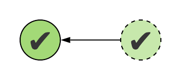
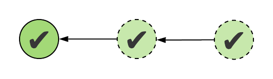
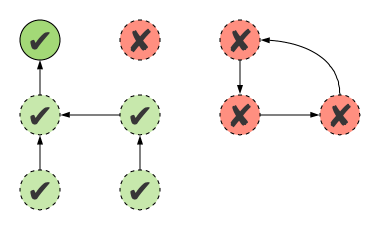
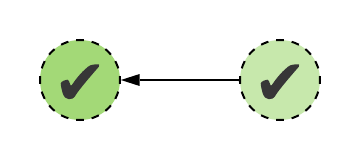
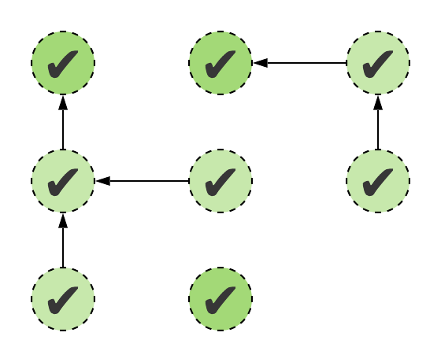

# Chapter 2: Object Oriented Programming

Continuing with the "just like Java but better" angle, we'll now take a look at how Kotlin approaches object oriented code. While [Java is clearly and strictly an object oriented language](https://steve-yegge.blogspot.com/2006/03/execution-in-kingdom-of-nouns.html), the same would be hard to say about Kotlin with confidence. We'll see later that it supports more than just this one paradigm. But for now, let's see how it does OOP.

### Intro to classes

It only makes sense to start with the shortest possible class:

```kotlin
class Person
```

This is what an empty class looks like in Kotlin. Classes usually have bodies indicated by curly braces `{}`, but they can be omitted if they're empty.

Classes have two kinds of constructor's - we'll deal with *primary constructors* first. These are declared right in the header of the class, and simply list the parameters you need to construct a class:

```kotlin
class Person(name: String, age: Int)
```

Just adding these parameters doesn't make much sense, we'd at the very least want to save them somewhere, so that we can work with them later. In Java, we'd use fields for this. In Kotlin we'll use *properties*, which is a higher level concept. We can create a property with either the `val` or `var` keyword, just like a local variable.

```kotlin
class Person(name: String, age: Int) {
    val name: String
    var age: Int
}
```

This code won't compile yet, as our properties are not initialized. Therefore, constructing an instance of `Person` wouldn't be safe: what would happen when someone reads the value of `name` or `age`?

There are two ways to initialize this property within the body of the class. Either by initializing it at its declaration, or inside an *initializer block*, which is executed when the class is constructed:

```kotlin
class Person(name: String, age: Int) {
    val name: String = name
    var age: Int

    init {
        this.age = age
    }
}
```

Since taking a parameter in the constructor and saving its value to a property with the same name is such a common pattern, there's shorthand for this. You can merge the declarations of the property and the constructor parameter, as well as the property's initialization by adding `val` or `var` directly in the primary constructor:

```kotlin
class Person(val name: String, var age: Int)
```

### Properties

So far, we've seen one kind of property, which could be declared either in the primary constructor, or in the body of the class.

Let's take the following example of using the class that we've created:

```kotlin
fun main() {
    val person = Person("Mandy", 41)
    println(person.name)
    person.age = 42
}
```

It would seem like this class doesn't follow the encapsulation rules of OOP - we're accessing the data stored in the class directly. That would be the case if this was a Java class and these were fields, however, we have *properties* here. Properties are a higher level concept, which encompass a field, a getter, and a setter (only for `var`s!) into a single entity. This becomes apparent if we start using the same class from Java:

```java
public class Main {
    public static void main(String[] args) {
        Person person = new Person("Mandy", 41);
        System.out.println(person.getName());
        person.setAge(42);
    }
}
```

While the getters and setters we have here are public, the fields that actually hold the data still remain private. Encapsulation checks out!

We can even jump into the Kotlin decompiler that ships with the Kotlin IntelliJ plugin and view a decompiled version of the class, which shows us an approximation of what the one-liner `Person` class above would look like in Java:

```java
public final class Person {
   private final String name;
   private int age;

   public final String getName() {
      return this.name;
   }

   public final int getAge() {
      return this.age;
   }

   public final void setAge(int age) {
      this.age = age;
   }

   public Person(String name, int age) {
      this.name = name;
      this.age = age;
   }
}
```

##### Custom getters and setters

As you can see, by default, the getters and setters generated for a property simply read or write the property's *backing field*. We can change this behaviour by modifying the getter or setter of a property. To do this, we'll have to move our property from the primary constructor to the body of the class - the primary constructor is only for simple, straightforward properties.

```kotlin
class Person(val name: String, age: Int) {
  var age: Int = age
      get() {
          return field
      }
      set(value) {
          field = value
      }
}
```

To start, we've reimplemented the default functionality of reading and writing the backing field, which can be accessed by the `field` keyword in both the getter and the setter. The getter can take no parameter, and the setter takes a single parameter, usually named `value`.

We can customize these functions to our liking now. For example, we can always lie about our age when asked, or make sure that we never get any younger than our current age:

```kotlin
var age = age
    get() = field - 5
    set(value) {
        if (value > field) {
            field = value
        }
    }
}
```

> Note the usage of an expression body with the getter, just like with any other function.

Notice how Kotlin's type inference is at work here. The type of the property is not specified anywhere in its now lengthy declaration, it's inferred from the constructor property that it's initialized from. The full syntax with very explicit typing would look like this:

```kotlin
var age: Int = age
    get(): Int = field - 5
    set(value: Int) {
        if (value > field) {
            field = value
        }
    }
```

This contains a lot of unnecessary typing, but typing at least the property itself on the first line may be a good idea - doing so prevents it from accidentally changing its type when the constructor parameter's type changes.

It's also important to note that even though we're now writing a getter an setter in our class' implementation, the usage remains the same as before. We can read and write our property by just referencing its name directly:

```kotlin
val person = Person("Dave", 38)
println(person.age) // 33
person.age = 20
println(person.age) // 33
```

However we implement a property, whether we rely on the default implementation or do it ourselves, they're always encapsulated, and use accessor functions under the hood. This helps us with [maintaining the APIs](https://zsmb.co/maintaining-compatibility-in-kotlin-libraries/) of classes, while allowing is to change their internals in a broad variety of ways.

##### Property delegation

Custom getters and setters tend to follow the same patterns over and over again. One of these popular patterns is *lazy initialization*, computing a value only when it's first needed, and then storing it for later use.

Here's an example of  a `pi` property which is computed only if it hasn't been accessed yet, and otherwise simply returned when the getter is invoked:

```kotlin
private var pi_: Double? = null
val pi: Double
    get() {
        if (pi_ == null) {
            // Some expensive computation
            val sum = (1..50_000).sumByDouble { 1.0 / (it * it) }
            pi_ = sqrt(sum * 6.0)
        }
        return pi_!!
    }
```

>This property uses another property to store its data instead of its own backing field - a *backing property* - because the types of the property and the data it needs to store are different. This is due to nullability concerns, which will be covered in the next lecture.

>The computation itself uses some advanced features that we didn't cover yet, but you can attempt to figure out how it works!

If we were to now write code that lazily computes `e` (Euler's constant), we'd end up writing a lot of the same code as before. Two properties, one of them `null` initially, and a custom getter that performs a `null` check and executes the initialization code if needed, and finally, a `return` statement.

```kotlin
private var e_: Double? = null
val e: Double
    get() {
        if (e_ == null) {
            // Again, complex, expensive computation
            val sum = (0..20).sumByDouble { 1.0 / (1..it).fold(1, { a, x -> a * x }) }
            e_ = sum
        }
        return e_!!
  }
```

A feature called *property delegation* comes to the rescue here, which allows us to extract our getter (and setter) logic into a class, and make it reusable. We'll look at how we can do this on our own later down the line, but let's take a look at what delegates the standard library provides for us, starting with [`lazy`](https://kotlinlang.org/api/latest/jvm/stdlib/kotlin/lazy.html). You can delegate a property using the `by` keyword, and create a lazy property with `lazy {}`:

```kotlin
val pi: Double by lazy {
    val sum = (1..50_000).sumByDouble { 1.0 / (it * it) }
    sqrt(sum * 6.0)
}
```

The logic performing the lazy initialization is now gone from our own code, and all we have to focus on is the initialization logic itself! It's worth mentioning that `lazy` is also thread-safe by default, which you can disable with an additional parameter, if you don't need the safety and want better performance:

```kotlin
lazy(mode = LazyThreadSafetyMode.NONE) { ... }
```

Another common pattern is running code whenever the value of a property changes. [`Delegates.observable`](https://kotlinlang.org/api/latest/jvm/stdlib/kotlin.properties/-delegates/observable.html) serves this purpose. Let's use it to ["log"](https://stackoverflow.com/questions/31869391/what-is-the-difference-between-java-logger-and-system-out-println) changes to a property's value:

```kotlin
var name: String by Delegates.observable("Megan") { property, oldValue, newValue ->
    println("Name changed from $oldValue to $newValue")
}
```

Finally, there's [`Delegates.vetoable`](https://kotlinlang.org/api/latest/jvm/stdlib/kotlin.properties/-delegates/vetoable.html), which lets you veto a new value, if it doesn't pass whatever criteria you define for it. Here you have to return a `Boolean` value, which when `false` will prevent the new value from being set. Let's perform the previously used aging validation again:

```kotlin
var age: Int by Delegates.vetoable(0) { property, oldValue, newValue ->
    newValue > oldValue
}
```

### Constructors

>This section was adapted from a blog post that originally appeared on [zsmb.co](https://zsmb.co/primaries-matter-a-discussion-of-constructors/).

Primary constructors play a fundamental role in Kotlin classes. Let's take a close look at them, understand what exactly is part of a primary constructor, what makes this constructor special, and what the alternatives are.

##### Back to Java for a moment

In Java, class creation isn't exactly strict. The language lets you leave variables uninitialized without any complaints. Take this class for example:

```java
public class Car {
    String model;
    int year;
    double miles;
}
```

It has three fields, and an implicit constructor with no parameters. When you call its constructor with `new Car()`, all of these fields will be initialized to implicit default values: `null`, `0`, and `0.0`, respectively. In general, primitive types are initialized to some resemblance of `0`, while reference types are initialized to `null`.

##### Kotlin's safety guarantees

In contrast, Kotlin is very strict about creating instances. We've seen that a class like this does not compile in Kotlin, because initializing each property when an instance is created is mandatory.

```kotlin
class Car {
    val model: String
    val year: Int
    var miles: Double
}
```

>*e: Property must be initialized or be abstract*

*This forces you to explicitly initialize every value in one way or another, and guarantees that your properties won't have implicit values stored in them.* Whenever you read a property, you'll get a value out of it that *you* put there.

##### The primary constructor

We've also seen already that there are two ways to initialize these properties. You can initialize them inline at their declarations, or in one or more initializer (`init`) blocks. 

```kotlin
class Car(model: String, year: Int) {
    val model: String = model
    val year: Int
    var miles: Double = 0.0

    init {
        this.year = year
    }
}
```

These two kinds of initializations are performed from top to bottom, in order. In the example, `model` and `miles` would be initialized first, and then finally `year` would get its value. *Any parameters that the primary constructor takes may be used for these initializations*.

The IDE warnings at this point will suggest for us to [join the declaration and assignment](https://stackoverflow.com/q/42600368/4465208) of `year`, and to move both `model` and `year` into the primary constructor. Properties in the primary constructor will be initialized before anything in the body of the class, and again, they'll be initialized in order.

```kotlin
class Car(val model: String, val year: Int) {
    var miles: Double = 0.0
}
```

Previously initialized variables will also be in scope during initialization if you want to rely on their values:

```kotlin
class Car(val model: String, val year: Int) {
    var miles: Double = 0.0

    val age: Int

    init {
        age = getCurrentYear() - year
    }

    val description: String = "$model ($age years, $miles miles)"
}
```

We can only initialize `description` this way after `age` has been initialized. If we 
placed it before the `init` block, we'd again see an error:
  
>*e: Variable 'age' must be initialized*

##### A look under the hood

If we decompile the bytecode produced for this class using the decompiler of the Kotlin IDEA plugin, we'll see this corresponding Java source (comments added):

```java
public final class Car {
    private double miles;
    private final int age;
    private final String description;
    private final String model;
    private final int year;

    // Getters & setters ...

    public Car(String model, int year) {
        // Properties in the primary constructor
        this.model = model;
        this.year = year;

        // Initialization at the declaration
        // (This is actually optimized away if we init to 0)
        this.miles = 0.0D;

        // init block
        this.age = Utils.getCurrentYear() - this.year;

        // Initialization at the declaration
        this.description = this.model + " (" + this.age + " years, " + this.miles + " miles)";
    }
}
```

This shows us how all the different kinds of initializations end up in the body of a single constructor together.

##### Initialization rules, recap

To review, the initialization order:

- Properties in the primary constructor, in declaration order.
- Initializations at property declarations and in initializer blocks, interleaved, in the order that they appear in the class body.

Essentially, you can read the initialization statements in the class top to bottom, and that's what you'll get in the "body" of the primary constructor.

In each of these initializations, you can use the values of:

- Constructor parameters, whether or not they're stored in properties.
- Previously initialized *(not just declared!)* properties.

*Due to these restrictions and safety guarantees, classes created via the primary constructor will always be in a valid state.*


##### Secondary constructors

Of course, there are cases when you want to create class instances with different sets of parameters, which normally requires multiple constructors. Kotlin's [default parameter values](https://kotlinlang.org/docs/reference/functions.html#default-arguments) make this possible to some extent while still keeping just a primary constructor. However, if you need a constructor that has entirely new parameters or parameters with entirely new types, you'll need a *secondary constructor*.

For our example, let's say we need to be able to create cars with a model, year, and mileage, all provided as strings. Our primary constructor can't accommodate these parameters, so it's time to write a new one. This could be our first attempt:

```kotlin
constructor(
        model: String,
        year: String,
        mileage: String
) {
    this.model = model
    this.year = year.toInt()
    this.miles = mileage.toDouble()
}
```

This code would fail at constructing a valid `Car` instance, and so it doesn't compile (though it certainly would in Java). For example, it doesn't set the `age` and `description` properties of the instance, which we expect to be initialized by every constructor.

>We also get an error for trying to set `year` and `miles` here: *Val cannot be reassigned*. As a `val` can only be initialized once, that one initialization will always have to happen in the primary constructor.


The fix, and the rule for secondary constructors is simple: it has to first call the primary constructor, and only after that can it perform further initialization on the instance that was created. *After the primary constructor is called by the secondary constructor, the instance is already in a guaranteed valid state*, so it's safe to operate on it in the body of the secondary constructor.

Let's fix our constructor to invoke the primary constructor first:

```kotlin
constructor(
        model: String,
        year: String,
        mileage: String
): this(model, year.toInt()) {
    miles = mileage.toDouble()
}
```



The call to the primary constructor doesn't have to be direct, it can also happen indirectly through calling another secondary constructor, but this chain eventually has to end in a call to a primary constructor.

Here's an example of yet another new constructor, which calls the previous secondary constructor:

```kotlin
constructor(data: Array<String>) : this(
        model = data[1],
        year = data[3],
        mileage = data[7]
)
```



What we really have here is a graph of the various constructors in our class calling each other.

- A primary constructor is valid if it initializes all properties. 
- A secondary constructor is valid if it eventually calls the primary constructor, i.e. if there's a directed path to the node representing the primary constructor from the node of the secondary constructor.
  - This also means no cycles within secondary constructor nodes, and no disconnected nodes.
- The entire class is valid if all constructors are valid.



##### Without primaries

One last approach you can take is to not use a primary constructor at all. This is useful when trying to convert the inputs of the various constructors into one canonical form is just too cumbersome to do.

In this case, the strict initialization requirements will apply to the secondary constructors. If you declare a property that's not initialized at its declaration or in an initializer block, it must be initialized by *all* secondary constructors.

You may still use those two ways of initializing properties that were used in the primary constructor before, and these will run before each of your secondary constructor's bodies. This means that any initialization that makes use of constructor parameters will now have to be placed inside the secondary constructors, and potentially needs to be duplicated. This is the downside of not using a primary constructor: losing its superpowers of accessing parameters in the class body.

For example, you can no longer initialize `age` this way, since the initialization of `year` will only happen after the initializer block has run, in the body of each secondary constructor:

```kotlin
class Car {
    val model: String
    val year: Int
    var miles: Double = 0.0
    val age: Int

    init {
        age = getCurrentYear() - year
    }

    constructor(
            model: String,
            year: Int
    ) {
        this.model = model
        this.year = year
    }

    constructor(
            model: String,
            year: String,
            mileage: String
    ) {
        this.model = model
        this.year = year.toInt()
        this.miles = mileage.toDouble()
    }
}
```

Thankfully, this results in a compile time check, and an error:

>*e: Variable 'year' must be initialized*

One solution for this would be to move the `age` initialization into each constructor separately:

```kotlin
constructor(
        model: String,
        year: Int
) {
    this.model = model
    this.year = year
    this.age = getCurrentYear() - year
}

constructor(
        model: String,
        year: String,
        mileage: String
) {
    this.model = model
    this.year = year.toInt()
    this.miles = mileage.toDouble()
    this.age = getCurrentYear() - year
}
```

In certain cases, you can get rid of this kind of duplication by calling one secondary constructor from another. In this case, the first constructor will guarantee that the class is already fully initialized, and the second one has no strict initialization requirements imposed on it.

```kotlin
constructor(
        model: String,
        year: Int
) {
    this.model = model
    this.year = year
    age = getCurrentYear() - year
}

constructor(
        model: String,
        year: String,
        mileage: String
) : this(model, year.toInt()) {
    miles = mileage.toDouble()
}
```



Visually, we've now lost the single node in the graph that we can delegate safe initialization to. Therefore, each secondary constructor has to perform correct initialization on its own merits, or call another, already known to be correct secondary constructor. We now have a forest instead of a tree.



### Data classes

One of the very frequently advertised features of Kotlin is *data classes*. To create a data class, simply add the `data` keyword to a class. Getting back to our `Person` example:

```kotlin
data class Person(val name: String, var age: Int)
```

Adding this keyword adds some new functionality to this class, in the form of automatically generated methods. The first three of these are the `equals`, `hashCode`, and `toString` methods, which you already know from Java.

>In Java, these methods are present on the `Object` type, which every class implicitly has as a supertype. In Kotlin, the type in the same role is called [`Any`](https://kotlinlang.org/api/latest/jvm/stdlib/kotlin/-any/index.html), and maps exactly to `java.lang.Object` when you're running Kotlin on the JVM.

The generated `equals` and `hashCode` methods will always consider all properties that are in the primary constructor, and only those. If you need different behaviour, you’ll need to write these methods yourself. This might be a case where you’re better off without a data class.

The generated `toString` method will give you a nicely formatted string that contains the name of the class, as well as the current values of its primary constructor properties:

```kotlin
val emma = Person("Emma", 19)
println(emma) // Person(name=Emma, age=19)
```

There are also methods generated that are only useful for Kotlin users. One of these is the `component1`, `component2`, etc. method that can be used with [destructuring declarations](https://kotlinlang.org/docs/reference/multi-declarations.html), a feature that allows you to decompose an object into its components by declaring and initializing multiple variables at the same time with an assignment like this:

```kotlin
val (name, age) = emma
println(name) // Emma
```

Note that destructuring works in a positional way, and that these variables can have arbitrary names. For example, swapping the names of these two variables will lead to very unexpected results:

```kotlin
val (age, name) = emma
println(name) // 19
```

Finally, the last generated method for data classes is `copy`, which allows you to, well, make a copy of your current instance.

```kotlin
val clone = emma.copy()
println(clone) // Person(name=Emma, age=19)
```

Its real power lies in the fact that it actually has as many parameters as the class does in its primary constructor - they just all default to taking the value of the original instance. This means that you can choose to change them one by one, using named parameters for example:

```kotlin
val olderEmma = emma.copy(age = 26)
println(olderEmma) // Person(name=Emma, age=26)
```

We've provided only the `age` parameter, so any other properties will take their values from the original instance.

The `copy` method comes in especially handy when using it on completely immutable data classes, which only have `val` properties. Since you can't change these, you have to create new instances whenever you need to represent new data, and this can get very tedious when you have to just copy each property. The `copy` method does this for you, allowing you to only change what you want to change for the new instance, easily.

>Notice how this is part of Kotlin's general push to prefer immutability. The less mutable state a class holds, the easier it is to reason about how it will behave at any given point in time. Immutability also has huge advantages in multi-threaded environments. You don't have to synchronize accesses to immutable objects, as they never change! So whether it's a local variable or a property, always go with a `val` first.

Data classes do have some requirements:
- Their primary constructor can't be empty, it needs to contain at least one property.
- All of the primary constructor parameters need to be properties, either `val` or `var`.
- Inheritance is also restricted: most importantly, they can not be inherited from.

The last point here is especially important, and can be quite restrictive in some cases. Remember that regular Kotlin classes are already very concise and powerful if you just need them to hold a couple values as properties. [Not everything has to be a data class.](https://zsmb.co/data-classes-arent-that-magical/)

>Hint: The generated code for data classes is a very interesting thing to look at with a decompiler!

### Objects

An `object` is a construct much like a class in Kotlin. It's essentially a very concise way to declare a singleton:

```kotlin
object Logger {
    var isEnabled = true
    
    fun log(message: String) {
        if (isEnabled) {
            println(message)
        }
    }
}
```

An `object` can not have a constructor, and its single instance can be accessed simply by its name:

```kotlin
Logger.log("Hello world") // Hello world
Logger.isEnabled = false
Logger.log("Oh no, where's my log") //
```

Objects may be declared inside classes. In this case, they can access the internals of the class that they're nested in, and they can be accessed with the following syntax:

```kotlin
class Document {
    object Counter {
        var count: Int = 0
    }

    val id = Counter.count++
}

fun main() {
    repeat(5) {
        Document()
    }
    println(Document.Counter.count) // 5
}
```

>[`repeat`](https://kotlinlang.org/api/latest/jvm/stdlib/kotlin/repeat.html) is a simple way to execute the piece of code a given number of times.

How would you add a counter like this in Java? You would simply use a static variable inside the class. Kotlin doesn't have static members, neither properties nor functions. However, if you mark a nested `object` inside the class inside as the class' *companion object*, you'll get the following familiar syntax for accessing it:

```kotlin
class Document {
    companion object Counter {
        var count: Int = 0
    }

    val id = Counter.count++
}

println(Document.count)
```

What happens in this case is that writing down the class' name -`Document` in this example - will give you the reference to the companion object immediately. You can confirm this easily, with this slightly interesting line of code:

```kotlin
val counter: Document.Counter = Document
```

Naturally, classes can only have one companion object. This object doesn't have to have an explicit name, in this case, it will be named `Companion` implicitly:

```kotlin
class Document {
    companion object {
        var count: Int = 0
    }

    val id = count++
}

val counter: Document.Companion = Document
println(Document.count) // 5
```

As far as Kotlin syntax is concerned, this is as good as having static variables and functions - you simply place these inside a companion object. However, these things are still members in an inner class of `Document`, which we're then using just a single instance of. They're not *really* static. This can cause issues with certain frameworks that work with statics, and the syntax for Java clients isn't completely smooth either:

```java
Document.Companion.getCount();
```

We'll discuss ways to ensure that Java clients get the best experience when calling into Kotlin code in a later lecture.

###  Nested classes

A very quick word about nested classes. They work similarly to the ones in Java, with one big difference: they don't hold a reference to the outer class by default. This helps avoid accidentally capturing references to outer classes, which can lead to memory leaks. In Java, this would be achieved by adding the `static` keyword in front of the nested class.

```kotlin
class Outer {
    var outerValue = 0
    
    class Inner {
        init {
            println(outerValue)
                 // ^ Unresolved reference: outerValue
        }
    }
}
```

To get an implicit reference to the outer class stored in the nested class, use the `inner` keyword:

```kotlin
class Outer {
    var outerValue = 0

    inner class Inner {
        init {
            println(outerValue) // 0
        }
    }
}
```

### Inheritance

Let's create a simple game to get to know how Kotlin deals with inheritance. For a start, we'll create an `Entity` base class, which will store the current position of an entity on screen:

```kotlin
class Entity(var x: Double, var y: Double)
```

We can extend this `Entity` class with a concrete implementation with the following syntax:

```kotlin
class UFO(x: Double, y: Double) : Entity(x, y)
```

This `UFO` class has a primary constructor that takes two parameters, and this primary constructor calls into the superclass' constructor, passing on both parameters.

>Note that even if `Entity` didn't take any parameters, you'd have to inherit from it by calling its constructor with the `: Entity()` syntax.

This code, somewhat surprisingly, doesn't compile. This is because classes in Kotlin are **final by default**, meaning that they can't be inherited from unless that's explicitly allowed, by making them `open`:

```kotlin
open class Entity(var x: Double, var y: Double)
```

This design choice falls in line with one of the often cited items of the [Effective Java](https://www.amazon.co.uk/Effective-Java-Joshua-Bloch-ebook/dp/B078H61SCH/) book - *Item 19: Design and document for inheritance or else prohibit it*. Extending a class that was not designed with inheritance in mind can lead to a wide variety of problems, and final by default serves as a safeguard against this.

>Items of this book will be referenced by these materials every now and again, as Kotlin promotes many Java best practices thanks to its language design.

In our specific case, it also doesn't make sense to let clients create `Entity` instances directly, which we can prevent by making this base class `abstract`, which works the same way as Java's abstract classes. Abstract classes, of course, are always `open`, because they're meant to be inherited from.

```kotlin
abstract class Entity(var x: Double, var y: Double)
```

Next up, we'll add a `progress` method to the base class, which will be invoked by the game engine to indicate that time has passed.

Methods are also final by default, meaning they can't be overridden. Any method that we want to allow overrides for must be marked `open`. In the case of an `abstract` class, a method may also be marked `abstract`, if there's no default implementation provided for it - this will force concrete subclasses to override it.

For our `progress` method, we'll choose an `open` method, which will have an empty body:

```kotlin
abstract class Entity(var x: Double, var y: Double) {
    open fun progress() {
        /* Empty */
    }
}
```

In Java, [`@Override`](https://docs.oracle.com/javase/8/docs/api/java/lang/Override.html) used to be an optional annotation. In Kotlin, it's a required keyword. Let's add some random movement to our UFO class in its `progress` method:

```kotlin
class UFO(x: Double, y: Double) : Entity(x, y) {
    override fun progress() {
        x += Random.nextDouble(from = -5.0, until = 5.0)
        y += Random.nextDouble(from = -10.0, until = 10.0)
    }
}
```

>[`java.util.Random`](https://docs.oracle.com/javase/8/docs/api/java/util/Random.html) is still available to use in Kotlin when you're on the JVM, but the [`kotlin.random.Random`](https://kotlinlang.org/api/latest/jvm/stdlib/kotlin.random/-random/index.html) class from the standard library also provides a simple, platform independent random API.

We'll keep track of our entities in a list in a `Game` class:

```kotlin
class Game {
    val entities = mutableListOf<Entity>()

    fun tick() {
        for (entity in entities) {
            entity.progress()
        }
    }
}
```

### Interfaces and type checks

Next up, let's draw our game on the screen, and learn about interfaces.

Kotlin's interfaces are fairly straightforward. They can not hold state, i.e. they can't declare concrete properties, but they can declare properties and methods that any classes that implement the interface will have to override. They can also contain default implementations for methods (just like Java 8).

Let's introduce a `Renderable` interface, which will be implemented by entities that can be displayed on the screen:

```kotlin
interface Renderable {
    val isVisible: Boolean
    fun render(canvas: Canvas)
}
```

This interface requires implementations to be able to tell whether they're currently visible, and to `render` themselves onto a `Canvas` when asked to do so.

Our `UFO` class will implement this interface:

```kotlin
class UFO(x: Double, y: Double) : Entity(x, y), Renderable {
    companion object {
        const val WIDTH = 40.0
        const val HEIGHT = 40.0
    }

    override var isVisible: Boolean = true

    override fun render(canvas: Canvas) {
        // Drawing logic using JavaFX
        val context = canvas.graphicsContext2D
        context.fill = Color.DIMGRAY
        context.fillOval(x, y, WIDTH, HEIGHT)
        context.fill = Color.DODGERBLUE
        context.fillOval(x + WIDTH / 4, y + HEIGHT / 4, WIDTH / 2, HEIGHT / 2)
    }

    /* ... */
}
```

A couple things to note here:

- Implementing interfaces uses nearly the same syntax as extending classes, except there are no parentheses indicating a constructor call.
- [Constants](https://kotlinlang.org/docs/reference/properties.html#compile-time-constants) which would be static in Java can't reside directly in classes - in that case, they would just be properties, present separately in each instance. However, they may be placed inside an `object`, which can then be nested in the class (for example, the companion). By marking these with the `const` keyword, we get to use them in annotations, and their values will be inlined to any use sites.

The implementation of `isVisible` is especially interesting. The `Renderable` interface declares it as a `val` of `Boolean` type. This lets implementations of the interface choose from a wide variety of implementations, as long as a getter exists for this property.

In the `UFO` class, we've implemented this as a `var`, which will create a field, a getter, and a setter inside the class. We can also implement this property with a custom getter, as a delegate, or as a *computed property*:

```kotlin
override val isVisible: Boolean
    get() {
        return x > y
    }
```

Computed properties are properties where the getter (and setter, if it's a `var`) doesn't reference its backing field. In this case, a backing field won't be generated inside the class for that property at all. The accessors of these properties can rely on other methods or properties that are in scope.

This means that computed properties can even be present in interfaces, as they store no state - they're just getters/setters with default implementations.

Let's update our `Game` class, to add support for rendering `Renderable` entities:

```kotlin
class Game {
    val entities = mutableListOf<Entity>()

    fun renderScene(canvas: Canvas) {
        canvas.graphicsContext2D.fill = Color.BLACK
        canvas.graphicsContext2D.fillRect(0.0, 0.0, canvas.width, canvas.height)

        for (entity in entities) {
            if (entity is Renderable && entity.isVisible) {
                entity.render(canvas)
            }
        }
    }
    
    /* ... */
}
```

The `renderScene` method fills the background of the game, and then renders each `Renderable` entity in a loop. Within the loop, we check whether each entity implements this interface with the `is Renderable` syntax (essentially an `instanceof` check).

The surprising part of this code is that there's no casting to a `Renderable` after this check passes. We just use the `isVisible` property and the `render` method of the entity that passed the type check directly.

This is thanks to a feature called [*smart casts*](https://kotlinlang.org/docs/reference/typecasts.html#smart-casts). Whenever the compiler can reason about the type of a variable based on type checks and control flow, it will automatically make the variable available as the known type, performing the cast for us.

This would even work if we checked for non-conformance to the `Renderable` interface, with the `!is` operator:

```kotlin
for (entity in entities) {
    if (entity !is Renderable) {
        continue
    }
    if (entity.isVisible) {
        entity.render(canvas)
    }
}

```

Smart casts replace most of manual casting, but casting explicitly is still possible with the `as` keyword. `entity as Renderable` will throw an exception if `entity` is not a `Renderable`, and return it with the `Renderable` type if it is.

### Sealed classes

At times, it's handy to be able to restrict inheritance from a class. *Sealed classes* prevent unknown subclasses of a base class by only allowing it to be extended by classes that are in the same file. ([Before Kotlin 1.1](https://kotlinlang.org/docs/reference/whatsnew11.html#sealed-and-data-classes), subclasses had to be nested in the sealed class.)

>Nothing to do with C# sealed classes!

For example, we may represent the response from a network call with a sealed class:

```kotlin
sealed class Response
class Success(val data: String) : Response()
class Error(val exception: IOException) : Response()
```

Then, instead of the unfriendly APIs that throw exceptions at us when something goes wrong, we can provide an API that will always return a `Response` instance as the result of a network call.

```kotlin
fun getDataFromAPI(): Response {
    return try {
        val data = URL("https://www.kotlinlang.org/").readText()
        Success(data)
    } catch (e: IOException) {
        Error(e)
    }
}
```

>Remember, `try-catch` is an expression!

We know that this will either be an instance of  `Success` or `Error`. This small set of possible values can only change if someone has access to this source file, and can recompile it.

This brings us to a frequently used capability of `when`: it can perform typechecks:

```kotlin
when (val response = getDataFromAPI()) {
    is Success -> {
        println("Network success")
        println(response.data)
    }
    is Error ->{
        System.err.println("Network error")
        response.exception.printStackTrace()
    }
}
```

If we use `when` as an expression (we return a value from it), we can use it with sealed classes without having to provide an `else` branch. It can guarantee that it's already exhaustive, since we know all existing implementations of `Response`:

```kotlin
val message = when (getDataFromAPI()) {
    is Success -> "Network success"
    is Error -> "Network error"
}
println(message)
```

### Enums

Enums are classes in Kotlin, which only have a small set of instances. A very simple enum would look like this:

```kotlin
enum class Sizes {
    S, M, L
} 
```

Enums may also have properties and methods just like any regular class, which can be implemented once for each of them, or be abstract and implemented by each value separately:

```kotlin
enum class MenuItem(val price: Double) {
    Hamburger(4.65),
    Fries(3.50),
    Coke(2.50) {
        override fun purchase() {
            super.purchase()
            println("It's a coke!")
        }
    };
    
    open fun purchase() {
        println("Spending $price")
    }
}
```

>The semicolon separating the list of instances from the enum's methods is the only required semicolon in the Kotlin language.

### Visibility

Kotlin has similar [visibility modifiers](https://kotlinlang.org/docs/reference/visibility-modifiers.html) to Java, with a few significant changes. These modifiers can be applied to declarations of various types: classes, objects, properties, and so on.

- `public` declarations are accessible from anywhere. *This is the default visibility in Kotlin*, its implicit, and there is no "package" visibility.
- `private` declarations in classes are only accessible within the same class, top level `private` declarations are only accessible in the same file.
- `protected` declarations are only accessible in the containing class or its subclasses. They are *not* accessible from code in the same package, like in Java.
- `internal` declarations are accessible within the same compilation unit, for example, the same Gradle module. This is especially useful for keeping library internals private from clients.

Some interesting uses of visibility modifiers would be applying them to constructors, or auto-generated getters/setters:

```kotlin
class SecretValue internal constructor(initialValue: Int) {
    var state: Int = initialValue
        private set
}
```

This class cannot be instantiated from another module due to the limited visibility of its constructor, and while its `state` property is a `var`, its setter will not be visible externally, essentially making it a `val` to the outside world.

### Class delegation (implementation by delegation)

Another significant item of the Effective Java book is *Item 18: Favor composition over inheritance*.

To oversimplify the item: inheritance is a popular way to reuse code, but it's also very error prone. It violates encapsulation, because the subclass depends on the internal implementation details of the superclass.

Here's the original example used in the book (it would be very, very similar in Kotlin - try converting it yourself):

```java
// Broken - Inappropriate use of inheritance!
public class InstrumentedHashSet<E> extends HashSet<E> {
    // The number of attempted element insertions
    int addCount = 0;

    @Override
    public boolean add(E e) {
        addCount++;
        return super.add(e);
    }

    @Override
    public boolean addAll(Collection<? extends E> c) {
        addCount += c.size();
        return super.addAll(c);
    }
}
```

This `HashSet` subclass that attempts to count the number of elements (attempted to be) inserted into it, however, it's broken. The superclass uses the `add` method in its implementation of `addAll`, causing it to count every element added to this set twice:

```kotlin
val set = InstrumentedHashSet<Int>()
set.addAll(listOf(1, 2, 3, 4, 5))
println(set.addCount) // 10
```

So what can you do instead? As the item suggests, you can use composition over inheritance. Contain an instance of `HashSet` in your own custom implementation, instead of extending it:

```java
public class InstrumentedSet<E> implements Set<E> {
    int addCount = 0;

    private final Set<E> set;
    public InstrumentedSet(Set<E> set) { this.set = set; }

    public boolean add(E e) {
        addCount++;
        return set.add(e);
    }

    public boolean addAll(Collection<? extends E> c) {
        addCount += c.size();
        return set.addAll(c);
    }
}
```

With this change, we'd have to provide the `Set` to wrap as a parameter at the use site:

```kotlin
val set = InstrumentedSet<Int>(HashSet())
set.addAll(listOf(1, 2, 3, 4, 5))
```

The problem with this solution, then, is that we're now implementing the entirety of the `Set` interface ourselves. We have `add` and `addAll` covered, but this interface requires twelve more methods! This would be boilerplate, where each method would just forward calls to it to the contained `set` instance.

Effective Java proposes the introduction of an intermediate `ForwardingSet` class, which `InstrumentedSet` can then subclass, and override just the two methods that it needs to intercept.

```java
public class ForwardingSet<E> implements Set<E> {
    private final Set<E> s;
    public ForwardingSet(Set<E> s) { this.s = s; }
    public void clear() { s.clear(); }
    public boolean contains(Object o) { return s.contains(o); }
    public boolean isEmpty() { return s.isEmpty(); }
    /* Lots of more methods... */
}
```

This is probably the best that Java can do. Let's implement `InstrumentedSet` in Kotlin instead. We'll make use of a new language feature, class delegation. This allows us to implement an interface by delegating it to another object, which is exactly what we're trying to achieve here.

```kotlin
class InstrumentedSet<E>(private val set: MutableSet<E>) : MutableSet<E> by set
```

>[`MutableSet`](https://kotlinlang.org/api/latest/jvm/stdlib/kotlin.collections/-mutable-set/index.html) is Kotlin's equivalent interface to [`java.util.Set`](https://docs.oracle.com/javase/8/docs/api/java/util/Set.html). We'll study Kotlin's collection types and API in detail later on.

Now our `InstrumentedSet` implements the `MutableSet` interface. Whenever a method is invoked on it, it will simply invoke the same method on the contained `set`. This is a one-liner implementation of `FowardingSet`!

All that's left to do is modify the `add` and `addAll` methods:

```kotlin
class InstrumentedSet<E>(
        private val set: MutableSet<E> = HashSet()
) : MutableSet<E> by set {
    var addCount = 0

    override fun add(element: E): Boolean {
        addCount++
        return set.add(element)
    }

    override fun addAll(elements: Collection<E>): Boolean {
        addCount += elements.size
        return set.addAll(elements)
    }
}
```

We've also added a default value for the `set` parameter, a simple `HashSet`. Clients can still pass in other `MutableSet` implementations, but they aren't required to do so.

And that's it, we have a working `InstrumentedSet` implementation. All the other `MutableSet` methods that we haven't implemented will continue to forward to `set`. Everything works as expected:

```kotlin
val set = InstrumentedSet<Int>()
set.addAll(listOf(1, 2, 3, 4, 5))
println(set.addCount) // 5
```

Interestingly, this feature - also referred to as *implementation by delegation* - has been named as the worst feature in Kotlin by the lead language designer, Andrey Breslav on several occasions (e.g. during the [KotlinConf 2018 closing panel discussion](https://youtu.be/heqjfkS4z2I?t=646)).
  
# Summary

The elements of object oriented programming in Kotlin are very similar to mainstream OO languages such as Java, with a few notable exceptions.

Instead of fields, getters, and setters, Kotlin operates on the abstraction level of properties. These properties can have auto-implemented accessors or custom ones. They may also be delegated, or be computed.

The primary constructor is the main way of initializing instances, and comes with special safety guarantees. Data classes come with auto-generated utility methods in exchange for suffering a few restrictions.

`object` declarations are a brief way to create singletons in Kotlin. Nested and companion objects can act as the "static" parts of classes. Inner classes are "static" by default, and have to be marked with `inner` to get a reference to the outer class.

Classes are final by default, and have to be marked with `open` (or `abstract`) to be inherited from. Interfaces can contain property and function declarations, as well as default implementations for functions. Casting is mostly done via smart casts which happen automatically after a successful type check. Sealed classes are a way to restrict an inheritance hierarchy, which can guarantee exhaustive checks on what the type of a given instance is.

Visibility modifiers are slightly different than in Java, most notably, declarations are `public` by default.

# Sources

- [Execution in the Kingdom of Nouns
](https://steve-yegge.blogspot.com/2006/03/execution-in-kingdom-of-nouns.html)
  - A tale of how functions are treated in Java.
- [Effective Java](https://www.amazon.co.uk/Effective-Java-Joshua-Bloch-ebook/dp/B078H61SCH/)
  - *The* book for writing better Java (and OO) code.
- Official documentation
  - [Classes and Inheritance](https://kotlinlang.org/docs/reference/classes.html)
  - [Interfaces](https://kotlinlang.org/docs/reference/interfaces.html)
  - [Properties and Fields](https://kotlinlang.org/docs/reference/properties.html)
  - [Delegated Properties](https://kotlinlang.org/docs/reference/delegated-properties.html)
  - [Data Classes](https://kotlinlang.org/docs/reference/data-classes.html)
  - [Sealed Classes](https://kotlinlang.org/docs/reference/sealed-classes.html)
  - [Nested and Inner Classes](https://kotlinlang.org/docs/reference/nested-classes.html)
  - [Enum Classes](https://kotlinlang.org/docs/reference/enum-classes.html)
  - [Visibility Modifiers](https://kotlinlang.org/docs/reference/visibility-modifiers.html)
  - [Delegation](https://kotlinlang.org/docs/reference/delegation.html)