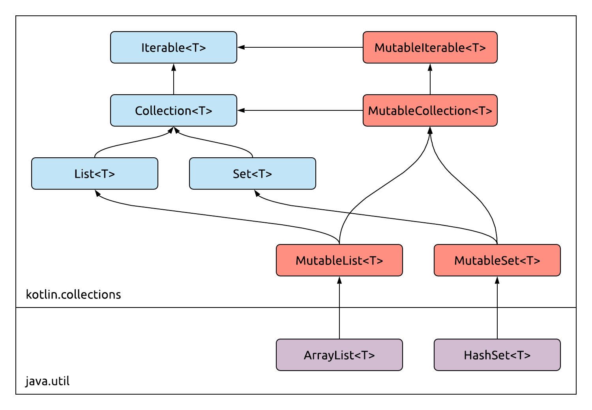
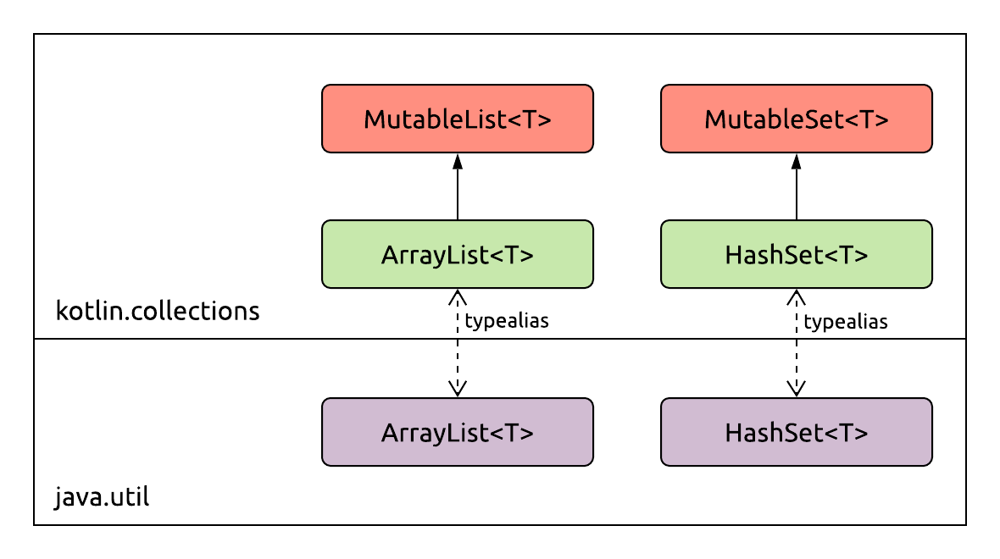

# Collections

Collections are a core part of programming. We keep track of our data by organizing it into lists, sets, maps, and other data structures. Then, we manipulate these structures in various ways: we look up, filter, group and transform their elements. We merge, intersect, and subtract their contents.

Kotlin improves on the collection handling in Java in two major ways:

- It defines its own, well-structured collection types, while still being fully interoperable with Java.
- The Standard Library provides you with an immense amount of easy-to-use, and powerful collection operations.

Let's see how these are achieved.

### Collection types

While you can use all the collection types of the JDK directly when working in Kotlin, it is discouraged. Kotlin's original and primary target *is* the JVM, but there is a huge push by JetBrains to make it [multiplatform](https://kotlinlang.org/docs/reference/multiplatform.html), and support JS and Native as well.

For (mostly) this reason, Kotlin introduces its own collection interfaces, which are independent of the platform you're running on. If you're using Kotlin on the JVM, the implementations of any collections you're using will still be the original JDK classes, e.g. `java.util.ArrayList` or `java.util.HashSet`. These are not reimplemented by the Kotlin standard library, which has some great benefits:

- These are well-tested, performant implementations, which are maintained anyway.
- Using the exact same classes makes interop with Java a breeze, as you can pass instances of them back and forth without having to perform conversions or mapping of any kind.

All Kotlin does is introduce its own collection semantics  _over_ these existing implementations, in the form of the standard library interfaces. A small bit of [compiler magic](https://kotlinlang.org/docs/reference/java-interop.html#mapped-types) makes it so that these interfaces are implemented by the existing JDK classes as well.

Take the example of lists - a dynamically resizable, ordered collection. In Java, there is a [`java.util.List`](https://docs.oracle.com/javase/8/docs/api/java/util/List.html) interface which defines what all lists should be capable of doing, and how they are to be used. Most of the time when we need a list, we create [`java.util.ArrayList`](https://docs.oracle.com/javase/8/docs/api/java/util/ArrayList.html) instances without thinking twice about it. Many times we also require `ArrayList<Whatever>` instances as function parameters, and returns `ArrayList<Something>` types, even though being backed by an array is just an implementation detail of the list, which we rarely use.

Kotlin introduces two interfaces for each type of collection. A read-only interface, and a mutable (read-write) interface. For lists, there's [`List`](https://kotlinlang.org/api/latest/jvm/stdlib/kotlin.collections/-list/index.html) and [`MutableList`](https://kotlinlang.org/api/latest/jvm/stdlib/kotlin.collections/-mutable-list/index.html).

`List` defines just a few basic properties and methods: `size`, `isEmpty`, `contains`, `iterator`, `get`, and the like. Notably, none of the methods defined in this interface allow you to change the contents of the list. All of the mutating methods are defined in `MutableList`, which extends `List`. This has methods such as `add`, `remove`,  or `clear`.

Thanks to the aforementioned compiler magic ([mapped types](https://kotlinlang.org/docs/reference/java-interop.html#mapped-types)), existing Java collections implement these Kotlin interfaces. A `java.util.ArrayList` *is a* `MutableList`, and a `java.util.HashSet` *is a* `MutableSet`. This eases interoperability tremendously. Imagine having to convert collection types every time you cross the language boundaries.



You should use these interfaces by default in your code instead of concrete implementation types, especially in public API:

- In the case of function parameters, this lets clients provide the function with whatever implementation of the collection they wish to give you. If your function can operate on anything that's a `List`, you should ask for just that interface - no reason to require an `ArrayList` or `LinkedList` specifically.
- If this is a return type, using these interfaces lets you change the specific implementation that you create internally in the future, without breaking client code. You can promise to just return a `MutableList` of things, and what implementation backs that list is not exposed to your clients.

If you write your code in a way such that it only relies on types defined in the Kotlin Standard Library, that code will be easily usable for non-JVM targets. If you reference `kotlin.MutableList` in your imports, that can immediately compile to JavaScript or Native, because there's a Kotlin standard library implementation of that interface on each platform. Whether that maps to an existing class directly (which is what happens on the JVM most of the time), wraps an existing class somehow, or is implemented for Kotlin from scratch, again, doesn't have to concern you. But if you refer to `java.util.TreeSet` in your code, that won't fly for the non-JVM targets, as the Java platform classes won't be available there.

Can you still use classes such as `java.util.ArrayList` directly, if you're running your code on the JVM? Of course.

- If you don't see your code going multiplatform at some point, using Java collections directly is perfectly okay.
- If you need a specific implementation for a `List` or a `Set` for performance reasons, sometimes you'll have to use the Java classes directly.

Interestingly, in recent releases of Kotlin, these specific types of implementations (such as an array based list) are wrapped under standard library typealiases too, so that they're platform independent by default: see [`kotlin.collections.ArrayList`](https://kotlinlang.org/api/latest/jvm/stdlib/kotlin.collections/-array-list/index.html) or [`kotlin.collections.HashSet`](https://kotlinlang.org/api/latest/jvm/stdlib/kotlin.collections/-hash-set/index.html) for examples of this. These Kotlin-defined types will usually show up first in IntelliJ completion, so you'll find yourself being pushed towards using them instead of the Java imports wherever possible. The same thing goes for most exceptions, e.g. [`IllegalArgumentException`](https://kotlinlang.org/api/latest/jvm/stdlib/kotlin/-illegal-argument-exception/index.html).



#### Creating collections

If you don't need a specific implementation of a certain type of collection, you can use the factory methods of the standard library to create them, such as `listOf`, `mapOf`, `mutableListOf`, `mutableMapOf`, and so on.

In the case of lists, this is super simple - you just provide the list of items that make up the list (in the case of a mutable one, the initial contents). All of these functions are generic, and they take a variable number of arguments:

```kotlin
val list1: List<Int> = listOf(1, 2, 3)
val list2: MutableList<Int> = mutableListOf(1, 2, 3)
val list3: List<Any> = listOf(1, "two", 3.0)
```

The types for these declarations are added for educational purposes - normally, they can just be inferred. Note how mixing types with no common supertype will yield a `List<Any>` in the last example.

A slightly more interesting endeavour is creating maps using factory functions. Here's a map of player names to scores being created:

```kotlin
val scores = mutableMapOf(
        "Jim" to 24,
        "Claire" to 20,
        "Amanda" to 30
)
```

This syntax seems quite magical. `to` looks like a special keyword which is to be used for creating a `Map` entry. However, nothing in this piece of code is magic. Here's the signature of the `mutableMapOf` function:

```kotlin
public fun <K, V> mutableMapOf(vararg pairs: Pair<K, V>): MutableMap<K, V>
```

As you can see, it just takes a variable number (`vararg`) of `Pair` instances.

>[`Pair`](https://kotlinlang.org/api/latest/jvm/stdlib/kotlin/-pair/index.html) and [`Triple`](https://kotlinlang.org/api/latest/jvm/stdlib/kotlin/-triple/index.html) are the only "tuple" types in Kotlin, and they're part of the standard library. The language doesn't support tuples, as data classes can easily serve the role of tuples, and they come with well-named values.

The syntax `"foo" to 5` actually creates a `Pair<String, Int>`. It turns out that [`to`](https://kotlinlang.org/api/latest/jvm/stdlib/kotlin/to.html) is nothing but a function:

```kotlin
public infix fun <A, B> A.to(that: B): Pair<A, B> = Pair(this, that)
```

The `infix` modifier on a function - which can either be a member or an extension, and has to take a single parameter - allows that function to be called with an operator-like syntax, dropping the `.()` symbols from its call site.

To sum up: using these factory functions for collections keeps your code more generic, and independent of the concrete underlying implementations. You don't know what specific class the standard library `mutableListOf` function will create for you - and you shouldn't care. All you need to know is that it will be an object that satisfies the contract of the `MutableList` interface.

#### A note on immutability

Like with `var` and `val`, you'll often see that official recommendations, the IDE itself, and the standard library APIs are pushing you towards the less mutable, read-only variants of these interfaces. You should always choose these by default until you actually do need mutability.

Kotlin's read only collection interfaces are not to be confused with truly immutable collections. Even though you might have a read-only view of a collection through a read-only interface, someone else might still have a reference to it as a more concrete, potentially mutable type. Immutable collections for Kotlin are currently [a work in progress](https://github.com/Kotlin/kotlinx.collections.immutable/blob/master/proposal.md).

>This is especially true when interoperating with Java code. Whether you're giving a `List` or a `MutableList` to a Java client, they'll see it as a `java.util.List`, and see all the mutating methods on that interface. Malicious Kotlin clients can also easily attempt to cast a `List` given to them as a `MutableList`, and then modify its contents.

### Arrays

Arrays are fixed-size, ordered containers. Their contents are contiguous in memory, which yields _O(1)_ access to an element at any index, as well as very fast and efficient iteration for arrays of primitives. They are a rather special type in Java, which also affects their design and API in Kotlin. 

Arrays for reference types are represented by the `Array` class in Kotlin. For a Java `String[]`, we can create an `Array<String>` in Kotlin. How? With factory functions, of course.

```kotlin
val colours: Array<String> = arrayOf("green", "yellow", "purple")
```

What about non-reference types? We don't have the distinction between primitives and boxed types for basic types such as `Int` in Kotlin. What happens when we create an array of those?

```kotlin
val primes: Array<Int> = arrayOf(2, 3, 5, 7, 11, 13, 17, 19)
```

We end up with an `Array` all the same, which, with the `Int` type parameter, is the equivalent of an `Integer[]`. This means boxing, as well as no fast iteration due to the indirection of storing just the references to the values in the array, instead of the actual values themselves.

For each of the primitive types, Kotlin has special array types: `IntArray`, `DoubleArray`, and so on. These come with their own factory methods:

```kotlin
val primes: IntArray = intArrayOf(2, 3, 5, 7, 11, 13, 17, 19)
```

These are the equivalents of primitive arrays such as `int[]`.

##### More, different ways of creating arrays

There are a couple more notable ways of creating arrays quickly, without having to list all of the initial elements. One of them is the following `Array` constructor:

```kotlin
public inline constructor(size: Int, init: (Int) -> T)
```

This takes the size of the array to create, and then a lambda, which will create the element of the array for the given index. For example, if we wanted an array that contained the numbers 0 to 99, as strings:

```kotlin
val numbers: Array<String> = Array(100) { i -> i.toString() }
```

Why can't you initialize the array just with a size? You can certainly do so in Java:

```java
String[] strings = new String[200];
```

An array like that contains all `null` values in Java when created. This can't be done for an `Array<String>` in Kotlin. It's guaranteed that all of its elements are non-null `String` instances! On the other hand, you can create an `Array<String?>` very quickly, using `arrayOfNulls`:

```kotlin
val strings: Array<String?> = arrayOfNulls(200)
```

>Note the difference between `Array<String?>` and `Array<String>?`. In the former case, you definitely have an `Array` reference, and any of its elements may be `null`. With the latter, you may or may not have an `Array` reference, but if you do, it contains non-null `String` instances only. Of course, there's also `Array<String?>?`, which you can surely figure out from here.

There *is* one case where you can you allocate an array just by specifying its size - for primitive arrays. In this case, you can use a constructor that takes just a single parameter:

```kotlin
val x = IntArray(20)
```

All the elements of this array will be initialized to `0`.

##### vararg

You're seen `vararg` being used in the factory functions for various collections. When a parameter is marked with `vararg`, any number of values (including zero) can be passed in for that parameter. They will be collected into an array, which can then be iterated inside the function:

```kotlin
fun printAll(vararg words: String) {
    for (word in words) {
        println(word)
    }
}

printAll("Nitwit", "Blubber", "Oddment", "Tweak")
```

If you already have your values in an array, you can pass them in as separate values of a `vararg` parameter using the *spread operator* `*`:

```kotlin
val words = arrayOf("Nitwit", "Blubber", "Oddment", "Tweak")
printAll(*words, "Thank", "You")
```

You can even mix and match regular values and spread values inside the parameter list as you like. Note that the spread operator only works for arrays. It does not work on the - much more commonly used - `List` type.

### Collection processing

Perhaps nothing shows off the power of extensions, higher order functions, and inline functions more than the collection extensions of the Kotlin standard library.

>Note that a lot of these are available on the `Iterable` type, but we'll use lists in the examples for simplicity.

Take a common operation that you perform all the time with collections: filtering them based on some condition. In Java, when you need to filter for, say, words shorter than 5 characters from a list, this is the code you'd write:

```java
public List<String> filterShortWords(List<String> words) {
    List<String> result = new ArrayList<String>();
    for (String word : words) {
        if (word.length() < 5) {
            result.add(word);
        }
    }
    return result;
}
```

What if you had a list of numbers, and needed just the odd ones? You would do this:

```java
public List<Integer> filterOddNumbers(List<Integer> numbers) {
    List<Integer> result = new ArrayList<Integer>();
    for (Integer number : numbers) {
        if (number % 2 == 1) {
            result.add(number);
        }
    }
    return result;
}
```

This is tedious code to write, and every time someone reads it, they need to make sure that it does what it looks like it does on first glimpse. There could easily be a small unexpected detail somewhere in there.

With the Kotlin language features mentioned above, we can encapsulate all of this "filtering" logic into a higher order function. This function can receive both the list of elements and the boolean expression to evaluate on each of them to decide whether they'll be added to the list - in the form of a function:

```kotlin
inline fun <T> Iterable<T>.filter(predicate: (T) -> Boolean): List<T> {
    val result = mutableListOf<T>()
    for (element in this) {
        if (predicate(element)) {
            result.add(element)
        }
    }
    return result
}
```

This function can then be reused for all your filtering needs, without having to reimplement the filtering logic itself. All you need is the list of items and the rule for what to filter:

```kotlin
words.filter({ word: String -> word.length < 5 })
```

Remember, this lambda syntax can be simplified in several steps:

```kotlin
words.filter({ word -> word.length < 5 })
words.filter({ it.length < 5 })
words.filter { it.length < 5 }
```

>Note how the type of the lambda's parameter is now being inferred by the generic type parameter of the receiver collection, which is already known.

And if you now need to filter a list of numbers for the odd ones, this is all the code you'll write:

```kotlin
numbers.filter { it % 2 == 1 }
```

##### More examples

There are far too many functions similar to [`filter`](https://kotlinlang.org/api/latest/jvm/stdlib/kotlin.collections/filter.html) in the standard library to discuss them all, but here are a few more commonly used ones.

`forEach` is a simple alternative for a `for` loop. The lambda passed to it is invoked for each element:

```kotlin
val numbers = listOf(1, 2, 3, 4, 5)
numbers.forEach {
    println(it)
}
```

The [`map`](https://kotlinlang.org/api/latest/jvm/stdlib/kotlin.collections/map.html) function allows you to transform each element in your list into some other element. Given a list of `A`, the function receives a function of type `(A) -> B`, and gives you a list of `B`.

You can use this to double each value in a list, to convert the type of each value, or to extract a piece of data from a larger object:

```kotlin
val numbers = listOf(1, 2, 3, 4, 5, 6)
val doubled = numbers.map { it * 2 } // 2, 4, 6, 8, 10, 12
val doubles = numbers.map { it.toDouble() } // 1.0, 2.0, ...

val people: List<Person> = ...
val names: List<String> = people.map { it.name }
```

[`flatMap`](https://kotlinlang.org/api/latest/jvm/stdlib/kotlin.collections/flat-map.html) is a similar function, except it performs a transformation of `(A) -> List<B>`, and then concatenates all the lists returned for each element into a single, *flattened* `List<B>`:

```kotlin
val ints = listOf(1, 2, 3)

val result = ints.flatMap {
    val list = mutableListOf<Int>()
    for (i in 0 until it) {
        list.add(it)
    }
    list
}

println(result) // [1, 2, 2, 3, 3, 3]
```

[`any`](https://kotlinlang.org/api/latest/jvm/stdlib/kotlin.collections/any.html) tells you whether there's an element in the collection matching your predicate, while [`all`](https://kotlinlang.org/api/latest/jvm/stdlib/kotlin.sequences/all.html) tells you whether it's true for all of the elements:

```kotlin
val numbers = listOf(7, 2, 8, 3, 7, 1)
val allOdd = numbers.all { it % 2 == 1 } // false, fails at 2

val names = listOf("Jane", "Kyra", "Leah")
val anyK = names.any { it.startsWith("K") } // true, succeeds at Kyra
```

The real power of these operators becomes apparent when you start chaining them.  Let's take an example where we have a list of words and want to find the length of the first one that would be sorted after the word "kite" alphabetically, and has no more than 4 letters. Contrived, but not _too_ contrived.

Here's the chain of operations we'd need to perform:

```kotlin
val words = listOf("camel", "pizza", "mug", "box", "shirt")

val result = words
        .filter { it > "kite" }     // the ones after "kite"
        .map { it.length }          // the length of those
        .filter { it <= 4 }         // the ones with <= 4 length
        .first()                    // the first one of these
```

>[`first`](https://kotlinlang.org/api/latest/jvm/stdlib/kotlin.collections/first.html) will throw an exception if there's no first element. [`firstOrNull`](https://kotlinlang.org/api/latest/jvm/stdlib/kotlin.collections/first-or-null.html) would be a no-exception alternative to use.

### Sequences

Chaining collections can get expensive if your collections are very large, or you're performing lots of operations on them. The collections on iterables and lists are evaluated eagerly, meaning that for each step of the chain, a new list is allocated (for the output), the input is processed, filling the output list, and then that list is returned. This means that each step of the way, an intermediate list is created, only to be thrown away once it's processed as the input of the next step.

This isn't necessarily an issue. Garbage collectors are quite good at getting rid of short-lived objects in memory. However, there are situations where another way of processing data comes in handy. Enter Kotlin's `Sequence` type.

The definition of `Sequence` is incredibly simple:

```kotlin
public interface Sequence<T> {
    public operator fun iterator(): Iterator<T>
}
```

>You might have noticed that there are a lot of explicit `public` visibility modifiers in the Standard Library. This is [an official recommendation](https://kotlinlang.org/docs/reference/coding-conventions.html#coding-conventions-for-libraries) and best practice for library authors: mark your public API explicitly `public`.

To transform a regular collection to a sequence, just use `asSequence`:

```kotlin
val wordSequence: Sequence<String> = words.asSequence()
```

Nearly all the operations available for `Iterable` or `List` are available on the `Sequence` type as well. The difference is in how they are implemented. Operations on sequences are *lazy*, meaning they're only evaluated when their result is required. `map`, `filter`, and similar operations don't return materialized, already computed results. Instead, they just return a new sequence, which represents that transformed state of the data:

```kotlin
val wordSequence: Sequence<Int> = words.asSequence()
        .filter { it > "kite" }     // the ones after "kite"
        .map { it.length }          // the length of those
        .filter { it <= 4 }         // the ones with <= 4 length
```

This code, so far, processes no data. It just prepares a pipeline of sorts, which is waiting to be executed. A `Sequence` will process its data when we use a *terminal operator* on it. These have return types which require the existence of the actual, processed, materialized result of the operations. Examples of this would be [`first`](https://kotlinlang.org/api/latest/jvm/stdlib/kotlin.sequences/first.html) or [`toList`](https://kotlinlang.org/api/latest/jvm/stdlib/kotlin.sequences/to-list.html):

```kotlin
val words = listOf("camel", "pizza", "mug", "box", "shirt")
val wordSequence: Int = words.asSequence()
        .filter { it > "kite" }     // the ones after "kite"
        .map { it.length }          // the length of those
        .filter { it <= 4 }         // the ones with <= 4 length
        .first()
```

When running the words through this sequence, the processing happens word-by-word instead of operation-by-operation.

- `"camel"` is tested in the first filter, and it doesn't pass.
- `"pizza"` passes the first filter, gets mapped to `5`, and doesn't pass the second filter.
- `"mug"` passes the first filter, gets mapped to `3`, passes the second filter, and is selected as the first element. The `first` operator returns, and no more words are processed!

Hopefully you have a feel for how lazy processing can avoid unnecessary work and intermediate collections in many cases. For a great visualization of how sequence processing happens, [read this article](https://typealias.com/guides/kotlin-sequences-illustrated-guide/).

So... When should you use sequences instead of regular collections? Well, you should consider them if you are processing large amounts of data, and if you have lots of operations. How large the data and how numerous the operations have to be for sequences to be more performant or more efficient is very hard to tell. The only way to make a smart decision is to benchmark your concrete use case with real amounts of data, and see whether it's worth it.

##### Infinite sequences

There is one thing that sequences are uniquely capable of, thanks to their lazy nature. They can represent infinite sequences of data.

For example, the [`generateSequence`](https://kotlinlang.org/api/latest/jvm/stdlib/kotlin.sequences/generate-sequence.html) function can receive an initial seed value and a function that can produce the next element of the sequence based on the previous one. Here's a simple piece of code that prints the first 20 powers of two:

```kotlin
generateSequence(1, { x -> x * 2 })
        .take(20)
        .forEach(::println)
```

>Note the use of a method reference used with the `forEach` function. Sometimes lambdas are not the most convenient or most efficient way of using collection extensions.

# Summary

Kotlin't collection APIs make a distinction between read-only and mutable types, as part of the language's push towards less mutability. One of the strengths of Kotlin is its extensive collection processing API, which eliminates the need to perform many common collection related tasks manually. Sequences offer lazy computations, which can come with great performance benefits in the right situation.

# Sources

- [Kotlin Sequences: An Illustrated Guide](https://typealias.com/guides/kotlin-sequences-illustrated-guide/)
- [When to Use Sequences](https://typealias.com/guides/when-to-use-sequences/)
- [Inside Sequences: Create Your Own Sequence Operations](https://typealias.com/guides/inside-kotlin-sequences/)
- Official documentation:
  - [Collections Overview](https://kotlinlang.org/docs/reference/collections-overview.html)
  - [Constructing Collections](https://kotlinlang.org/docs/reference/constructing-collections.html)
  - [Collection operations](https://kotlinlang.org/docs/reference/collection-operations.html)
  - [Sequences](https://kotlinlang.org/docs/reference/sequences.html)