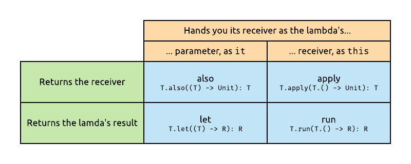

# Chapter 6: Functions, Functions, Functions!

We've covered Kotlin's first-class support for functions and function types before. Now, let's dive even deeper into some of its capabilities related to functions.

### Local functions

We've seen that we can have functions that exist outside of classes, as top level declarations in a file. Functions can also exist in very small scopes: within another function. This can come in handy for quick helper functions that wouldn't be used anywhere else in the application.

For example, let's say you have to populate a details screen such as this one:


Here's the corresponding data class, which can contain the value of each field:

```kotlin
class FormData(
        val name: String?,
        val role: String?,
        val address: String?
)
```

The business rule is that for any fields that are missing a value, both the title and the value field should be hidden. Instead of writing this logic over and over for each field, you can extract it into a local function, which will only be in scope within the enclosing function:

```kotlin
private fun updateFormData(formData: FormData) {
    fun setTextAndVisibility(title: Text, content: Text, text: String?) {
        val shouldBeVisible = text.isNullOrBlank().not()
        title.isVisible = shouldBeVisible
        content.isVisible = shouldBeVisible
        content.text = text
    }

    setTextAndVisibility(nameTitle, nameContent, formData.name)
    setTextAndVisibility(roleTitle, roleContent, formData.role)
    setTextAndVisibility(addressTitle, addressContent, formData.address)
}
```

>[`isNullOrBlank`](https://kotlinlang.org/api/latest/jvm/stdlib/kotlin.text/is-null-or-blank.html) is one of the many handy `String` extensions from the Kotlin standard library.

Note that this function also has access to the parameters of the enclosing function - it acts as a closure.

### Function literals with receivers

As stated before, Kotlin doesn't claim to have original features. Almost everything it does has been done in other languages before - though Kotlin does often improve on syntax and cohesion.

One feature that Kotlin does claim to have introduced itself is function literals with receivers (or lambdas with receivers). This a powerful combination of two features that we've looked at before: lambdas and extension functions.

Not only can a function type in Kotlin have parameters and a return type, it can also have a *receiver*. For example, take the following, simple extension function:

```kotlin
fun String.lastChar(): Char {
    return this[this.length - 1]
}
```

If we create a reference to this, and assign it to a variable, we can type it like so:

```kotlin
val ref: String.() -> Char = String::lastChar
```

>Notice that an extension function on a type can be referenced with the `::` syntax, just like any real member of that type.

Similarly to how `String.` preceded the function name at its declaration to indicate that it's an extension on the `String` type, when declaring a function type that's an extension, the same `String.` syntax can show up before the parentheses of the parameter list.

Next, we'll look at two examples of higher order functions which make excellent use of this feature.

#### The StringBuilder example

First, let's take a look at an example that showcases that we can be placed in the scope of *any* object with such a lambda, even ones that we don't create or own.

`StringBuilder` is a well-known class from Java that allows us to assemble strings from pieces without having to create many intermediate `String` instances, which would then be thrown away. The basic usage of its API looks like this:

```kotlin
val builder = StringBuilder()
builder.append("Little Timmy is ")
builder.append(age)
builder.append(" years old today")
val result = builder.toString()
println(result)
```

There's a pattern here, which is repeated every time a `StringBuilder` is used. It's created, a set of actions are performed on it (various `append` calls), and finally, we call `toString` on it, to fetch the `String` that we've built. Let's extract this to a higher order function, using lambdas with receivers:

```kotlin
inline fun buildString(actions: StringBuilder.() -> Unit): String {
    val builder = StringBuilder()
    builder.actions()
    return builder.toString()
}
```

This function receives a lambda as a parameter, which itself *is an extension on `StringBuilder`*. This is practically the same as a lambda that receives a `StringBuilder` as a parameter, it just takes the reference as its *receiver* instead - the point is, that it can operate on it. Inside `buildString`, an instance of a builder is allocated, the `actions` are performed *on* it - which can be done, as `actions` is an extension on `StringBuilder` -  and finally, the result is extracted and returned.

The real magic, however, happens on the call site, which looks like this:

```kotlin
val result = buildString {
    this.append("Little Timmy is ")
    append(age)
    append(" years old today")
}
println(result)
```

Within the curly braces defining the lambda that we're passing in to `buildString`, we are in the body of an extension on the `StringBuilder` type. This means that `this` refers to *some instance* of a `StringBuilder` (in this case, the one being created inside the `buildString` function). Methods on `StringBuilder` can also be called without a qualifier in front of them, as if we were within the body of that class.

>It's important to see that we are defining an extension function on `StringBuilder` because that's what the `buildString` function requires as a parameter. When we pass this parameter in, we don't know what `StringBuilder` instance this lambda will be called on, how many times, or at what time.

This, being able to "set the scope" of a lambda to any object so that it can operate *on* it, is an immensely powerful language feature, and we'll see it widely used for various purposes.

#### The database example

Another classic example of using a function literal with a receiver, as well as some other functional language features, is that of a database transaction (as presented [by Jake Wharton in this talk](https://youtu.be/A2LukgT2mKc?t=1463)). Let's say we have the following database interface:

```kotlin
interface Database {
    fun beginTransaction()
    fun commitTransaction()
    fun rollbackTransaction()
    fun insert(item: Int)
    fun delete(item: Int)
}
```

We'll assume that `insert` and `delete` might throw exceptions if the item being inserted already exists, or if there's nothing to delete. Clearly, based on this API, every modification will have to happen inside a transaction, which has to be started with `beginTransaction`, and then either cancelled with `rollbackTransaction` in the case of an error, or finished with `commitTransaction` if everything went well.

So basic usage when we need to interact with this database might look like this:

```kotlin
db.beginTransaction()
try {
    db.insert(11)
    db.delete(12)
    db.commitTransaction()
} catch (e: IllegalStateException) {
    db.rollbackTransaction()
}
```

We'd ideally want to focus on just the one tiny bit of code in the middle that matters to us from the example above - the insert and delete operations. Everything else is just boilerplate we'll repeat every time we touch the database. We can easily introduce a higher order function that takes care of all the ceremony of handling transactions and exceptions for us:

```kotlin
fun inTransaction(db: Database, block: () -> Unit) {
    db.beginTransaction()
    try {
        block()
        db.commitTransaction()
    } catch (e: IllegalStateException) {
        db.rollbackTransaction()
    }
}
```

Notice how we're passing in a lambda that will be executed by the function when we're inside a transaction. We can now use this function as clients, by passing in our two operations in a lambda:

```kotlin
inTransaction(db) {
    db.insert(11)
    db.delete(12)
}
```

We have extension functions! Let's make this function an extension on `Database`, to make the call site even nicer.

```kotlin
fun Database.inTransaction(block: () -> Unit) {
    beginTransaction()
    try {
        block()
        commitTransaction()
    } catch (e: IllegalStateException) {
        rollbackTransaction()
    }
}

db.inTransaction {
    db.insert(11)
    db.delete(12)
}
```

Now, let's make the lambda we're passing in take the `Database` as a parameter, so that we can make sure that our block of code operates on the same instance that we've started the transaction on. 

```kotlin
fun Database.inTransaction(block: (Database) -> Unit) {
    beginTransaction()
    try {
        block(this)
        commitTransaction()
    } catch (e: IllegalStateException) {
        rollbackTransaction()
    }
}
```

We now get the `Database` in our lambda as the single parameter, which means that it can be referred to as `it` by default.

```kotlin
db.inTransaction {
    it.insert(11)
    it.delete(12)
}
```

Now, to put our newly acquired knowledge of lambdas with receivers to work, it's time for another improvement. Even better than giving the lambda supplied by our clients a `Database` as as parameter, we can *put them in the scope of the `Database`* that they'll operate on, by making the lambda parameter an extension on that type.

```kotlin
fun Database.inTransaction(block: Database.() -> Unit) {
    beginTransaction()
    try {
        this.block() // or just block()
        commitTransaction()
    } catch (e: IllegalStateException) {
        rollbackTransaction()
    }
}
```

With that, the call site is as clean as can be - inside the braces, we're writing code as if we were in the `Database` class. We're also still in a transaction.

```kotlin
db.inTransaction {
    insert(11)
    delete(12)
}
```

Of course, we mustn't forget performance. Passing in a lambda would mean an object allocation, which we can avoid by making the method `inline`:

```kotlin
inline fun Database.inTransaction(block: Database.() -> Unit) {
    beginTransaction()
    try {
        block()
        commitTransaction()
    } catch (e: IllegalStateException) {
        rollbackTransaction()
    }
}
```

Having the code handling transactions and performing the try-catch inlined will result in bytecode that's the same as if we've written these structures around our database operations everywhere in our codebase where we perform them. However, at the source level, we don't have to implement it over and over again. We've abstracted the logic for it out into a function, and we did this, yet again, *for free*.

### Tail recursion

We know that anything that can be solved iteratively can also be solved with recursion, and vice versa. Many problems lend themselves to the recursive approach, calculating factorials being one of them. The trivial recursive implementation of factorial looks like this:

```kotlin
fun fact(n: Int): Int {
    if (n == 0) 
        return 1
    return n * fact(n - 1)
}
```

This function works well enough - ignoring the upper limits of the `Int` type for the sake of this section - but it builds a call stack which is as deep as the parameter that was passed in. Why is this call stack maintained? Because when the last function in the stack returns `1`, each level of the stack has to be visited backwards, so they can multiply the result so far with their own `n` value, before returning it.

There's another way to implement this same recursion, using an accumulator variable, `res`, which we'll expect clients to set to `1` initially. Inside the function, if we've reached the end of the recursion, we return whatever value is in `res`. Otherwise, we go a level deeper, decrementing `n`, and performing the multiplication on `res`.

```kotlin
fun fact(n: Int, res: Int): Int {
    if (n == 0)
        return res
    return fact(n - 1, res * n)
}
```

This means that instead of doing the multiplication going upwards, while unwinding the stack, we're instead performing it on the way down to the bottom. When we reach the end, we already have our final value computed. At this point, all the intermediate steps of walking through the stack are basically useless. Nothing happens in those intermediate functions anymore, they all just return what they've received from a level down. We don't really need the stack here.

This is a well-known pattern, called *tail recursion*. A function is tail-recursive if all of its recursive calls to itself are the very last call in the function (in a given execution branch, that is), and if the result of that recursive call is returned *as-is*, without any additional operations being performed.

In such functions, the recursive calls and the stack building can actually be optimized away, so that the recursion is replaced with an iterative solution *at compile time*. The trick is simple: instead of performing a recursive call at the tail of the function, simply rewrite the values of the function's parameter with those values that are in the recursive call's parameter list, and then jump back to the beginning of the function to execute it again! This is semantically the same as performing the recursive call, but doesn't deepen the stack.

Some compilers do this themselves when they notice that a function is tail recursive. Kotlin, however, chooses to be explicit about this. You have to mark your function with the `tailrec` keyword for the optimization to kick in:

```kotlin
tailrec fun fact(n: Int, res: Int): Int {
    if (n == 0)
        return res
    return fact(n - 1, res * n)
}
```

[Why?](https://stackoverflow.com/q/51638557/4465208) Well, mostly to make sure that whatever you want optimized is truly eligible for the optimization. If you mark a function that's not truly tail recursive with the keyword, you'll get a compilation error.

This recursive implementation comes with the downside of requiring callers to pass in an extra `1` as a parameter, which is a bit odd. This can be easily fixed by adding a one-parameter helper function, which clients should use (the recursive function could then be marked `private`):

```kotlin
fun fact(n: Int) = fact(n, 1)
```

### The standard library's scoping functions

The standard library contains a small suite of very simple functions that perform basic "scoping" operations, using features we've learned about: higher order functions and function literals with receivers.

These are used so frequently in Kotlin that they are often seen as language features - but it's important to see that these are not special whatsoever, and you could implement any of them in a second. They, as many other constructs in the language, are just *functions*.

#### The `let` function

One of the simplest of these is [`let`](https://kotlinlang.org/api/latest/jvm/stdlib/kotlin/let.html). `let` is defined as an extension on a generic `T` type, so you can invoke it on anything. It takes a lambda as its parameter, which has to accept the same `T` type, and can return any `R` type.

This all sounds very abstract, so let's just take a look at the implementation:

```kotlin
public inline fun <T, R> T.let(block: (T) -> R): R {
    return block(this)
}
```

So what does `let` do, in simple terms? It executes the piece of code you pass to it (usually as a lambda). Your lambda will be called with the receiver of `let` as its parameter. Whatever you return from the lambda will also be the return value of the `let` call. 

Take this example:

```kotlin
val length = File("./README.md").let {
    println(it.name)
    println(it.absoluteFile)
    println(it.length())
    it.length()
}
```

Inside the lambda, `it` will refer to the `File` instance, as that's what you've called it *on* - that's the receiver of `let`. The last expression of the lambda will be the return value of the entire `let` call.

>Remember the [`map`](https://kotlinlang.org/api/latest/jvm/stdlib/kotlin.collections/map.html) function? You can think of `let` as a `map` operation on a single element.

You can use `let` instead of creating a local variable to introduce a temporary name for an object, if you give the lambda's incoming parameter an explicit name. Take a look at this usage of `let`:

```kotlin
File("./README.md").let { file ->
    println(file.name)
    println(file.length())
    println(file.absoluteFile)
}
```

Since `let` is `inline`, this is exactly equivalent* to the following code, which creates a regular local variable, with no extra cost at runtime (no actual lambda allocation, for example).

**except `let` contains the variable in its own scope*

```kotlin
val file = File("./README.md")
println(file.name)
println(file.length())
println(file.absoluteFile)
```

A popular use case for `let` is using it to perform `null` checks. Since there's a function invocation (not really, due to inlining, but semantically and on the source level) right before the actions are executed on the receiver of `let`, a safe call can be injected here:

```kotlin
val someFile: File? = ...
someFile?.let { file: File ->
    println(file.name)
}
```

If `someFile` happens to be `null`, the function call `let` will simply not be invoked by the safe call operator. If it *is* invoked, we get the receiver inside the lambda with a non-null type. This makes sense: if it *was* null, the lambda wouldn't be executing in the first place. This is a `null` check, which conditionally executes the code inside the lambda that we've passed in!

This `null` check is a versatile one. It can, for example, be used in the situation of dealing with a nullable, class level property which is declared as a `var`. We've seen before that these can not be null checked and smart cast by regular means:

```kotlin
private var timer: AnimationTimer? = null

override fun start(primaryStage: Stage) {
    if (timer != null) {
        timer.stop()
        // ^ This line doesn't compile!
    }
}
```

The issue was that the value of `timer` was being read again inside the body of the `if` statement, and it might have a new value by that time, which might be `null`.

This isn't an issue for the `?.let {}` idiom, however. Take the following code:

```kotlin
private var timer: AnimationTimer? = null

override fun start(primaryStage: Stage) {
    timer?.let {
        it.stop()
    }
}
```

If `timer` is not `null`, its current value is passed into the `let` function and then back into the lambda as a parameter. If the value of the property changes in the meantime, that change won't be reflected in the reference that the lambda receives - that reference is held onto as a parameter value, and can not change.

The `let` call here is equivalent to this longer, more manual solution:

```kotlin
private var timer: AnimationTimer? = null

override fun start(primaryStage: Stage) {
   val t = timer
   if (t != null) {
       t.stop()
   }
}
```

In essence, we are using `let` to very concisely create this local, temporary copy of the reference that's stored in the property.

#### The `apply` function

Along with `let`, [`apply`](https://kotlinlang.org/api/latest/jvm/stdlib/kotlin/apply.html) is one of the most used scoping functions in Kotlin.

It can be called on any generic type, and it takes a lambda as its parameter. This lambda is an extension on the object that `apply` was called on, and `apply` invokes it on that object. The lambda is *applied* to the object. Finally, `apply` returns the original object. 

Here's its implementation:

```kotlin
public inline fun <T> T.apply(block: T.() -> Unit): T {
    this.block()
    return this
}
```

Let's see a real-life use case. Take a `Rectangle` class, which only has a no-param constructor. If you want to create an instance and initialize it, you'll end up writing code like this:

```kotlin
val rect = Rectangle()
rect.x = 8.0
rect.y = 9.0
rect.width = 100.0
rect.height = 200.0
```

Using `apply`, you can move your code *in the scope of* that `Rectangle`, as its parameter will be an extension on the `Rectangle` type. This lets you be a lot more concise with these assignments:

```kotlin
val rect = Rectangle().apply {
    x = 8.0
    y = 9.0
    width = 100.0
    height = 200.0
}
```

Remember our earlier `buildString` implementation?

```kotlin
inline fun buildString(actions: StringBuilder.() -> Unit): String {
    val builder = StringBuilder()
    builder.actions()
    return builder.toString()
}
```

We can now rewrite this using `apply`, to avoid having to create a local variable:

```kotlin
inline fun buildString(builderAction: StringBuilder.() -> Unit): String =
    StringBuilder().apply(builderAction).toString()
```

>The [`buildString`](https://kotlinlang.org/api/latest/jvm/stdlib/kotlin.text/build-string.html) function is actually part of the Standard Library, with this exact implementation.

This is all that `apply` does: it executes an extension on its receiver, and then returns the original object. It's a quick way to open a lambda into the scope of an object.

#### Also, run.

There are two more extensions that are more rarely used variations on these previous two.

[`also`](https://kotlinlang.org/api/latest/jvm/stdlib/kotlin/also.html) gives you its receiver as a parameter inside the lambda (just like `let`), but instead of returning the result of the lambda, it returns its receiver.

```kotlin
public inline fun <T> T.also(block: (T) -> Unit): T {
    block(this)
    return this
}
```

[`run`](https://kotlinlang.org/api/latest/jvm/stdlib/kotlin/run.html) takes an extension as its parameter and runs it on its receiver (just like `apply`), but instead of returning its receiver, it returns the result of the lambda.

```kotlin
public inline fun <T, R> T.run(block: T.() -> R): R {
    return block()
}
```

Here's a handy chart to sum it all up:



The [`with`](https://kotlinlang.org/api/latest/jvm/stdlib/kotlin/with.html) function deserves an honourable mention. It's just like `run`, but instead of being an extension, it's a regular function that takes its "receiver" as the first parameter.

#### The `use` function

An excellent example of just how powerful Kotlin's features surrounding functions are is its [`use`](https://kotlinlang.org/api/latest/jvm/stdlib/kotlin.io/use.html) function. This functions is the equivalent to the try-with-resources construct in Java, which automatically closes a given resource when the end of its block is reached:

```java
try (PrintWriter writer = new PrintWriter(new File("test.txt"))) {
    writer.println("Hello World");
}
```

In Kotlin, we can replace this with a call to a higher order function:

```kotlin
PrintWriter(File("test.txt")).use { writer -> 
    writer.println("Hello World") 
}
```

Here's a very simplified version of the `use` function's implementation, to give you an idea of how it works (the real one has a lot more error handling):

```kotlin
public inline fun <T : Closeable?, R> T.use(block: (T) -> R): R {
    try {
        return block(this)
    } catch (e: Throwable) {
        throw e
    } finally {
        close()
    }
}
```

# Summary

Kotlin has even more to offer when it comes to functions than what we've seen before. It has functions in many scopes: top level, member, and even local functions.

One of its most powerful functional features is *function literals with receivers*, which allows you to place the caller of your function into the scope of a specific object when they're defining a lambda.

The standard library offers several scoping functions (building on lambdas with receivers, as well as higher order functions in general) that make simple, everyday tasks easier.

# Sources

- Official documentation:
  - [Local functions](https://kotlinlang.org/docs/reference/functions.html#local-functions)
  - [Function literals with receiver](https://kotlinlang.org/docs/reference/lambdas.html#function-literals-with-receiver)
  - [Scope Functions](https://kotlinlang.org/docs/reference/scope-functions.html)