# Chapter 9: Type System and Generics

Thanks to Kotlin's strong typing, we rely on its type system to write safe code every time we're using the language. Now it's time to examine this type system, get familiar with its special types, and learn about its mechanisms in detail. Then, we'll move on to the topic of generics, which we've also touched on before, but haven't discussed its intricacies yet.

## A closer look at the type system

>This discussion of the type system is based in part on [this original article](https://www.kotlindevelopment.com/typical-kotlin/).

First things first, what exactly is a *type*? Types are what let us - and the compiler - define expectations for any given object. What properties and methods can be called on it, where it can be passed as a parameter, where it can be assigned.

Every variable, property, parameter, and expression has a type in Kotlin at compile time - this static typing is what guarantees that, for example, no calls are made to non-existent functions. This eliminates a whole class of possible runtime errors that might occur in dynamically typed languages.

It's important to note that types are **not** equivalent to classes. We are creating new types every time we declare a class, interface, object, or typealias (going forward, we'll stick mostly to just classes for simplicity). In fact, in all of these cases, we're creating multiple new types with these declarations. Let's take just the case of a boring, empty class:

```kotlin
class Hello
```

By defining this class, we've already created the `Hello` and `Hello?` types. These are separate and very different types, as the compiler forces us to explicitly handle the possible nullability of a `Hello?` in the form of null checks, while letting us use a `Hello` relatively freely in comparison, since it knows it's always safe to do so.

Creating a class with a type parameter introduces yet more types:

```kotlin
class List<T>
```

In fact, this unbounded `T` type parameter introduces infinitely many types. Some of these would be `List<String>`, `List<String>?`, `List<String?>`, `List<String?>?`, `List<List<Int>>`, `List<in String>`, `List<*>`... Just to mention a few. (Don't worry, we'll take a look at what all of these are later in this chapter!)

### The `Any` type

Just like classes, types exist in a hierarchy. We'll put aside nullable types for a moment, and look at just the hierarchy of non-nullable types. This looks essentially the same as the hierarchy formed by the respective classes that create these types.

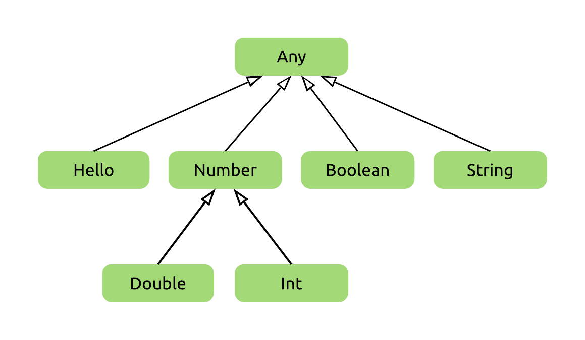

The root of Kotlin's type hierarchy is the `Any` type (just like the [`Any`](https://kotlinlang.org/api/latest/jvm/stdlib/kotlin/-any/index.html) class is the root of its class hierarchy). This type defines basic functions such as `equals`, `hashCode`, and `toString`, which are available on all object instances in Kotlin, as they all have `Any` as their supertype.

Classes with no explicit superclass inherit directly from the `Any` class, and therefore the (non-nullable) types produced by these classes are direct subtypes of the `Any` type. An example of this is the `Hello` class we've defined earlier. As Kotlin doesn't distinguish between primitives and wrappers, the basic types (`Int`, `Double`, `Boolean`, etc.) are also subtypes of `Any`.

>The number types aren't direct subtypes of `Any`, but instead they are subtypes of [`Number`](https://kotlinlang.org/api/latest/jvm/stdlib/kotlin/-number/index.html), which defines some of the common functionality of numerical types.

### Subtyping

We've used the words *subtype* and *supertype* in this previous section, so it's time that we clarify what these words mean.

*Y is a subtype of X if an object of type Y can be used in any place where an X is expected.*

This requirement is twofold. On one hand, it's a technical requirement, which the type system can verify for us. For a concrete example, we know that if we create a `Car` superclass and then inherit from it with a `Tesla`, then the compiler lets us pass a `Tesla` to a function that expects to operate on a `Car`:

```kotlin
open class Car
class Tesla : Car()

fun drive(car: Car) {
    println("Driving $car, vroom vroom")
}

drive(Tesla())
```

We tend to summarize why this works in a very simplistic phrase: a `Tesla` *is a* `Car`. However, inheriting from the base class with the syntax `: Car()` isn't really what makes a `Tesla` a `Car`.

The other requirement for this subtyping to be correct is for the `Tesla` class to *fulfill the contract of a `Car`*. If we have a reference of type `Car` which points to a `Tesla` instance, we should be able to call methods on this object and get behaviour consistent with what we expect from the base `Car` type. This is one of the SOLID principles, namely, the [Liskov substitution principle](https://en.wikipedia.org/wiki/Liskov_substitution_principle).

>This second requirement can technically be broken, and it's rather easy to break it. Doing so is a code smell called *refused bequest* - a class inheriting from another class, without upholding its contract. This is usually a misguided effort to reuse code from the superclass. You'll find this discussed in Effective Java in detail, in *Item 18: Favor composition over inheritance*.

Let's have `Car` contain a method that lets us drive it for a given number of miles, and returns the gallons of fuel consumed as a result. For any method, its *contract* consists of the set of input values it can accept, plus the promises it makes for its return values. For this one, we could say that its parameter `miles` always has to be non-negative `Int`, and what it promises for its return value is that it'll be some kind of a `Number`.

We can put these requirements into code like this:

```kotlin
open class Car {
    open fun drive(miles: Int): Number {
        require(miles >= 0)
        // Compute & return some default consumption value...
    }
}
```

Note how both of these are restrictions on sets of values. The input is first restricted to values of a single type, `Int`, and then even further restricted by specifying what values within that type may be used. The first of these is enforced by the compiler, and since the type system can't enforce the latter, the best we can do is perform a runtime check for it ourselves.

Similarly, the output has the restriction that out of all possible types of objects, it has to be a `Number`. This is only a type restriction, so it can be enforced entirely by the compiler.

What happens when we override a method like this in a subtype? We are required to hold up the contract it originally had, as someone might use our `Tesla` as a `Car` (and not just a Netflix player).

The easy way to remember the Liskov principle is with this short phrase: **expect no more, provide no less**.

**Expect no more.** We can't define stricter expectations for inputs than our superclass did, as we have to be able to process everything that the superclass is able to process. We can usually make our input requirements looser, if we want: for our concrete example, we might choose to allow negative values in the subclass (as long as we don't consider an exception being thrown for negative values part of the contract of `Car`, that is).

**Provide no less.** For our output, we have to provide at least as much as the superclass, which means that we have to provide a `Number`. We may also provide a more concrete type, for example, always an `Int`. This will always fulfill the needs of clients who expect to receive a `Number` from this method.

```kotlin
class Tesla : Car() {
    override fun drive(miles: Int): Int {
        return 0 // No gallons consumed, duh!
    }
}
```

We can even change the method signature in this subclass to the more concrete return type, as you can see in this previous code snippet.

>Interestingly, we can't make our input parameters have less concrete types in the override - this is explained neatly [here](https://typealias.com/concepts/contravariance/#functions).

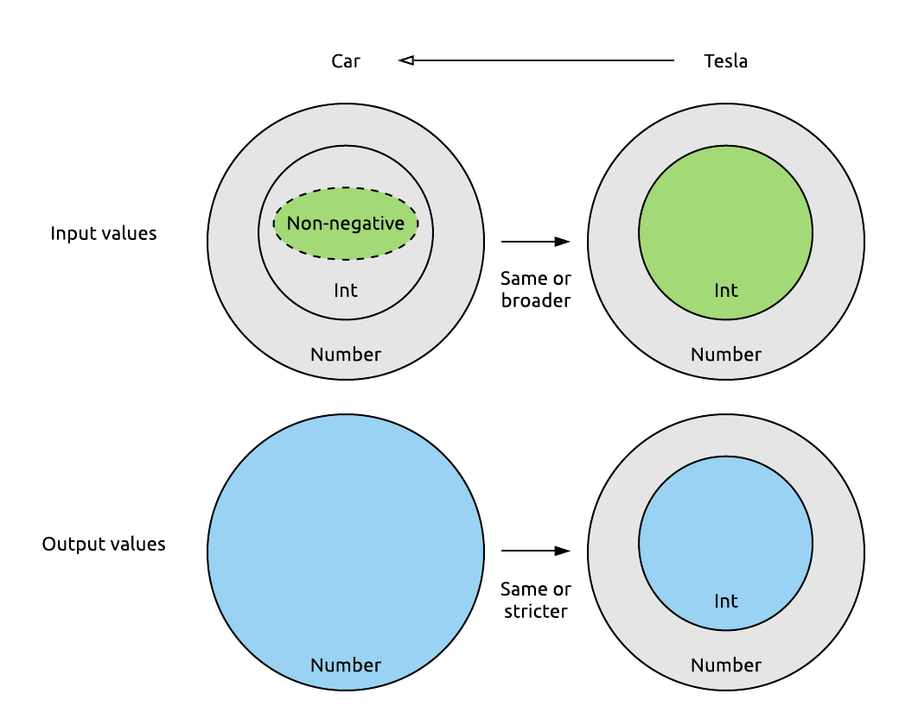

One last time, for proper subtyping, during inheritance:

- The set of accepted values may only broaden - preconditions can only be equal or weaker. **Expect no more.**
- The set of returned values may only be shrunk - postconditions can only be equal or stricter. **Provide no less.**

### The parallel nullable and non-nullable type hierarchies

Now, let's see how nullable types fit into the picture of our type system. The relation of a given type and its counterpart is fairly simple to determine. The non-nullable type is a more concrete type, as it can only accept a subset of the values that the nullable type can (all of them, except for `null`).

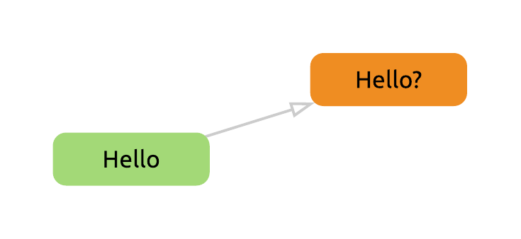

Applying this to every type in our type hierarchy, we get two tightly connected parallel hierarchies, which we can visualize like so:

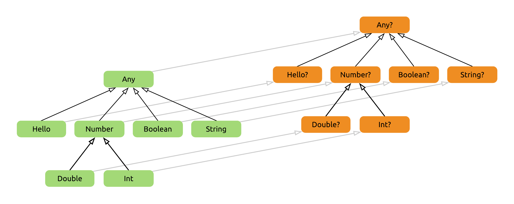

Looking at this, we can see that the real root of the entire type hierarchy is the `Any?` type. A variable of type `Any?` is able to store an object of any type - pun intended.

We can take a moment to check if all the indirect relations between types also make sense. As an example, we see that `Double` is a subtype of `Number?`, according to the diagram. This makes sense, since a `Double` really does produce all the behaviour that is expected from a `Number?`. We might also have the intuition that an object of type `Double` can be safely stored in a variable of type `Number?`.

### Elvis revisited

With our newly developed knowledge of the type hierarchy of Kotlin, we can get more familiar with a feature that we've already been using for a while - the Elvis operator.

This operator is most often used to handle cases where a value is `null` and we have to use a substitute value in its place. If its left hand side is `null`, it will simply return the right hand side. What about the return type of the entire *Elvis expression* though?

Most often, we use the Elvis operator to provide a non-nullable value that has the "same type" as the left hand side:

```kotlin
val maybeString: String? = null
val definitelyString = maybeString ?: "replacement"
```

This is the straightforward case, and `definitelyString` will simply have the type `String` inferred here, as we're expecting it.

But how does the compiler choose the correct type for an Elvis expression? What if we use different types on the two sides of the operator, and not just the nullable and non-nullable variant of the same type?

Let's answer these questions by looking at some examples. Here's a small type hierarchy we'll be using for these:

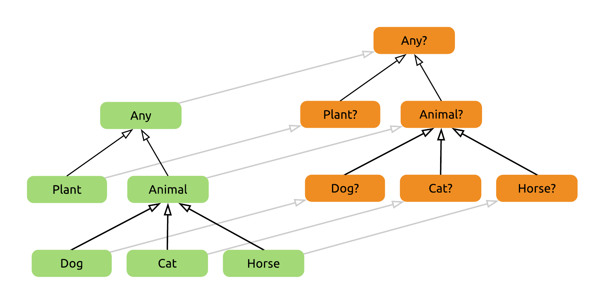

##### Both nullable 

Let's evaluate an Elvis expression between a `Dog?` and a `Horse?` type. I'll be using this notation to describe this task:

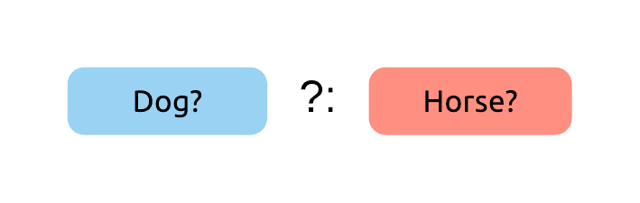

First, we find these types in the hierarchy:

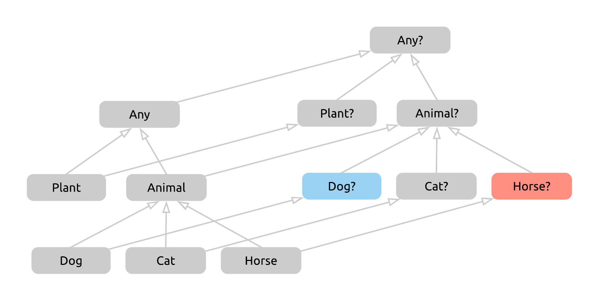

Now we have to figure out what type the Elvis expression above will return. As our first guess, let's take *the first common supertype of these two sides* and see if that works.

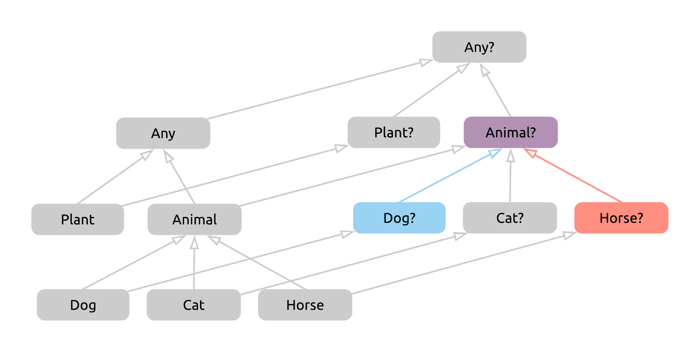

We got `Animal?` as our type for the entire expression created by the Elvis operator. This seems fine. We'll either have a `Dog` or a `Horse`, plus they might be `null`, and an `Animal?` can hold all of these possible values - and we can check one by one that no other, more concrete type can do so. If we verify our result - for example, in IntelliJ with type inference - we'll see that we have indeed found the correct return type.

##### Right nullable

Here's our next example to evaluate - we've changed the left hand side to a non-nullable type.

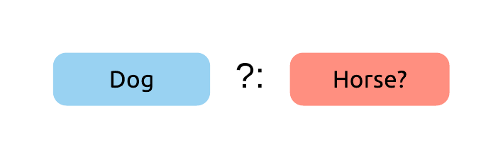

We can find these types quickly now:

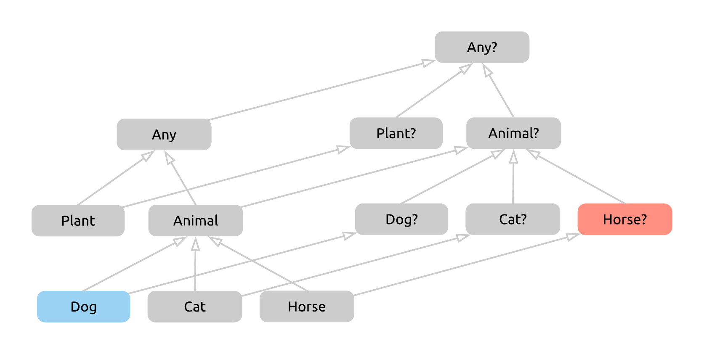

Again, we'll take the first common supertype, as this worked well for us before, and we have no reason to doubt it. We could take multiple routes from `Dog` to `Animal?` here, however, this doesn't affect the end result.

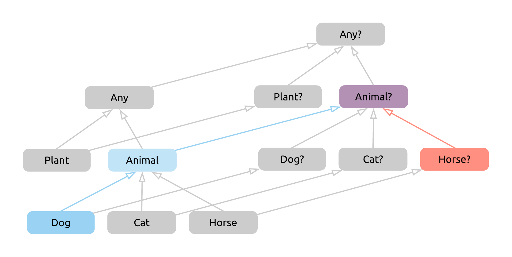

We have a few more jumps now, but the result seems sensible. If we check in IntelliJ, we are again correct as far as the return type of an expression like this goes.

If we take a step back however, we'll also find that the Elvis operator is simply redundant in this case - the left side can never be `null`! Nevertheless, if we were to still write this down and not heed the IDE's warnings to remove the Elvis operator, we'd get `Animal?` as the return type.

##### Left nullable

As a non-nullable type on the left side makes no sense, we'll get to our last combination of nullabilities for the two sides:

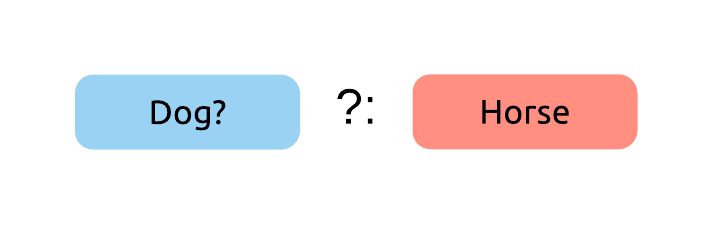

We identify the types in the hierarchy:

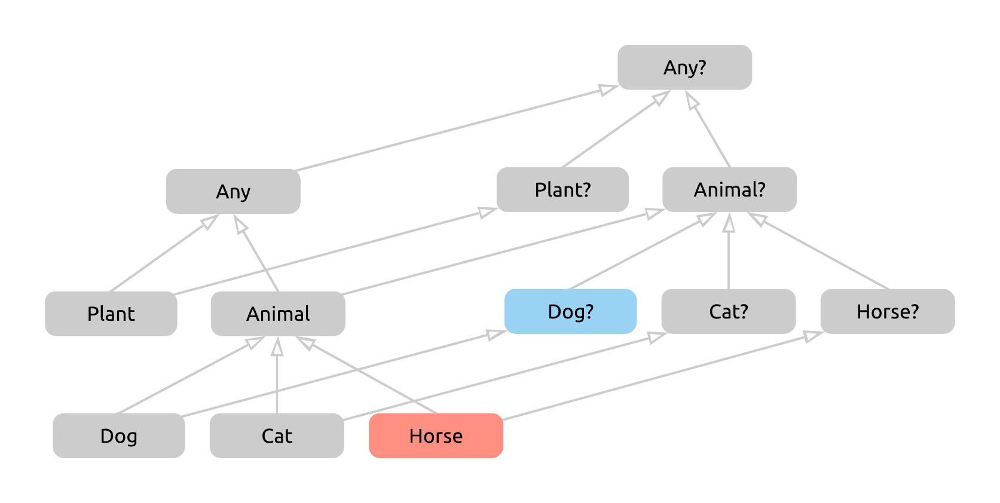

And we take the first common supertype of these two. Again, we could take multiple routes from `Horse` to `Animal?`, but it _is_ the first common supertype.

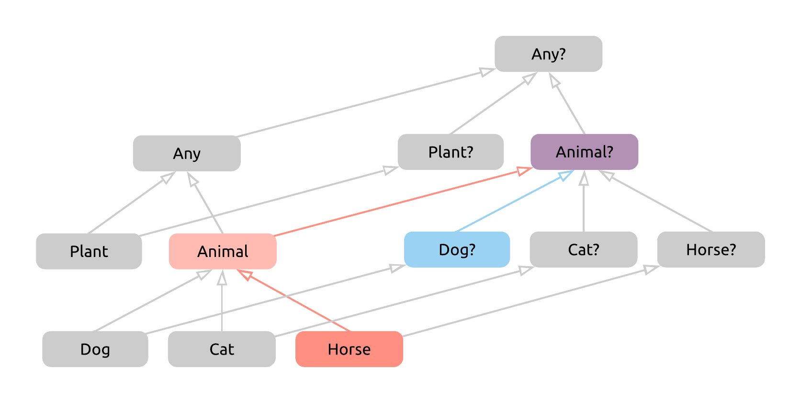

Something has gone wrong here. If we take a moment to think, we'll find the nullable result of `Animal?` to be overly cautious. If the left hand side of the expression happens to be `null`, we'll be using the right side instead, which will give us a non-nullable `Horse` value. If the left side is not `null`, we get a non-nullable `Dog` as the result.

This means that `Animal` would be a perfectly reasonable result for the expression as well. What went wrong, how did we get a nullable type when none is needed? Our mistake was to treat the left side as nullable, even though an Elvis expression will never return `null` from that side.

To fix this, we'll adjust our "algorithm": we'll take the non-nullable version of the type on the left, and the type as it is on the right, and find the first common supertype of _these_ two types.

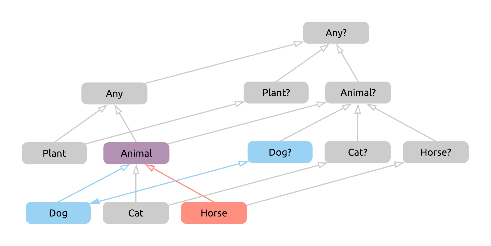

In our case, this means first taking `Dog?` back to the non-nullable side of the hierarchy to `Dog`, and then finding the first common supertype with `Horse`, which, as expected, will now be the correct `Animal` type.

This is the correct way of determining the return type of an Elvis expression. We'll see why it's useful to be familiar with this later.

### Unit

`Unit` is a special type in Kotlin that we've already met in the very first chapter. It's worth taking another look at it though.

The documentation describes it as *the type with only one value*. As far as its code goes, this is achieved simply by declaring `Unit` as a singleton `object`. Here's its entire source:

```kotlin
public object Unit {
    override fun toString() = "kotlin.Unit"
}
```

This of course wouldn't be enough for `Unit` to do all the things it does, there's also quite a bit of special treatment by the compiler involved to achieve its functionality.

The most important of these is that functions that return no meaningful value return `Unit` instead in Kotlin. This is a meaningless return value (as it's an empty object), but this way, all functions work semantically the same way: they all return something. In comparison, Java has to give special treatment to `void` returning functions - for example, we can't assign their return type to a variable.

We'll get back to `Unit` when discussing generics later in this chapter.

### Nothing

#### A value that never exists

[`Nothing`](https://kotlinlang.org/api/latest/jvm/stdlib/kotlin/-nothing.html) may look a lot like `Unit` on first glance. `Nothing` is a class that can never be instantiated. Again, this is backed by its very short source:

```kotlin 
public class Nothing private constructor()
```

This in itself leads to some interesting consequences for using `Nothing`. For example, if a function has `Nothing` as its return type, we know that it can never return, since it has no way of acquiring the instance of `Nothing` it would return. This, again, is different from `Unit` returning functions - those did return something, that value just wasn't meaningful.

What does a function that never returns look like? It might contain an infinite loop, or it might always throw an exception instead of terminating normally:

```kotlin
fun loopy(): Nothing {
    while (true) {
        println("Loop!")
    }
}

fun exceptional(): Nothing {
    throw IllegalStateException()
}
```

The Kotlin compiler allows both of these functions to compile since it understands control flow and sees that neither will ever reach a `return` statement. Of course, both of these could just return `Unit`, but this way, we can signal to client code that they will never return.

Why would we want to do this? For example, because the IDE can now warn callers about code that's placed after a call to these `Nothing`-returning functions, which will never be executed:

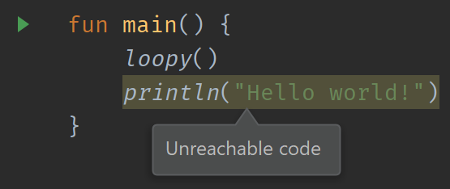

#### `Nothing` as a bottom type

The `Nothing` type gets some additional special treatment from the compiler. Since an instance of it can never exist, it can serve in the type system as a [bottom type](https://en.wikipedia.org/wiki/Bottom_type).

>In subtyping systems, the *bottom type* is the subtype of all types.

This updates our overall hierarchy like so:

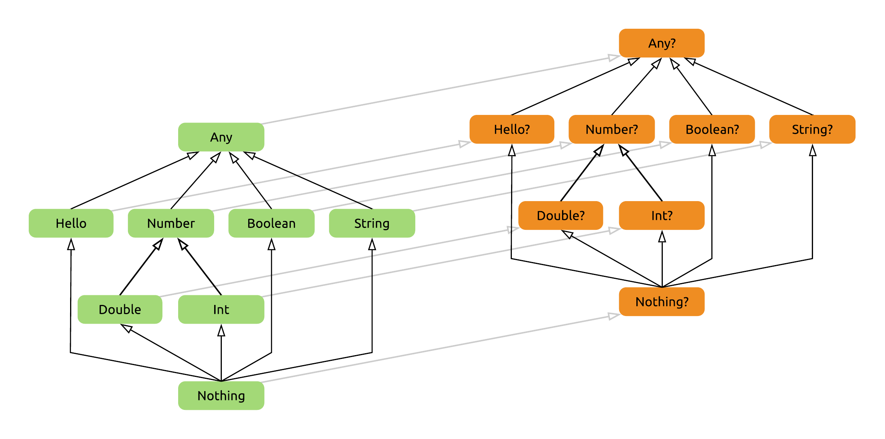

Why and how can `Nothing` serve this purpose? Think about it for a second - anywhere you need a concrete type, be it an `Int`, a `Dog`, or an [`AbstractSingletonProxyFactoryBean`](https://docs.spring.io/spring/docs/current/javadoc-api/org/springframework/aop/framework/AbstractSingletonProxyFactoryBean.html), it's safe to pass in something that has the type `Nothing`, because you know that this code can never actually be reached. 

For example, the `loopy` function shown above will never return properly, which makes this variable assignment and then the call to this `processData` function completely safe to compile, albeit nonsensical:

```kotlin
fun processData(data: List<String>) {
    // Use data
}

fun main() {
    val data: Nothing = loopy()
    processData(data)
}
```

We see that the specific type of `processData`'s parameter doesn't matter. It could be any arbitrary type, and `Nothing` could still be passed in safely (as it will never actually be passed in!).

Let's move on to a use case where we can make more sensible use of `Nothing` being a bottom type.

#### TODO

The Standard Library's [`TODO()`](https://kotlinlang.org/api/latest/jvm/stdlib/kotlin/-t-o-d-o.html) function is a great example of making use of `Nothing`. It's a never-returning function, because it always throws a `NotImplementedError`. Since the compiler knows that it never returns, it allows you to leave functions half-implemented like this, without making you return a value:

```kotlin
fun getValue(): Int {
    TODO("implement later")
}
```

>In Java, you would have to `return 0;` or `return null;`to functions like these to make them compile, which you might forget about later on.

Since `Nothing` is a bottom type, you can also return `TODO()` from any function regardless of what the return type is, and you can use it as a placeholder for any function parameter as well:

```kotlin
fun calculate(x: Int): Int = TODO()

calculate(TODO())
```

All these usages of `TODO` will crash before returning, reminding you that this part of the code is not implemented yet.

>IntelliJ IDEA also picks up invocations of this function the same way that it picks up comments containing "TODO", so you can view them on the same panel.

#### Nothing ft. Elvis

We're going to bring two previous topics together now, `Nothing` and the Elvis operator.

Consider what happens when you use an `Elvis` operator with something of type `Nothing` on the right hand side. If the expression's left side ends up being non-null, that's the result of the expression, and we can continue on with our code. However, if we have to evaluate the "default" right side, execution of whatever function we're in is guaranteed to be halted, as evaluating that side will either never terminate, or will terminate exceptionally.

I'm going to reuse the `Nothing`-returning `exceptional` function defined above for this example:

```kotlin
fun calculate(someParam: Int?) {
    val x = someParam ?: exceptional()
    val y = x * 2
    println(y)
}
```

Notice that we are using `x` as an `Int` on the third line where we're multiplying it. This code compiles and works correctly, despite the parameter having a type of `Int?`. This makes sense intuitively. If we were to run into the right hand side case of the Elvis expression and call the `exceptional` function, `calculate` would not proceed due to the exception thrown from there, and otherwise we have a non-null `Int` on our hands.

However, let's be precise and take a look at the type hierarchy again, and see what the return type of the Elvis expression should be:

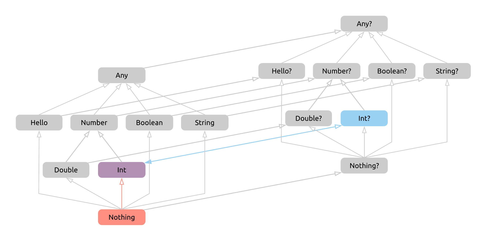

First, we take `Int?` back to the non-nullable hierarchy, and then we find the first common supertype of `Int` and `Nothing`, which, since `Nothing` is a bottom type, is `Int` itself! Notice that the same would happen for any nullable type on the left of the Elvis operator when there's `Nothing` on its right side: the return type of the expression would just be the non-nullable variant of the type on the left.

This is already a quite nice way to handle `null` cases of certain values by throwing an exception, and have them be available on the next line conveniently as their original type, only its non-null variant. 

We don't even need to wrap throwing an exception into a function that returns `Nothing`. Like many other built-in constructs, `throw` is actually an expression in Kotlin, and naturally, its return type is `Nothing`. This lets us do simply this:

```kotlin
fun calculate(someParam: Int?) {
    val x = someParam ?: throw IllegalArgumentException("someParam must not be null")
    val y = x * 2
    println(y)
}
```

There's another very handy little expression that can be used here for a different effect - the `return` expression. This lets us stop execution of this function for an invalid argument silently.

```kotlin
fun calculate(someParam: Int?) {
    val x = someParam ?: return
    val y = x * 2
    println(y)
}
```

Of course, we're creating a new variable here that's essentially the same as our parameter. This is both wasteful and somewhat confusing, especially in a longer function. Here's a neat trick that's common practice in Kotlin:

```kotlin
fun calculate(someParam: Int?) {
    someParam ?: return
    val y = someParam * 2
    println(y)
}
```

Why does this still work? Because the Elvis expression (as every other expression) will be evaluated even when its return value is unused, and if the parameter was `null`, it returns from the function. From the next line, `someParam` will be available as an `Int` due to a smart cast. (This of course can be used the same way with a `throw`.)

#### throw return

A weird quirk of both `return` and `throw` having a type of `Nothing` is that statements like this are perfectly valid in Kotlin:

```kotlin
fun oddity() {
    throw return return throw return
}
```

Why is this? Well, both `return` and `throw` take an argument that needs to be evaluated before they're executed. `throw` takes a `Throwable`, and `return` takes whatever the return type of the given function is - in this case, it's `Unit`, which is applied implicitly as a special case, but the same line would compile even if the function returned an `Int` and we ended it with `return 1`.

So, for the first `throw` to be executed, it needs a `Throwable` as an argument. The `return` expression right after it returns `Nothing`, which of course _is_ a `Throwable`. Similarly, whatever the function's return type, writing either `throw` or `return` down after a `return` keyword will pass type checks, because `Nothing` will fit that return type.

Now we know why this compiles, but what happens when we run the code? The first expression needs its argument evaluated, which in turn needs its argument evaluated, and so on. At the end of this chain, only the very last expression will be executed, because whether it's a `throw` or a `return`, it will exit the current function. The operations before it on the line, which were "in the queue" to be executed, will never have a chance to take effect.

Now you know how to return values and throw exceptions _in style_.

#### About `Nothing?`

When introducing `Nothing` as a bottom type, we've updated our type hierarchy with two new types, but all we've discussed so far was the non-nullable `Nothing`. Does the nullable type `Nothing?` make any sense, and is it of any use to us?

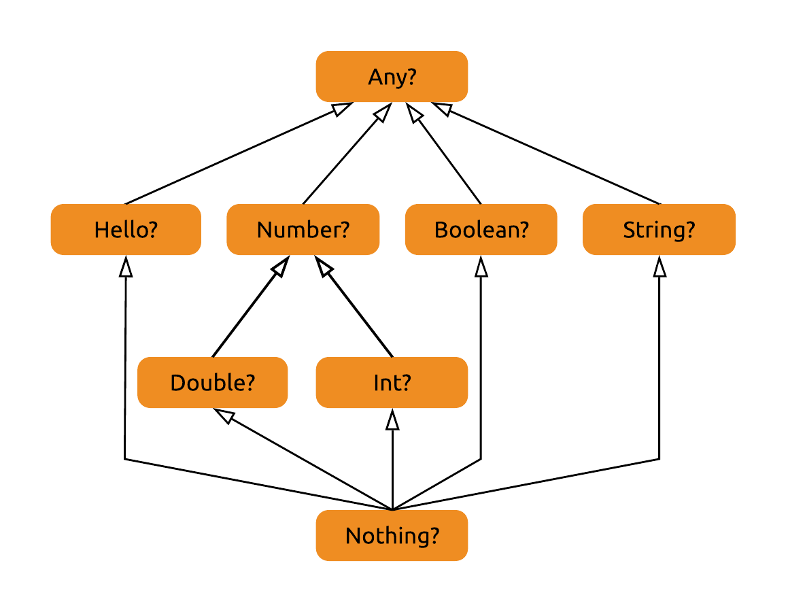

It's a subtype of all nullable types, which would mean that a value of type `Nothing?` could be used anywhere where a nullable value is required. We know exactly one value that fits this description - `null` itself.

We can confirm our suspicion by assigning `null` to a variable, and letting type inference do its job:

```kotlin
val x = null
```

From here, we can check with either reflection or through the IDE's tooling that `x`, in fact, is of the type `Nothing?`. You almost never want to declare a variable like this, because you'll never be able to assign it anything but `null` itself.

Here's the common example of how you might run into issues with this:

```kotlin
var x = null
x = "this is a string" // e: Type mismatch. Required: Nothing? Found: String
```

Although there's a type that would work perfectly well here for both usages of `x` (the nullable `String?`), letting the compiler infer the type in this scenario leaves us with a scary-at-first error message seen above.

Hopefully going forward this won't scare you, and you'll realize quickly that inference is to blame, and you can fix the issue by explicitly typing `x` as a `String?`:

```kotlin
var x: String? = null
x = "this is a string"
```

## Generics

Generics are a powerful means of code reuse, and are widely utilized in both Java and Kotlin.

Imagine that we don't have a list collection provided to us by the JDK or the Kotlin Standard Library, and have to implement our own. Without generics, we'd have two choices:

- Implement a list type for each type of object that we want to store in lists. For example, a `StringList` class would take a `String` as the parameter of its `add` method, and return a `String` from its `get` method. This is convenient and safe to use, but whenever we want to create a list of a new type, we have to implement a new list class for that specific stored type.

    ```kotlin
    class StringList {
        fun add(string: String) { ... }
        fun get(index: Int): String { ... }
    }
    
    val stringList = StringList()
    stringList.add("testing")
    val test: String = stringList.get(0)
    ```

- Create a single `List` type that stores a `List` of `Any` (or `Object`) instances, which solves the issue of having to create new types all the time. However, we now have to remember that we stored, say, `String` instances in a given list, then remember to only put `String` instances in it, and finally cast them back to `String` when we read them from the list, so that we can actually use them.

    ```kotlin
    class List {
        fun add(t: Any) { ... }
        fun get(index: Int): Any { ... }
    }
    
    val stringList = List()
    stringList.add("testing") // remember, Strings only!
    val test: String = stringList.get(0) as String // hope it's a String
    ```

It probably doesn't need further explanation that both of these approaches are remarkably inconvenient and error-prone.

With generics, we can create a `List<T>` class, which uses the generic *type parameter* `T` in its implementation, such as for the parameter of `add` and the return type of `get`. Then, if we instantiate a `List<String>`, the type parameter is fulfilled by the concrete *type argument* `String`, and we'll only be able to add `String` instances to our list, and get any objects out of it with the `String` type as well. Safe and convenient!

```kotlin
class List<T> {
    fun add(t: T) { ... }
    fun get(index: Int): T { ... }
}

val stringList = List<String>()
stringList.add("testing")
val test: String = stringList.get(0)
```

>Under the hood, on the JVM, we're essentially performing the second scenario layed out above - but the compiler is helping us out with a lot of the type checking and casting.

Similarly to generic classes, we can create generic functions, by adding type parameters to them. These allow us to, for example, define a `forEach` function that can work on a `List<T>`, regardless of what the actual `T` type is:

```kotlin
inline fun <T> List<T>.forEach(actions: (T) -> Unit) {
    for (element in this) actions(element)
}
```

The `T` type parameter is declared right after the `fun` keyword. Calling this on a `List<Person>` will substitute the type parameter with `Person` thanks to type inference, and give us a parameter of the `Person` type in our lambda:

```kotlin
people.forEach { person: Person ->
    println(person.name)
}
```

It's also possible to explicitly pass a type parameter to a function, if it can't be inferred from context, for example a function like this:

```kotlin
fun <T> create(): T { /* create an instance of T somehow... */ }

create<Person>()
```

>Type parameters are usually single letters in Kotlin. If you look into the Standard Library, you'll see plenty of `T`, `R`, and `C`. These are great if they're being used in relatively standard ways (`T` being whatever single generic parameter, `R` a return type parameter, `C` a collection of some kind), but they can get confusing otherwise. Don't be afraid to use generic type names such as `Item` or `Element` if it makes your code easier to read.

### Upper bounds

You can require certain upper bounds for generic type parameters, if you have requirements for the type arguments. For example, you might want to create a function that accepts numbers, prints them as a `Double`, and then returns them with their original type:

```kotlin
fun <N : Number> printNumber(number: N): N {
    println(number.toDouble())
    return number
}

val l: Long = printNumber(23L)
```

One upper bound that you might want to use a lot is, surprisingly, `Any`. If you don't specify an upper bound for your functions, the default will actually be `Any?`, which allows any nullable type to be substituted as well! 

```kotlin
fun <T> testEquality(t1: T, t2: T): Boolean {
    return t1.equals(t2) 
          // ^ e: Only safe (?.) or non-null asserted (!!.) calls 
          //      are allowed on a nullable receiver of type T
}
```

Using `Any` as an upper bound will only allow subtypes of `Any`, which are all non-nullable types.

```kotlin
fun <T : Any> testEquality(t1: T, t2: T): Boolean {
    return t1.equals(t2)
}
```

>Note that specifying a type parameter such as `T : Any` still lets you use the `T?` type, if you need to.

By default, you can specify a single constraint on a type parameter when you declare it. But what if we needed, for example, a type parameter that implements both of these interfaces?

```kotlin
interface Writer {
    fun write(str: String)
}

interface Reader {
    fun read(): String
}
```

If you need multiple upper bounds, you can specify them at the very end of the function signature, with the `where` keyword:

```kotlin
fun <T> readWriteStuff(t: T)
        where T : Reader, T : Writer {
    val str = t.read()
    t.write(str)
}
```

While the language doesn't support intersection types (a type that's defined as having to be a subtype of multiple types), these kinds of combined constraints can give you type parameters which can behave a lot like a intersection type. 

### The usefulness of `Unit`

`Unit` being a proper type comes in handy with generics - let's say we have a `Task<T>` type like this:

```kotlin
interface Task<T> {
    fun execute(): T
}
```

If we need an instance that returns no result when it's done, in Java we'd have to use a special type, [`Void`](https://docs.oracle.com/javase/8/docs/api/java/lang/Void.html), which is technically a separate concept from the `void` keyword, which signifies that we have a function that doesn't return a result. In Kotlin, we can use the same `Unit` in both of these places to describe the lack of meaningful data, so we'd end up with simply `Task<Unit>`.

### Variance

The interaction of generics and inheritance is a very interesting one. For simple types, we know that they can be used wherever their supertypes are expected. What about generic types?

Let's create a `Garage` type representing a parking garage, which lets you park and then retrieve a generic type of `Car`:

```kotlin
interface Garage<T : Car> {
    fun park(car: T)
    fun take(): T
}
```

The million dollar question, then: given that a `Tesla` is a `Car`, does it follow that a `Garage<Tesla>` is a `Garage<Car>`?

#### Covariance

Let's see if we can use a `Garage<Tesla>` where a `Garage<Car>` is expected. We'll create a function that takes a `Garage<Car>` as a parameter, and uses its functionality. It first empties the entire garage, and then parks a new `Car` in it.
  
```kotlin
fun testGarage(garage: Garage<Car>) {
    // Empty the garage
    while (true) {
        val car: Car = garage.take() ?: break
        println("Removed $car")
    }
    // Park a new car
    garage.park(Car())
}
```

>Yes, `break` is also an expression, and its return type is `Nothing`. Handy!

Now, let's call it with a `Garage<Tesla>` as its parameter:

```kotlin
val teslaGarage = object : Garage<Tesla> {
    override fun take(): Tesla { ... }
    override fun park(car: Tesla) { ... }
}

testGarage(teslaGarage)
```

We get an error on the call to `testGarage`:

```
Type mismatch.
Required: Garage<Car>
Found: Garage<Tesla>
```

So why are we not allowed to pass in this parameter? Whenever `take()` is called, our `Garage<Tesla>` will return a `Tesla?`, which is a `Car?`. This is all sound. However, then we can also attempt to park a `Car()` (or `Fiat()`, or any other `Car` instance) in a `Garage<Car>`, which we can't do with a `Garage<Tesla>` that only accepts `Tesla` instances. *This means that a `Garage<Tesla>` is not a `Garage<Car>`.*

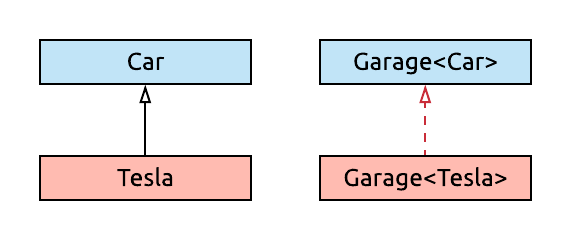

We've seen that a `Garage<Tesla>` worked fine in the place of a `Garage<Car>` in certain ways, and not others. It was fine as long as we only took generic values *out* of it. If we just remove the problematic method that takes values of `T` as a parameter, our `Garage<Tesla>` would be safe to use as a `Garage<Car>`.

We'll define an interface that only allows picking cars up:

```kotlin
interface PickupPoint<out T : Car> {
    fun take(): T?
}
```

Note how we've marked the `T` type parameter with the `out` keyword. This keyword ensures that the generic type parameter is only used in *out* positions, i.e. as the return type of functions or properties. If we used `T` for a function's parameter inside this interface, in an *in* position, we'd get a compilation error. In exchange for this restriction, the compiler now knows that a `PickupPoint<Tesla>` can function as a `PickupPoint<Car>`:

```kotlin
fun testPickup(pickupPoint: PickupPoint<Car>) {
    // Take a car from the pickup point
    val car: Car = requireNotNull(pickupPoint.take())
    println("Driving a $car")
}

val teslaPickup = object: PickupPoint<Tesla> {
    override fun take(): Tesla? { ... }
}
testPickup(teslaPickup) // All good!
```

This behavior, marked by the `out` keyword, is called *covariance*. A generic type `Generic` is covariant on a type parameter, when `X` being a subtype of `Y` means that a `Generic<X>` will be a subtype of a `Generic<Y>`. The **subtyping direction is the same** for the parameters and the generic types that use them. They vary *together*, they are *co*variant.

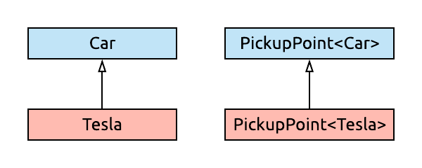

#### Contravariance

What about handing off cars to a `Garage`? We've seen that a `Garage<Tesla>` can't work as a `Garage<Car>` for these purposes, because a `Garage<Car>` has to accept any kind of `Car`. However, we can spot an inverse relationship here: a `Garage<Car>` can work as a `Garage<Tesla>`, as it can accept `Tesla` instances!

Of course it won't be true that `Garage<Car>` is a subtype of `Garage<Tesla>`. When we want to pick up a `Tesla`, we can't get one from a `Garage<Car>` in a type safe manner, because it might contain other types of cars, and give us one of those. The same problem as before - we have to split this functionality into a one-way interface too:

```kotlin
interface HandoffPoint<in T : Car> {
    fun park(car: T)
}
```

This time, the type parameter is marked with the `in` keyword, which restricts us to using it in *in* positions, only as the types of values that the interface receives as a parameter. This tells the compiler that an instance of a `HandoffPoint` may have a more general type argument than what's required.

Case in point, it makes our `HandoffPoint<Car>` work as a `HandoffPoint<Tesla>`, just like we wanted it to:

```kotlin
fun testHandoff(handoff: HandoffPoint<Tesla>) {
    handoff.park(Tesla())
}

val carHandoff = object : HandoffPoint<Car> {
    override fun park(car: Car) { ... }
}
testHandoff(carHandoff) // OK!
```

This behavior, marked by the `in` keyword, is called *contravariance*. A generic type `Generic` is covariant on a type parameter, when `X` being a subtype of `Y` means that a `Generic<Y>` will be a subtype of a `Generic<X>`. The **subtyping direction is reversed** between the type arguments and the generic types that use them. They vary in the *opposite* direction, they are *contra*variant.

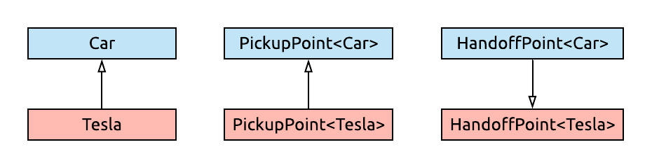

####  Invariance

With these new interfaces in place, we can quickly reintroduce the `Garage` type, as the combination of these two interfaces:

```kotlin
interface Garage<T : Car> : PickupPoint<T>, HandoffPoint<T>
```

The type parameter of `Garage` can neither be covariant nor contravariant, as it uses the `T` type parameter in both *in* and *out* positions. A type like this is an *invariant* type.

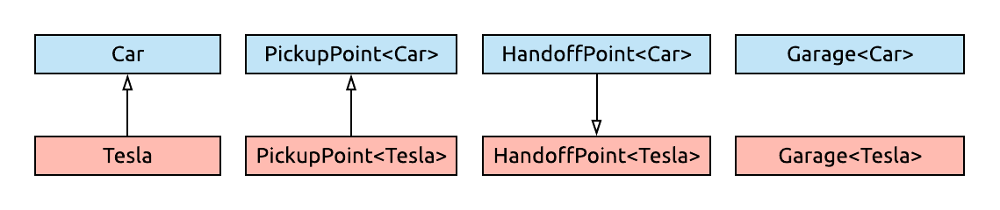

>We've seen that reading values from a type with a generic type parameter enables covariance. This is another benefit of having separate [`List`](https://kotlinlang.org/api/latest/jvm/stdlib/kotlin.collections/-list/index.html) and [`MutableList`](https://kotlinlang.org/api/latest/jvm/stdlib/kotlin.collections/-mutable-list/index.html) interfaces in the Standard Library. While the `MutableList` interface is doomed to be invariant, `List` is actually covariant. A `List<Tesla>` is automatically  a `List<Car>`, which makes using lists a lot smoother!

>There are first-party types that use this exact same approach of splitting a bidirectional interface into two interfaces for variance. [`Channel`](https://kotlin.github.io/kotlinx.coroutines/kotlinx-coroutines-core/kotlinx.coroutines.channels/-channel/index.html) is a good example of this, as it combines the [`SendChannel`](https://kotlin.github.io/kotlinx.coroutines/kotlinx-coroutines-core/kotlinx.coroutines.channels/-send-channel/) and [`ReceiveChannel`](https://kotlin.github.io/kotlinx.coroutines/kotlinx-coroutines-core/kotlinx.coroutines.channels/-receive-channel/) interfaces, which are contravariant and covariant, respectively.

#### Use-site variance

What you've seen above is *declaration-site variance*. The variance of the generic type parameter is specified at the declaration of the class that it belongs to, and this variance will apply to all usages of the generic class. In the example above, this means that every `PickupPoint` will be covariant, and every `HandoffPoint` will be contravariant on its type parameter.

For invariant types, such as `Garage` or `MutableList`, we might still want to occasionally have some variance on their type parameters, when our specific use case allows it.

Let's say we want to empty a `Garage` with a function like this:

```kotlin
fun emptyGarage(garage: Garage<Car>) {
    while (true) {
        val car: Car = garage.take() ?: break
        println("Removed $car")
    }
}
```

As we've seen before, we can't pass a `Garage<Tesla>` into this function. While it always outputs `Car` instances, meaning our current usage would be safe, it can't accept any kind of `Car` instance in its `park` function, which would make using it as a `Garage<Car>` potentially unsafe. What if we could promise the compiler that we won't use the instance we get that way, for just this specific function?

This is exactly what use-site variance allows us to do. Specify variance for a single use of a type which is otherwise invariant, using the `out` keyword for covariance:

```kotlin
fun emptyGarage(garage: Garage<out Car>) {
    while (true) {
        val car: Car = garage.take() ?: break
        println("Removed $car")
    }
}

val teslaGarage: Garage<Tesla> = ...
emptyGarage(teslaGarage)
```

This allows us to safely use any method where the type parameter is in an *out* position.

What ensures that we won't park just any `Car` into this garage? It turns out that wherever the type parameter is used in an *in* position, it's changed to the `Nothing` type when you employ use-site covariance:

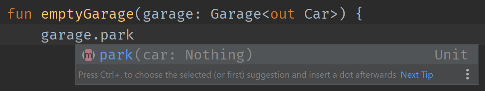

This prevents us from calling this method altogether, which is the price to pay for the covariance. The compiler effectively removed this method from the interface, by making it uncallable.

---

You can also add contravariance after-the-fact with use-site variance. Let's write a function that parks a `Tesla` in a `Garage<Tesla>`, like this:

```kotlin
fun parkTesla(garage: Garage<Tesla>) {
    garage.park(Tesla())
}
```

Again, this function can't be called with a `Garage<Car>`, as we might take a car from the garage, and then we'd expect to receive a `Tesla` specifically. But we can add use-site variance to get contravariance, and enable our limited use case of only placing cars in the garage:

```kotlin
fun parkTesla(garage: Garage<in Tesla>) {
    garage.park(Tesla())
}

val garage: Garage<Car> = ...
parkTesla(garage)
```

Methods where the type parameter appears in *in* positions are safe to use in this case, but what about the ones where it's in the *out* position? You can still call them, but it can't be guaranteed that you'll get  a `Tesla` out of them. Instead, the type parameter in these positions is modified to `Any?`:

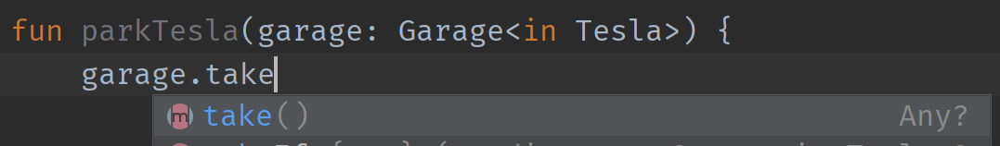

This means that with use-site contravariance, all functions remain callable on the object that the original type had. For this to be safe, you lose some typing when using methods that have the type parameter in the *out* position.

The special, restricted types that you get when using use-site variance are called *projected types*, and the mechanism creating them is *type projection*. For a nice visual recap of variance and projections, [take a look at this article](https://typealias.com/guides/ins-and-outs-of-generic-variance/).

#### Star projections

You may want to refer to a `Garage` in your code, regardless of what its type arguments are. This would be useful, for example, if the type contained some methods that don't rely on its generic parameters (for example, a `count()` method that simply returns an `Int`).

The language feature that gives you a type with no specific type argument is a *star projection*, and it looks like this: `Garage<*>`.

```kotlin
fun useGarage(garage: Garage<*>) {
    // Use non-generic functions?
}
```

All `Garage` types are a subtype of `Garage<*>`, regardless of their type argument.

```kotlin
useGarage(garage) // Garage<Car>
useGarage(teslaGarage) // Garage<Tesla>
```

Using this projected type will have to come with serious restrictions: since you don't know the type parameter of the `Garage` instance you're handling, you can't use the type parameter in either *in* or *out* positions.

The restriction for *in* positions will be a familiar one: the type parameter is replaced with `Nothing` whenever it's in an *in* position, making the method impossible to call:

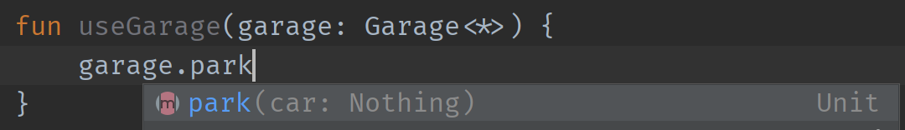

Interestingly, the type parameters in the *out* position don't simply get replaced with `Any?`. This projection is a bit smarter than the one that deals with contravariance, and it knows that since there's a constraint on the type parameter of `Garage` (`T : Car`) it can at most be as broad as that constraint, so it deducts `Car?` as the return type for `take`.

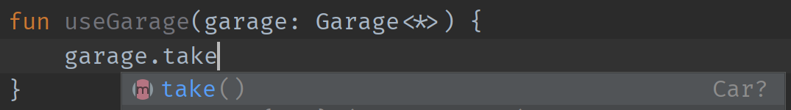

For even more about star projections, and neat illustrations, [read this article](https://typealias.com/guides/star-projections-and-how-they-work/).

#### The usefulness of `Nothing` in generics

Generics and variance also gives us an opportunity to use `Nothing`. It's a common pattern to define a sealed class that can either hold a generic result, or wrap an error, like this:

```kotlin
sealed class Result<T : Any>
class Success<T : Any>(val result: T) : Result<T>()
class Error<T : Any>(val throwable: Throwable) : Result<T>()
```

>Note how the result `T` type can never be nullable here.

If we want to report an error for a call that expects a `Result` like this, we can do it by creating an `Error` instance:

```kotlin
fun getData(): Result<String> {
    return Error<String>(RuntimeException("oh bother"))
}
```

The way that this `Error` class works is interesting. It defines a generic type parameter that it doesn't use - or rather, uses only to conform to its supertype. This class doesn't actually have to be generic to inherit from `Result`. It doesn't use its generic parameter in any way, and there's no reason why the same `Error` containing an exception couldn't be a `Result` that asked for a `String` and a `Result` that asked for a `Customer` at the same time. We can express this like so, thanks to `Nothing` being a bottom type:

```kotlin
sealed class Result<T : Any>
class Success<T : Any>(val result: T) : Result<T>()
class Error(val throwable: Throwable) : Result<Nothing>()
```

If we haven't realized that we needed variance on this class so far, we'd definitely realize it now, as a `Result<Nothing>` at this point is not a `Result<String>` or a `Result<Customer>`, so we can't use `Error` in the way that we wanted to use it.

Similarly, code like this doesn't work either, because a `Result<Employee>` is not a `Result<Person>`:

```kotlin
open class Person
class Employee : Person()

fun getPerson() : Result<Person> {
    return Success<Employee>(Employee())
}
```

The issue in both of these cases is that `Result` is invariant (the default behaviour for a generic parameter, if not specified otherwise), so only exact type arguments can be used. This can be fixed by adding covariance to our `Result` class, using the `out` keyword:

```kotlin
sealed class Result<out T : Any>
class Success<T : Any>(val result: T) : Result<T>()
class Error(val throwable: Throwable) : Result<Nothing>()
```

>Sealed classes for results of operations like this one are used frequenty in Kotlin, as a way to avoid having to handle exceptions with `try-catch` blocks. Instead, methods using these result types can always return normally, and their results can be checked for success or failure using a `when` statement. 

### Reified generics

In Java, whenever we use generics, we have to deal with [*type erasure*](https://docs.oracle.com/javase/tutorial/java/generics/erasure.html). To oversimplify it: generic types only exist at compile time, and all generic parameters are replaced with the `Object` type by the time they end up in the bytecode. This differs for example from the C++ implementation of generics, where separate, typed classes get generated for every type parameter that a generic class is used with. (These are the second and first painful manual options laid out [in the introduction above](#generics), respectively).

This type erasure is the reason why we have trouble with...

- Telling apart a `List<Kitten>` and a `List<Tiger>` at runtime by performing `instanceof` checks on a `List` instance

    ```java
    if (list instanceof List<Kitten>) {
        print("Aww.")    // ^ Error: Illegal generic type for instanceof
    } else if (list instanceof List<Tiger>) {
        print("Uh-oh.")         // ^ Error: Illegal generic type for instanceof  
    }
    ```

- Getting the `.class` of a type parameter like we'd do with a regular type

    ```java
    System.out.println(String.class); // This works
    System.out.println(T.class);     
                     // ^ Error: Cannot select from a type variable
    ```
 
- Performing type checks against a type parameter
    
    ```java
    System.out.println("" instanceof String); // This works
    System.out.println("" instanceof T);
                                  // ^ Error: Class or array expected
    ```

So what are reified generics, and how do they help us with these issues in Kotlin? They are, essentially, a clever compile time trick. When we create a generic function in Kotlin, we can mark its type parameters as `reified` - but only if we also make the function itself `inline`. For example:

```kotlin
inline fun <reified T> printType(t: T) {
    println("I think '$t' is ${T::class}")
}
```

Accessing the generic parameter's `class` wouldn't normally be possible on the JVM, however, if we call this function with the reified parameter, it works:

```kotlin
printType("hi")  // I think 'hi' is class kotlin.String
printType(Bar()) // I think 'Bar' is class foo.Bar
```

How is this possible? Remember, we can only make type parameters reified if our function is inlined - and that's exactly where the magic happens. When we call an inline function, its body is essentially copied to the call site instead of a function call being performed.

When this happens for a function that has a reified type parameter, all usages of that type parameter in the body get replaced with the concrete type argument that the function was invoked with at the call site. This is the same process that happens to regular parameters during inlining.

For example, our previous two calls above compile to these lines (at the bytecode level), with the concrete values of the type parameters inlined:

```kotlin
println("I think '${"hi"}' is ${String::class}")
println("I think '${Bar()}' is ${Bar::class}")
```

... which are perfectly valid calls to perform on these concrete types.

This handy transformation also lets us perform type checks such as `x is T` if `T` is reified. For example, this generic function can be easily implemented in Kotlin:

```kotlin
inline fun <reified R> List<*>.filterType(): List<R> {
    val result = mutableListOf<R>()
    for (element in this) {
        if (element is R) {
            result.add(element)
        }
    }
    return result
}
```

It's an extension on a `List` with an unknown (or any) type argument, takes a reified type parameter, and filters the original list to only those elements that are of the type `R`. Its usage would look like this:

```kotlin
val list = listOf(1, 'o', 992.5233, 2, 25.21, "foo", 17)
println(list.filterType<Double>()) // [992.5233, 25.21]
```

When we invoke this `filterType` function with the `Double` type argument, the type check inside it becomes an `element is Double` check at compile time, which is perfectly valid bytecode.

>This function is actually called [`filterIsInstance`](https://kotlinlang.org/api/latest/jvm/stdlib/kotlin.collections/filter-is-instance.html), and it's part of the Kotlin Standard Library.

# Summary

The Kotlin type system is perhaps the most important part of the language. It's the source of the safety that pervades the language. It provides safe null handing, well-defined subtyping, and powerful support for advanced generics, with the help of type constraints, variance, and projections. You don't even really have to keep track of how these things interact in your code - the compiler pays attention to all of this for you, and ensures that you're only performing safe operations.

# Sources

- [Typical Kotlin](https://www.kotlindevelopment.com/typical-kotlin/)
- Illustrated articles on generics by Dave Leeds
    - [An Illustrated Guide to Covariance and Contravariance in Kotlin](https://typealias.com/guides/illustrated-guide-covariance-contravariance/)
    - [The Ins and Outs of Generic Variance in Kotlin](https://typealias.com/guides/ins-and-outs-of-generic-variance/)
    - [Star-Projections and How They Work](https://typealias.com/guides/star-projections-and-how-they-work/)
- Official documentation
    - [Generics: in, out, where](https://kotlinlang.org/docs/reference/generics.html)
